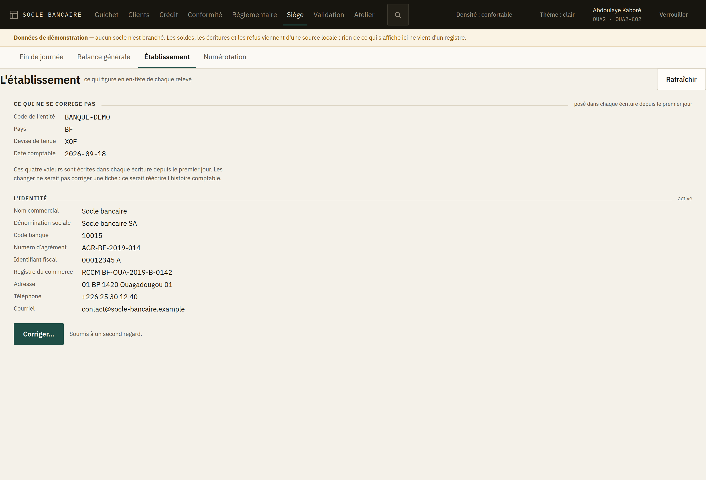
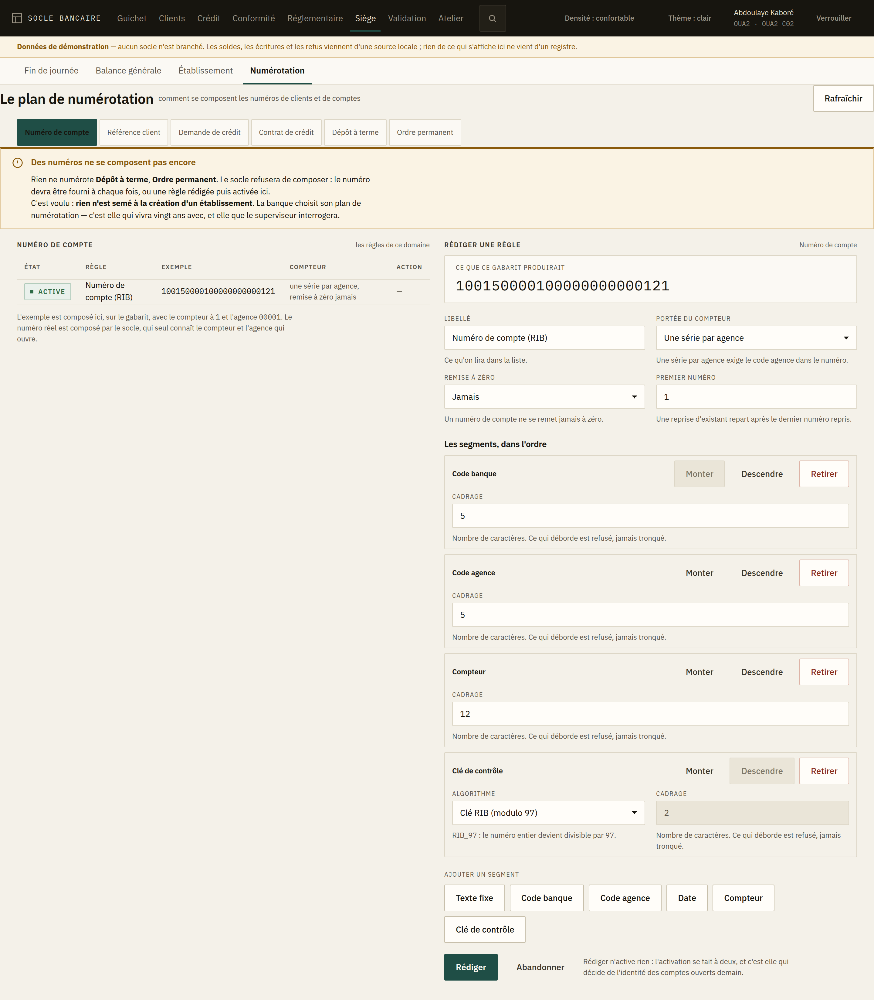
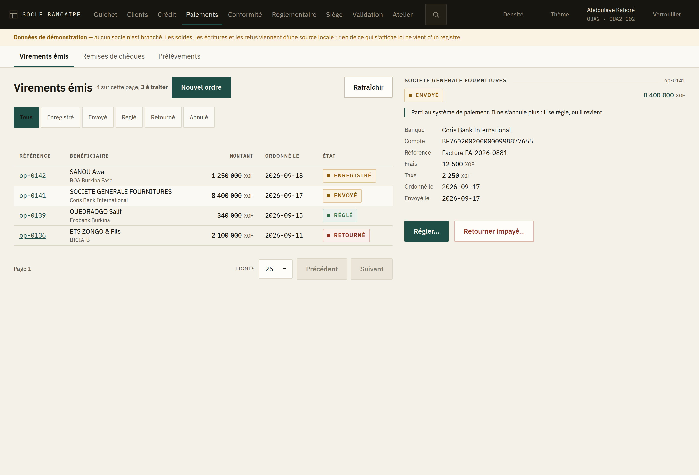
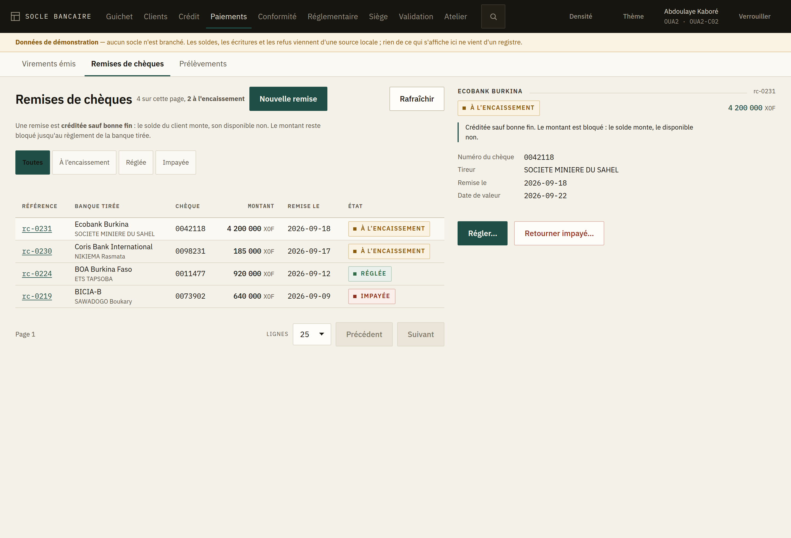
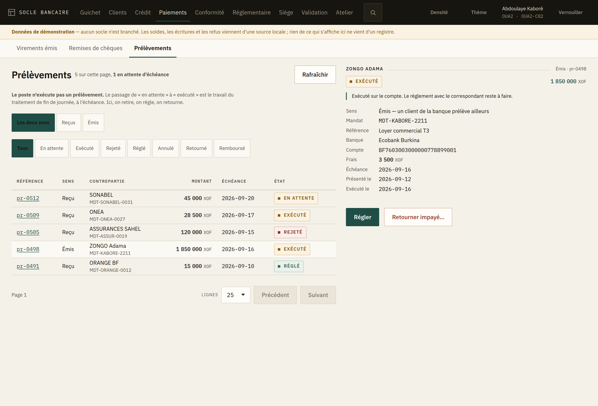

# 16 — Back-office agence : décisions, garde-fous, thèse de design

Ce document fixe ce qui a été décidé avant la première ligne de code du front. Il joue pour
l'interface le rôle que les invariants jouent pour le socle : ce n'est pas une intention, c'est
une contrainte qu'on ne renégocie pas écran par écran.

**Périmètre** : le back-office **agence** — le poste de travail du guichetier, du chargé de
clientèle, du chef d'agence, et les écrans de siège (comptabilité, conformité, exploitation,
paramétrage) qui partagent la même application. Le portail client et le mobile ne sont pas ici.

---

## 1. Décisions d'architecture

| Décision | Raison |
|---|---|
| **Angular + TypeScript, SPA** | L'API est déjà un contrat OpenAPI publié et testé ; le front en dérive ses types au lieu de les retaper |
| **OAuth2 Authorization Code + PKCE** contre Keycloak, sans BFF pour l'instant | Le jeton reste porté par le navigateur ; un BFF s'ajoutera si une banque exige de ne jamais l'exposer — c'est un composant d'exploitation de plus, pas une évidence |
| **Une seule application, deux espaces** — guichet et siège | Deux métiers, deux ergonomies, mais une seule authentification, un seul client d'API, un seul jeu de types. Deux applications les dupliqueraient et les feraient diverger |
| **Nos propres composants, sur `@angular/cdk`** | Le CDK n'apporte aucun CSS : il apporte ce qu'on rate en écrivant soi-même — piège de focus, positionnement d'overlay, navigation clavier, défilement virtuel. Et il suit le train de release d'Angular, donc pas de décalage à la montée de version |
| **Zoneless + signals** | Zone.js relance la détection de changement à chaque événement ; une table dense devient molle. C'est le premier levier de performance, et il est structurant — donc posé au départ |
| **Pas d'écriture hors ligne** | Le registre est central et l'écriture est comptable. On traite la **résilience au réseau instable**, pas le mode déconnecté |

### Ce que « nos propres composants » veut dire

Ce qu'on écrit : tout le markup, tout le CSS, la densité, l'ergonomie clavier.

Ce qu'on ne réécrit pas, et qu'on prend au CDK : `a11y` (piège de focus, `ListKeyManager`,
annonceur), `overlay` (positionnement conscient du bord de l'écran), `scrolling` (défilement
virtuel du journal), `table` (la logique, sans un seul `<td>` imposé).

Ce qu'on ne fait pas du tout : un calendrier complet. Un guichetier tape `15/03/2026` plus vite
qu'il ne clique — champ masqué avec validation, petit calendrier en appoint sur l'overlay du CDK.
Écrire un sélecteur de date accessible et localisé coûte deux à trois semaines pour un gain nul
au guichet.

### Le coût des composants maison, et pourquoi il est borné

Le noyau — bouton, champ texte / nombre / montant / date masquée, combobox, table, dialogue,
tiroir, onglets, notice, badge d'état, pagination, barre d'outils — représente trois à quatre
semaines de travail focalisé. Une bonne part du reste est de toute façon du **domaine**, qu'aucune
librairie ne fournit : champ montant qui connaît l'échelle de la devise, sélecteur de compte qui
montre le disponible, bandeau client avec statut KYC et blocages, récapitulatif d'imputation, file
de validation.

**Un composant maison mal écrit est plus lent qu'un composant de librairie bien écrit.** « Fait
maison » n'est pas synonyme de rapide : ça l'est si, et seulement si, les leviers ci-dessous sont
tenus.

### Les leviers de performance, par ordre d'impact

1. **Zoneless + signals** — seul ce qui a changé se recalcule.
2. **Pagination serveur** — l'API pagine par curseur ; on ne charge jamais dix mille lignes.
3. **Défilement virtuel** sur le journal et le grand livre.
4. **Routes paresseuses par espace** — le guichet n'embarque pas les écrans de paramétrage.

Le poids du bundle vient après : environ 300 Ko gzip pour l'application entière, contre 700 Ko à
1 Mo avec une librairie de composants complète. Réel, pas décisif.

---

## 2. Sécurité

**Le front n'est pas une frontière de sécurité.** L'interface cache ce qui est interdit ; c'est
l'API qui l'empêche. Aucune règle métier de sécurité ne vit côté client.

| Règle | Raison |
|---|---|
| Le menu se construit à partir des opérations autorisées **rendues par l'API** | Réimplémenter `SecurityConfig` côté front garantit la divergence. Une source, deux lecteurs |
| **Jamais de jeton en `localStorage`** — jeton d'accès en mémoire, rafraîchissement en cookie `HttpOnly` / `SameSite` | Un XSS de back-office bancaire, c'est une session de guichetier volée |
| **CSP stricte**, pas de `bypassSecurityTrust*` | Angular AOT s'en passe ; l'exception doit être une revue, pas une habitude |
| **Verrouillage sur inactivité, pas déconnexion** | Le guichetier perdrait sa saisie. Re-saisie du mot de passe, la saisie survit |
| **L'agence et la caisse viennent du jeton** | La règle est déjà celle du socle ; l'interface ne doit pas offrir de sélecteur qui laisse croire le contraire |
| **Les exports passent par l'API** | Un CSV construit depuis une liste déjà chargée échappe à l'habilitation et à la trace |
| Les écrans en **lecture tracée** le disent | Le socle trace déjà (LCB-FT, audit, dossier client) ; l'afficher est dissuasif et honnête |
| **Aucun secret dans le bundle** | Client Keycloak public avec PKCE ; seules l'URL de l'API et le realm sont publics |
| **La police est auto-hébergée** | Un réseau de banque bloque souvent les CDN externes, et une requête vers un tiers à chaque ouverture de session est une fuite de métadonnées |

### À ajouter côté API

- `GET /v1/me/permissions` — les opérations autorisées du porteur, dérivées de la politique.
  Sans cela, le front devine, et il devinera faux.

---

## 3. Configurable — les trois niveaux, et le piège

**Le front ne configure rien qui soit déjà configuré ailleurs : il le lit.**

**Niveau 1 — ce que l'interface reflète.** Produits, familles, barèmes, devises et leurs échelles,
calendriers, natures de pièces, motifs d'opposition, scénarios de surveillance, déclarations. Rien
n'est retapé : **les types TypeScript se génèrent depuis `openapi.json`**. Le contrat est déjà
versionné et tenu par un test ; un `npm run api:generate` et le front ne peut plus diverger.

**Niveau 2 — ce qui se configure par déploiement.** Logo, couleur d'accent, libellés, format
d'affichage des comptes, écrans activés, ordre du menu, langue. Chargé au démarrage, sans
recompilation.

**Niveau 3 — ce qui ne doit pas être configurable.** Les contrôles de saisie et les enchaînements
d'écran. Vouloir les paramétrer produit un moteur de workflow maison, non typé et non testé. Un
enchaînement différent, c'est du code — comme une nouvelle méthode de surveillance est une
livraison.

**L'exception qui se justifie** : le formulaire de paramétrage produit. Les familles déclarent déjà
leurs paramètres obligatoires (`product/families.json`). Un formulaire générique y est légitime,
**à condition d'être piloté par un descripteur exposé par l'API** — nom, type, unité, obligatoire,
bornes — et non par une configuration front. La source de vérité reste le socle.

### À ajouter côté API

- Un descripteur de paramétrage par famille de produit, lisible, pour que le formulaire se rende
  sans que le front connaisse les clés.

---

## 4. Thèse de design

La concurrence — T24, Finacle, FLEXCUBE, Amplitude — partage une signature : chrome gris froid,
onglets dans des onglets, modales en cascade, huit couleurs qui ne veulent rien dire, et un code
d'erreur quand ça refuse. Ce sont des formulaires boulonnés sur une base de données.

**On ne se démarque pas en étant spectaculaire. On se démarque en étant calme, dense et honnête.**
Le back-office doit ressembler à ce que le registre croit : rigoureux, explicite, ne cachant jamais
son état.

### 4.1 La typographie fait le produit, pas la couleur

**IBM Plex Sans** pour le texte, **IBM Plex Mono** pour les références, numéros de compte et
identifiants d'écriture. Le choix se justifie sur quatre points : chiffres tabulaires excellents,
caractère institutionnel plutôt que startup, licence libre et **auto-hébergeable** (un réseau de
banque bloque les CDN), et une famille monospace assortie — ce qui compte quand la moitié des
données affichées sont des références.

Chiffres tabulaires partout : `font-variant-numeric: tabular-nums lining-nums`. Une colonne de
montants ne danse jamais.

### 4.2 Notre identité est dans la structure ; l'accent appartient à la banque

Base papier tiède, pas de blanc pur ni de gris bleuté d'entreprise : ces écrans sont regardés huit
heures par jour sous néon. **Une seule couleur d'accent, configurable par déploiement**, et une
palette sémantique stricte réservée aux états. Quand tout est neutre sauf ce qui compte, ce qui
compte se voit.

C'est aussi ce qui rend la thématisation possible sans rien perdre : la banque prend l'accent,
notre signature reste la structure, la typographie et la densité.

### 4.3 Le montant est un objet de première classe

Chiffres tabulaires, alignement sur le dernier chiffre, devise en graisse légère, signe explicite.
**Jamais de rouge par défaut sur un solde négatif** : un découvert autorisé n'est pas une alarme.
Le disponible est affiché à côté du solde comptable, avec le détail des blocages — un guichetier
qui refuse un retrait sans pouvoir dire pourquoi, c'est un incident client.

### 4.4 « En attente de validation » est un état à part entière

C'est l'état le plus fréquent d'un back-office bancaire, et personne ne le traite : ni succès, ni
échec. Il a sa couleur, sa place, et un vocabulaire d'états identique partout — **brouillon, en
attente, comptabilisé, contre-passé, rejeté, bloqué**.

Le maker-checker occupe deux écrans : « soumis, en attente » côté demandeur, une file côté
valideur. Et l'interface dit ce que le socle fait — **la requête est rejouée à l'approbation**,
donc l'exécution peut refuser ce que la saisie acceptait.

### 4.5 Pas de modale pour travailler : un tiroir de contexte

Il glisse à droite, la liste reste visible, l'opérateur ne perd jamais où il est. La modale est
réservée à une seule chose : confirmer l'irréversible.

### 4.6 La palette de commandes comme chemin le plus rapide

`Ctrl+K` : « versement », « CLI-0042 », « arrêté de caisse ». Courant dans les outils de
développeur, inexistant en banque. Un différenciateur réel, et il sert l'exigence de vitesse — un
guichetier fait cent cinquante opérations par jour et connaît ses écrans par cœur. On n'optimise
pas la découverte, on optimise la répétition.

### 4.7 Le refus est un moment de design

Le socle écrit déjà des refus faits pour être lus. Ils méritent mieux qu'un toast rouge qui
disparaît : la raison, la règle, et quoi faire — à un endroit conçu pour ça. C'est là que le
produit se distinguera le plus vite.

### 4.8 Deux détails qui pèsent lourd

**Densité au choix** — compacte ou confortable, persistée par utilisateur. Et **mode sombre
dessiné**, pas inversé : les arrêtés se font le soir.

### 4.9 Le réseau instable est un cas nominal

La clé d'idempotence est générée côté client et **conservée**. « Réessayer » rejoue la même clé ;
on ne re-saisit jamais une opération dont on ne sait pas si elle est partie.

---

## 5. Ce qu'on ne fait pas

- Pas d'animation décorative — 120 ms, fonctionnel, rien qui rebondit.
- Pas de bouton à icône seule hors barre d'outils ; le texte mène, l'icône accompagne.
- Pas de dégradé, pas d'ombre portée molle, pas de carte arrondie flottante : ce vocabulaire dit
  « tableau de bord marketing », pas « salle des comptes ».
- Pas de défilement infini sur une liste comptable — la pagination à curseur existe.
- Pas de toast éphémère pour confirmer une écriture : il faut une trace persistante, avec son
  numéro.
- Pas de graphique tant qu'il n'y a rien à comprendre d'un coup d'œil.
- Pas de modales imbriquées.

---

## 6. Les garde-fous qui tiennent tout cela dans le temps

Du même ordre que le test de contrat OpenAPI : des mécanismes, pas des intentions.

| Garde-fou | Ce qu'il empêche |
|---|---|
| **Un jeu fermé de primitives**, documenté | Quarante variantes de bouton au bout d'un an |
| **Une page atelier vivante dans l'application** — toutes les primitives, tous les états, les deux densités, les deux thèmes | Un composant qui n'y figure pas n'existe pas |
| **Un budget de taille dans le build** (`budgets` d'`angular.json`) | Une régression de poids fait échouer la compilation, elle ne se découvre pas en production |
| **Des tokens CSS** (propriétés personnalisées), pas d'utilitaires épars | Sur dix ans, ça se relit et ça se rethématise |
| **Les types générés depuis le contrat** | Le front ne peut pas diverger de l'API en silence |

---

## 7. Ordre de construction

1. **Socle visuel** : tokens, typographie, densités, thèmes clair et sombre, page atelier.
2. **Premier écran de bout en bout** : guichet — **versement d'espèces**. Il contient tout ce que
   la thèse doit prouver : bandeau client, solde et disponible, récapitulatif d'imputation avec
   date de valeur et frais, clé d'idempotence, reçu, refus métier lisible.
3. **File de validation** (maker-checker), qui éprouve le vocabulaire d'états.
4. Le reste des écrans du guichet, puis l'espace siège.
5. **Authentification et habilitations**, une fois qu'il y a assez d'écrans pour que filtrer un
   menu ait un sens.
6. **Le référentiel client**, prérequis de tout le reste : on n'ouvre pas un compte à personne.
7. **Le crédit**, de la demande au contrat, puis sa fin de vie.
8. **La conformité LCB-FT**, dont l'interface est elle-même un risque : ce qu'elle relie peut
   constituer un délit.
9. **Le réglementaire**, où l'écran doit défaire une confusion plutôt qu'en présenter une :
   produire et transmettre passent pour le même geste, et ne le sont pas.

Cet ordre n'était pas écrit d'avance au-delà du point 4 : les points 5 à 9 se sont imposés en
construisant. L'avancement réel est au §8.

## 8. État de la construction

Le code du front est dans [`core-banking/web`](../../core-banking/web) ; son README décrit la
mécanique (commandes, organisation, garde-fous). Node ≥ 22.22.3 est requis par Angular 22.

Ce document dit **pourquoi** les écrans sont ce qu'ils sont. Ce qu'un guichetier, un valideur ou
un exploitant doit faire devant eux est dans le [guide de l'utilisateur](utilisateur/README.md),
écrit pour être lu sans aucune connaissance technique.

| Étape du §7 | État |
|---|---|
| 1. Socle visuel | **Livré** — tokens, deux thèmes, deux densités, jeu fermé de 18 primitives, page atelier, budgets, types générés |
| 2. Guichet — versement d'espèces | **Livré** — bandeau client, billetage BCEAO contrôlé, imputation en projection puis reçu, idempotence conservée, refus lisible |
| 3. File de validation | **Livré** — file paginée, détail de la requête soumise, approbation qui exécute, rejet motivé, auto-approbation signalée, échec d'exécution après approbation |
| 4. Reste du guichet, puis siège | **Livré** — guichet complet (versement, retrait, virement, relevé, arrêté de caisse) ; siège ouvert (fin de journée, balance générale) |
| 5. Authentification et habilitations | **Livré** — OAuth2 PKCE contre Keycloak, jeton porté aux seuls appels du socle, rafraîchissement silencieux, verrouillage du poste, menu filtré (§16) ; droits lus **à la granularité de l'action**, plafonds et seconds regards annoncés (§21) |
| 6. Référentiel client | **Livré** — recherche, dossier avec obstacles nommés, création, ouverture de compte (§15) |
| 7. Crédit | **Livré** — demandes, dossier d'instruction, portefeuille, contrat (§17) ; fin de vie : remboursement anticipé, rééchelonnement, révision de taux, passage en perte et recouvrement (§18) |
| 8. Conformité LCB-FT | **Livré** — file des alertes, dossier avec ses pièces, classement motivé, déclaration de soupçon et son dépôt, scénarios de surveillance (§19) |
| 9. Réglementaire | **Livré** — échéances, états et leur détail, transmission et reprise, catalogue, fiscalité (§20) |
| — Liasse et consolidation | **Bloqué par le contrat** — un périmètre cite des entités membres, et aucune route ne liste les entités (§20) |
| — Sûretés | **Bloqué par le contrat** — seuls des `POST` sont exposés ; sans lecture, rien ne peut s'afficher (§19) |
| — Moyens de paiement | **Pas commencé** — chèques, prélèvements, virements sortants ; le socle les expose, l'interface pas encore |

**Vingt-neuf écrans**, visités à **trente-cinq adresses** — plusieurs jeux de données par écran,
choisis là où la mise en page se tend — à sept largeurs, sans débordement horizontal ni cible
tactile sous 24 px, vérifiés à chaque livraison par `scripts/largeurs.mjs`.

Rien n'est figé : ce qui suit est ce qu'on sait aujourd'hui, pas un engagement. Les décisions
prises pendant la construction du socle sont consignées ici pour qu'on puisse les défaire en
connaissance de cause.

### Ce que la construction a appris

**L'accent est déclaré par thème, pas dérivé.** Une couleur lisible sur papier tiède ne l'est pas
toujours sur fond sombre. `config.json` porte donc un accent clair et, facultativement, un accent
sombre ; les valeurs sont écrites dans une règle CSS par thème — un style en ligne sur `<html>`
l'emporterait sur `[data-theme='dark']` et figerait l'accent clair dans le thème sombre. Et parce
que `config.json` est du contenu de déploiement et non du code, seules les valeurs qui ont la
forme d'une couleur sont recopiées dans la feuille de style.

**Le tiroir de contexte est modal aujourd'hui.** Le `Dialog` du CDK piège le focus : la liste
reste lisible, pas manipulable. Le jour où un écran demandera de travailler la liste tiroir
ouvert, ce sera un `Overlay` sans piège de focus — pas un `Dialog` auquel on retire le voile en
faisant semblant.

**Les polices sont réduites au latin.** Le cyrillique, le grec et le vietnamien triplaient le
poids embarqué pour rien dans une agence de l'UEMOA. IBM Plex Sans est pris en fonte variable
(une requête pour toutes les graisses), IBM Plex Mono en trois graisses fixes.

**Le démarrage a son propre test.** Un initialiseur qui appelle `inject()` après un `await`
compile, passe les tests de composants, et casse l'application au premier chargement (NG0203).
Seule l'exécution de la séquence de démarrage le montre — elle est donc jouée par un test.

### Responsivité — les largeurs d'un poste d'agence

Ce n'est pas un site : personne ne fait un versement sur un téléphone. Mais les postes d'agence
sont souvent des 1366×768, le chef d'agence consulte sur tablette, et un écran qui casse à 1024
est un écran qu'on n'ouvre pas.

| Seuil | Ce qui change |
|---|---|
| ≥ 1280 | Deux colonnes : la saisie à gauche, l'imputation et l'action à droite, épinglées |
| 1280 | Le suivi repasse sous la saisie |
| 1100 | La barre se resserre ; la recherche garde son icône et perd son libellé |
| 768 | Une colonne ; le sommaire de l'atelier et les libellés secondaires tombent |
| < 768 | Consultation : lisible, jamais de défilement horizontal, ni clé d'idempotence ni raccourci clavier |

Une table comptable ne se replie jamais en cartes : elle défile dans son conteneur, colonnes
alignées. Un relevé lu en cartes empilées n'est plus un relevé.

`npm run check:largeurs` ouvre chaque écran à sept largeurs et échoue sur un débordement
horizontal ou une cible sous 24 px (WCAG 2.2, critère 2.5.8). Il demande un navigateur, donc il
n'est pas dans `npm test` ; il devient une barrière d'intégration le jour où le front en a une.

---

## 9. L'écran de versement : ce qu'il a tranché

**Le poste ne calcule ni les frais, ni la taxe, ni la date de valeur.** Ce sont des paramètres du
socle. L'écran montre donc l'imputation en deux temps : en projection, les deux lignes certaines
— débit caisse, crédit client — et une mention explicite ; après la comptabilisation, les chiffres
du reçu. Un barème recopié dans le navigateur finit par diverger, et l'écart se paie à l'arrêté de
caisse.

**Le billetage est un contrôle, pas une commodité.** Le montant annoncé et le comptage doivent
tomber juste ; l'écart bloque l'envoi et se voit à la remise, pas le soir quand il faudra rappeler
le client. Le comptage reste facultatif — un guichetier qui n'a pas encore compté saisit le
montant — mais dès la première coupure, il est contrôlé. Les coupures sont celles de la BCEAO,
billets et pièces, le 500 des deux côtés parce qu'un caissier les range séparément.

**La clé d'idempotence couvre une demande, pas une session.** Elle est conservée tant que la
saisie ne change pas : « Réessayer » rejoue la même clé, et un réseau qui tombe ne peut pas
produire un double versement. Dès que le montant, le compte ou le libellé changent, la clé est
renouvelée — sinon le socle rejouerait le premier reçu pour une opération différente, et le
guichetier croirait avoir passé la seconde.

**Les trois issues du socle sont trois messages distincts.** 201 comptabilisé, 200 rejeu d'une clé
déjà traitée, 202 en attente d'un second regard. « Comptabilisé » annoncé deux fois fait recompter
la caisse ; annoncé sur une opération en attente, il fait remettre les espèces au client.

**L'identité du remettant part au libellé de l'écriture.** Le contrat n'a pas de champ dédié, et
c'est de toute façon ce qu'un libellé d'écriture porte dans une agence. La lacune est nommée
ci-dessous.

**Une source de démonstration, jamais déguisée.** Tant qu'aucun socle n'est branché
(`sourceDonnees: "factice"`), un bandeau permanent le dit : rien de ce qui s'affiche ne vient d'un
registre. Basculer sur un socle réel est une ligne de `config.json`.

### Lacunes du contrat, relevées en construisant l'écran

Aucune n'a été comblée côté front : une règle devinée dans le navigateur est une divergence
programmée.

- **Cotation d'une opération** — frais, taxe et date de valeur avant comptabilisation. Sans elle,
  le guichetier ne peut pas annoncer au client ce qui sera prélevé.
- **Lien compte → titulaire** — le solde ne porte pas le tiers ; le bandeau client ne peut pas
  afficher le nom sans un appel qui n'existe pas.
- **Lecture des blocages d'un compte** — leur pose est exposée, pas leur lecture. L'écart entre
  solde et disponible reste donc inexpliqué face à un socle réel.
- **Recherche de compte** — `GET /parties` cherche des tiers, pas des comptes. Le guichet cherche
  un compte.
- **Identité du remettant, structurée** — exigence LCB-FT que `Requests.CashOperation` ne porte pas.
- **Lignes d'écriture du reçu** — le reçu donne les montants, pas les lignes. Un
  `GET /entries/{entryId}` permettrait d'afficher l'imputation réelle, pas seulement ses totaux.

---

## 10. La file de validation : ce qu'elle a tranché

**Le vocabulaire d'états passe de six à neuf.** Le socle a six statuts d'opération en attente —
`PENDING`, `APPROVED`, `REJECTED`, `EXPIRED`, `EXECUTED`, `FAILED` — et en écraser trois dans les
six états d'origine cacherait exactement ce qu'un exploitant doit voir. Les trois nouveaux :

| État | Ce qu'il dit |
|---|---|
| **approuvée, non confirmée** | Décidée, exécution non confirmée. Une anomalie d'exploitation ; la fondre dans « comptabilisé » la rendrait invisible le jour où elle compte |
| **échouée** | Approuvée, mais l'exécution a refusé. La décision reste ; c'est le demandeur qui resoumet |
| **expirée** | Le délai a couru sans que personne ne décide |

Un rejet humain et un échec d'exécution partagent la couleur mais pas le libellé : dans les deux
cas ça n'est pas passé, mais l'un se discute avec le valideur et l'autre avec l'état du compte.

**L'avertissement de rejeu est sur la confirmation, pas en note de bas de page.** L'approbation
exécute la requête telle qu'elle a été soumise ; le socle la rejoue, donc l'exécution peut refuser
ce que la saisie acceptait. C'est écrit là où le valideur clique.

**Une exécution refusée après approbation n'est pas un échec de l'approbation.** La décision est
prise et reste tracée ; l'opération passe en échouée et l'écran le dit explicitement : ce n'est pas
au valideur de corriger, c'est au demandeur de resoumettre. L'écran relit l'opération après le
refus pour montrer son état réel, pas celui d'avant le clic.

**L'échéance est calculée à l'affichage.** Le socle n'expire que paresseusement — il marque
`EXPIRED` au moment où quelqu'un tente de décider. Une ligne dont l'échéance est passée reste donc
`PENDING` en base, et l'afficher « en attente » enverrait un valideur sur une opération que plus
personne ne peut décider. L'interface calcule l'état affiché ; elle ne réécrit rien.

**Un rejet se motive, et le motif est la seule chose que le demandeur verra.** Le champ est
obligatoire côté écran comme côté socle : sans motif, le demandeur resoumet la même demande.

**L'auto-approbation est signalée avant le clic et refusée par l'API.** L'interface cache ce qui
est interdit ; c'est l'API qui l'empêche. Quand le contrat ne dit pas qui porte le jeton, l'écran
ne devine pas : il laisse l'API refuser.

### Lacune du contrat ajoutée à la liste

- **`GET /v1/me`** — le porteur du jeton. Sans lui, l'interface ne peut pas signaler
  l'auto-approbation avant le clic, ni construire le menu à partir des opérations autorisées
  (§2). Déduire l'identité du JWT côté front ferait du navigateur une source d'identité.

---

## 11. Retrait et arrêté de caisse : ce qu'ils ont tranché

**Ce qui est identique entre deux opérations de guichet ne s'écrit qu'une fois.** La clé
d'idempotence, son renouvellement, le rejeu et la distinction des trois issues du socle vivent
dans une seule classe (`Soumission`), partagée par le versement et le retrait. C'est là qu'on se
trompe ; le versement y est passé sans qu'un test bouge, ce qui est la meilleure preuve que la
mécanique était bien isolée.

**Au retrait, c'est le disponible qui commande, pas le solde comptable.** Un blocage retient une
part du solde ; l'écran l'affiche en clair, avec le montant retenu et le renvoi au tiroir de
contexte. Un guichetier qui refuse un retrait sans pouvoir dire pourquoi est un incident client.

**Le poste ne bloque que sur ce qu'il sait avec certitude.** Un montant supérieur au disponible
sera refusé quoi qu'il arrive : inutile de faire l'aller-retour. En dessous, les frais peuvent
encore faire basculer — et c'est le socle qui tranche, pas le navigateur. La limite entre
« empêcher » et « laisser refuser » est exactement là : le poste empêche ce qui est certain, il ne
devine jamais un barème.

**En attente de validation, on ne remet pas les espèces.** Un retrait mis en attente n'est pas
comptabilisé ; l'écran le dit en toutes lettres, parce que c'est le seul écran où une mauvaise
lecture fait sortir de l'argent du tiroir.

**L'imputation connaît son sens.** Débit d'abord : caisse puis client au versement, client puis
caisse au retrait. Les frais sont toujours au débit du compte client — le client paie la
commission, qu'il verse ou qu'il retire.

### L'arrêté de caisse

C'est l'écran qui relie le guichet au cycle comptable : **le traitement de fin de journée refuse
de clore une journée dont une caisse mouvementée n'a pas été arrêtée**. Tant que le comptage n'est
pas fait, l'agence entière attend — et l'écran commence par le dire.

Le solde théorique vient du registre, le comptage des doigts du guichetier, l'écart de la
soustraction des deux. Il s'affiche au fur et à mesure, nommé : excédent quand il y a plus en
caisse que ce que le registre annonce, manquant dans l'autre sens.

**Un écart n'empêche pas l'arrêté — le cacher serait pire.** Mais il se confirme explicitement :
l'écart s'impute au compte d'écart de caisse, reste au nom de celui qui a compté, et se justifie.
La confirmation le dit, et rappelle que c'est le dernier moment pour recompter. C'est le seul
usage légitime d'une modale : confirmer l'irréversible.

### Lacunes du contrat ajoutées à la liste

- **`GET /v1/me/till`** — la caisse du porteur. Le contrat crée une caisse et l'arrête, mais ne la
  lit pas.
- **Solde théorique d'une caisse** — sans lui, l'arrêté ne peut pas être présenté. Le recalculer
  côté poste serait réécrire le registre dans le navigateur ; l'implémentation HTTP refuse donc
  explicitement plutôt que de deviner, et l'écran affiche ce refus.

---

## 12. Virement, relevé, et la barre qui a dû grandir

**La barre du haut porte les espaces, pas les écrans.** À sept entrées elle tronquait déjà le
dernier nom — et une entrée de menu tronquée fait disparaître un écran. Les cinq écrans du guichet
vivent donc sous une barre d'espace, et la barre du haut est revenue à trois entrées : Guichet,
Validation, Atelier. C'est la structure annoncée au §1 — une application, deux espaces — appliquée
au moment où elle devenait nécessaire plutôt qu'au moment où elle était théorique.

### Le virement interne

**Une seule écriture, deux comptes.** Le socle débite et crédite dans la même transaction : il n'y
a jamais un instant où l'argent n'est nulle part. L'écran ne fait donc jamais deux appels, et le
reçu parle d'une écriture, pas de deux.

Comme au retrait, **le disponible du débiteur commande**. Et comme partout, le poste n'empêche que
ce qui est certain : deux fois le même compte, deux devises différentes — un virement interne ne
fait pas le change. Le reste appartient au socle.

L'imputation reprend le même composant, avec la contrepartie paramétrée : la caisse au guichet, le
compte bénéficiaire au virement. Débit d'abord, toujours.

### Le relevé de compte

Trois choses qu'un relevé doit dire et que la plupart taisent.

**Une contre-passation ne remplace pas l'écriture d'origine, elle s'ajoute.** Les deux restent au
journal et le relevé les montre toutes les deux : l'annulée marquée comme telle, l'annulante
citant le numéro de pièce qu'elle annule. Et parce qu'on n'a lu qu'une page, on ne marque
« contre-passée » que ce que la page montre — affirmer qu'une écriture est intacte sur la foi
d'une page serait une affirmation qu'on ne peut pas tenir.

**Une écriture peut être passée après le jour qu'elle affecte.** Le socle est bitemporel ; quand
la date de connaissance diffère du jour comptable, la ligne le dit. C'est ce qui explique un solde
qui a « changé » hier.

**Les totaux sont ceux de la page, jamais un solde** — et le pied de table l'écrit. Un total de
page présenté comme un solde est un mensonge par cadrage.

La consultation d'un relevé est tracée par le socle ; l'écran l'affiche. C'est honnête, et
dissuasif.

### Un double de test partagé

Les écrans de guichet parlent tous au même port. Leur double de test vit désormais dans un seul
fichier : une classe à faire suivre quand le port grandit, au lieu d'une par écran qui diverge.
Son compte par défaut porte un blocage — c'est là que solde et disponible divergent, et c'est ce
que les écrans doivent savoir montrer.

---

## 13. L'espace siège : exploitation et balance

### Le traitement de fin de journée

L'écran le plus lourd de conséquences de l'application, et il tient sur trois idées.

**L'essai à blanc n'écrit rien, et c'est lui qui trouve le blocage.** Un exploitant passe en essai
avant d'engager sa journée : les étapes s'exécutent, les anomalies sortent, le registre ne bouge
pas. La distinction est portée par un bandeau permanent, pas par une case à cocher qu'on oublie.
C'est pour cela que la source de démonstration fait échouer le **premier** passage, essai compris :
un essai qui ne trouverait rien n'aurait aucune raison d'exister.

**Un échec bloquant arrête la chaîne, et les étapes suivantes ne sont pas « en attente ».** Elles
n'ont jamais été tentées. L'écran l'écrit, et compte combien : lire « en attente » sur un
traitement terminé fait croire qu'il reste du travail en cours, alors qu'il n'y a plus rien qui
tourne. La reprise repart de l'étape échouée, pas du début — l'écran le dit aussi, parce que c'est
la première question qu'on se pose avant de cliquer.

**Une anomalie non bloquante n'arrête rien et doit être lue.** Elle revient le lendemain, en plus
gros. Elles sont comptées dans le bandeau du passage et détaillées sur leur étape.

Deux gardes : **on n'annule pas un essai à blanc** — il n'a rien écrit, et le proposer laisserait
croire le contraire ; et l'annulation d'un passage réel rappelle que le socle la refuse dès qu'une
journée postérieure a tourné.

L'écran relit le passage tant qu'il tourne, et seulement tant qu'il tourne : interroger un
traitement terminé n'apprend rien.

Les 27 étapes affichées sont **celles du socle, dans son ordre**, repris du test qui les épingle.
Un exploitant qui apprend l'écran doit reconnaître son traitement, pas une liste plausible.

Et la boucle se ferme : le refus de démonstration sur `PRE_CHECKS` est une caisse mouvementée non
arrêtée. C'est exactement l'écran d'arrêté de caisse du guichet qui le débloque.

### La balance générale

**L'équilibre est l'information de tête, pas une colonne de plus.** Une balance qui ne s'équilibre
pas veut dire que le registre ne se tient pas, et rien de ce qu'on en tire — état financier,
déclaration réglementaire — ne vaut tant que ce n'est pas réglé. L'écran l'annonce avant les
chiffres, et donne les deux colonnes : ce n'est pas un écran à corriger, c'est une écriture à
retrouver.

**Les totaux sont rendus par devise.** Une balance ne s'additionne pas entre devises ; le faire
produirait un nombre qui ne veut rien dire. Le socle totalise, le poste n'additionne rien.

---

## 14. L'authentification : ce qu'elle a tranché

L'écran ne garde aucun secret durable. Le jeton d'accès et le jeton de rafraîchissement vivent en
mémoire, dans un service, et disparaissent au rechargement — **jamais dans `localStorage`**, qui
survit à la fermeture du navigateur et se lit depuis n'importe quel script chargé par la page. Le
prix est connu : un rafraîchissement de page redemande une session. Le silencieux
(`prompt=none` contre Keycloak) le rend indolore quand la session du fournisseur est encore
ouverte, et honnête quand elle ne l'est plus.

**PKCE est écrit ici, pas importé.** Le calcul tient en une soixantaine de lignes — un aléa de 32
octets, son empreinte SHA-256, le tout en base64url — et il est testable sans navigateur. Embarquer
une bibliothèque d'authentification pour cela contredirait le jeu fermé de primitives du §3 et
ajouterait au poids embarqué ce qu'on refuse ailleurs. Le `state` est comparé **à temps constant** :
un écart de durée sur une comparaison de chaîne est une fuite, petite mais gratuite à éviter.

**Le jeton ne part qu'au socle.** L'intercepteur compare l'origine de chaque requête à
`apiBaseUrl` et n'ajoute l'en-tête `Authorization` que si elles coïncident. Un intercepteur qui
signe tout laisse filer le jeton vers le premier service tiers que le front appellera un jour ;
c'est le genre de fuite qu'on n'écrit pas volontairement et qu'on constate trop tard.

**Un 401 vaut un rafraîchissement, une fois.** Le jeton est renouvelé puis la requête rejouée ;
si le renouvellement échoue, ou si le rejeu échoue encore, l'erreur remonte à l'écran. Il n'y a
pas de seconde tentative, parce qu'une boucle de rafraîchissement sur un jeton mort tape le
fournisseur d'identité en rafale et masque à l'opérateur ce qui se passe réellement.

**Verrouiller n'est pas déconnecter.** Un guichetier qui s'absente verrouille ; l'application reste
montée derrière le voile, la saisie en cours intacte, et elle repart où elle était. Une
déconnexion perdrait le versement à moitié saisi, donc personne ne verrouillerait, donc le poste
resterait ouvert — c'est ainsi qu'une mesure de sécurité se retourne. Le délai d'inactivité vient
de `config.json` (`auth.verrouillageMinutes`) : une agence de quartier et un siège n'ont pas la
même exposition.

**Les habilitations inconnues laissent tout voir.** Le socle n'expose pas encore les opérations
autorisées pour l'appelant (lacune de contrat n° 1, §8). Tant qu'il ne les expose pas, `autorise()`
répond vrai : le menu montre tout et **l'API refuse**. Un menu deviné qui cache un écran auquel
l'agent a droit produit un ticket de support ; un menu qui montre un écran auquel il n'a pas droit
produit un refus explicite du socle. Le second est le bon défaut, et il disparaîtra le jour où le
socle répondra. La table `OPERATION_PAR_ECRAN` — chaque écran vers l'opération réelle qu'il
appelle (`CASH_OPERATION`, `TRANSFER`, `ACCOUNT_JOURNAL_READ`, `TILL_CLOSE`, `PERIOD_CLOSE`,
`LEDGER_READ`) — est déjà écrite et testée : seule la source des droits manque.

**Le mode démonstration ne simule pas un mot de passe.** Le fournisseur factice ouvre une session
sans réseau et le dit ; il n'invente pas un écran de connexion qui accepterait n'importe quoi. Le
bandeau de démonstration, lui, ne bouge pas.

**La recherche cède avant la navigation.** L'arrivée du porteur et du bouton *Verrouiller* dans la
barre a coupé « Atelier » à 1440 : la recherche et la navigation se serraient à poids égal. Le
poids de rétrécissement est désormais explicite (20 contre 1), ce qui rend vraie la phrase que le
code affirmait déjà. Le contrôle de largeurs ne l'attrape pas — il mesure le débordement, pas la
troncature — c'est la relecture des captures qui l'a vu.

### Lacune du contrat ajoutée à la liste

- **`GET /v1/me/permissions`** — les opérations autorisées pour l'appelant. C'est la lacune qui
  coûte le plus cher aujourd'hui : elle est la raison pour laquelle le menu montre tout. Le socle
  connaît déjà la réponse — les habilitations sont dans sa base et il les applique à chaque appel
  — il ne l'expose simplement pas. Le jour où il l'expose, `autorise()` cesse de répondre vrai par
  défaut et rien d'autre ne bouge dans le front : c'est déjà branché.

Rappel du principe qui rend cette lacune vivable : **déduire les droits du JWT côté navigateur
serait faire du poste une source d'habilitation.** Les rôles Keycloak (`TELLER`,
`BRANCH_MANAGER`) servent au fournisseur d'identité, pas au contrôle d'accès du socle ; les
confondre donnerait un front qui se croit autorisé et un socle qui refuse, ou pire, l'inverse.

---

## 15. L'espace client : ce qu'il a tranché

Quatre écrans sous `/clients` : rechercher, dossier, nouveau client, ouverture de compte. C'est
le premier espace où l'interface ne saisit pas une opération mais **constitue un dossier** — et
la grammaire change en conséquence.

### La relecture du contrat a payé quatre fois

L'instruction était de relire le contrat OpenAPI à chaque écran. Elle a trouvé quatre choses que
le code supposait à tort :

1. **Les bénéficiaires effectifs étaient lus sous de faux noms.** Le front lisait `personName`,
   `sharePercent`, `endedOn` ; `BeneficialOwners.Owner` déclare `ownerName`, `ownershipPercent`,
   `validTo`. L'écran aurait affiché des colonnes vides dès le premier branchement réel, sans
   erreur, sans trace — le pire mode de défaillance qui soit. Le modèle miroite désormais le
   contrat champ pour champ, comme `Tiers` miroite `Party`.

2. **Une ouverture de compte n'a qu'une issue favorable.** `POST /v1/entities/{id}/accounts` ne
   déclare que `202`, et `AccountController.open` porte `@ResponseStatus(ACCEPTED)` sans
   condition : **aucun compte ne s'ouvre dans la foulée, jamais**. Le premier jet reprenait la
   grammaire du guichet à trois issues ; la branche « ouvert » était du code mort qui promettait
   au guichetier quelque chose que le socle ne fait pas. Elle est supprimée — modèle, adaptateur,
   factice et gabarit — et l'écran annonce le second regard **avant** l'envoi.

3. **Ni `POST /parties` ni `POST /accounts` ne reconnaissent de clé d'idempotence.** L'en-tête
   n'est résolu que là où un contrôleur déclare un paramètre `IdempotencyKey` — les opérations de
   guichet. Voir ci-dessous ce que l'écran en fait.

4. **`PARTY_MANAGE` n'existe pas.** L'opération du socle est `PARTY_CREATE`. La table
   `OPERATION_PAR_ECRAN` citait un nom inventé ; il aurait rendu l'espace invisible le jour où le
   socle expose les habilitations.

### L'issue incertaine : la décision la plus lourde de ce lot

Sans clé d'idempotence honorée, un envoi qui se perd — réseau coupé, 5xx — laisse une question
sans réponse : la demande a-t-elle été enregistrée ? Rejouer créerait **un second client au
référentiel**, ou **une seconde demande d'ouverture**. Un doublon de client se paie ensuite en
rapprochements manuels, et un compte ouvert en double se paie en clôture et en explications.

L'écran distingue donc deux familles de refus, ce que `RefusMetier.rejouable` ne peut pas faire
seul puisqu'il suppose la clé honorée :

- **refus certain** (4xx métier) : le socle n'a rien écrit, la saisie se reprend ;
- **issue incertaine** (statut 0 ou ≥ 500) : **aucun rejeu n'est proposé.** L'ouverture renvoie
  vers la file de validation, la création vers la recherche, préremplie du nom saisi — pour
  aller vérifier avant de recommencer.

La clé continue d'être envoyée : le jour où ces routes la reconnaîtront, le poste n'aura rien à
changer, et `issueIncertaine` deviendra une précaution inutile plutôt qu'un garde-fou nécessaire.

### Le vocabulaire du référentiel n'est pas celui des écritures

Les captures ont montré un client affiché « COMPTABILISÉ » et une pièce d'identité « EXPIRÉE ».
Les couleurs d'état sont justes — la gravité se lit pareil — mais les mots venaient de
`LIBELLE_ETAT`, qui nomme des écritures. `CbStateBadge` accepte désormais une entrée `mot` : la
couleur reste celle de l'état, le vocabulaire redevient celui du métier qu'on regarde. Un client
est **actif**, **bloqué** ou **clos** ; une pièce est **en vigueur**, **expirée** ou
**remplacée** ; la connaissance client est **vérifiée**, **à vérifier**, **revue dépassée** ou
**bloquée**.

### Ce que les écrans refusent de faire

- **La recherche ne se déclenche pas à la frappe.** Un guichetier tape un nom pendant que le
  client l'épelle : interroger à chaque lettre ferait défiler des résultats faux sous ses yeux.
  Une recherche vide n'est pas une erreur — elle rend les premiers clients, ce qu'on veut en
  ouvrant l'écran. Aucun résultat n'est une réponse, et elle propose la seule suite utile.
- **Le dossier répond d'abord à « puis-je ouvrir un compte ? »**, avant l'inventaire des pièces.
  Il ne dit jamais « dossier incomplet » sans nommer ce qui manque : un guichetier a besoin de
  savoir quoi réclamer, pas d'un verdict.
- **Une pièce remplacée reste au dossier**, grisée. Un dossier client se relit des années après ;
  une pièce disparue est une question sans réponse.
- **La création ne recueille que l'identité.** Un formulaire qui prétendrait tout collecter d'un
  coup serait abandonné en cours de route. Il dit à la création qu'**un client naît non vérifié**.
- **L'ouverture ne compose pas de numéro de compte.** Le contrat l'accepte vide et le socle le
  compose selon le plan de numérotation ; le saisir au guichet produirait des numéros hors règle.
- **Un formulaire vierge ne reproche rien.** Les manques n'apparaissent qu'à partir de la première
  frappe : lister « le code produit est obligatoire » avant que l'opérateur ait touché un champ,
  c'est le gronder pour ce qu'il n'a pas encore eu l'occasion de faire.

### Deux pièges Angular que les tests ont attrapés

- **Une entrée de route n'est pas posée à la construction.** `input.required` lève `NG0950` si le
  constructeur la lit ; une `input()` avec valeur par défaut est pire — elle rend silencieusement
  la valeur par défaut, et l'amorçage de la recherche par `?q=` ne marchait donc pas du tout. Les
  trois écrans concernés chargent maintenant depuis un `effect`, ce qui règle aussi le passage
  d'un client à l'autre sans quitter l'écran.
- **`untracked` borne la dépendance de l'effect au seul paramètre d'URL.** Sans lui, la lecture
  de `q` par le chargement ferait de la frappe un déclencheur — exactement ce que cet écran
  refuse.

### Responsivité

`scripts/largeurs.mjs` couvre désormais 14 pages, dont les quatre nouvelles et deux dossiers de
démonstration (personne physique complète, personne morale incomplète — c'est là que la liste
d'obstacles s'allonge et que la mise en page se tend). Deux corrections sont venues de là :

- le raccourci clavier et la mention de validation disparaissent sous 768 px, comme au guichet ;
- **le glyphe `⏎` a été remplacé par « Entrée »** sur les six écrans qui l'affichaient. Il ne
  s'est pas rendu dans le Chromium de capture, faute de couverture dans la police mono ; un poste
  d'agence sous Linux minimal poserait le même problème, et un raccourci illisible n'est pas un
  raccourci.

### Lacunes du contrat ajoutées à la liste

- **`GET /v1/entities/{id}/products`** — la liste des produits ouvrables. Le socle sait rédiger et
  activer un produit, pas dire lesquels sont ouvrables. L'écran passe en saisie libre et le dit
  dans l'aide du champ, plutôt que de proposer un catalogue deviné.
- **Clé d'idempotence sur `POST /parties` et `POST /accounts`** — absente du contrat comme de la
  signature des contrôleurs. C'est la lacune la plus coûteuse de ce lot : elle oblige le poste à
  refuser le rejeu là où il devrait l'offrir, et laisse au guichetier un aller-retour de
  vérification que la clé rendrait inutile.

---

## 16. Trois lacunes comblées côté socle

Les écrans construits jusqu'ici ont nommé douze manques du contrat. Trois sont comblés — les
trois qui coûtaient le plus cher — et le front a été rebranché dessus dans la foulée.

### `GET /v1/me` et `GET /v1/me/permissions`

C'était la lacune n° 1, et la plus chère : elle était la raison pour laquelle le menu montrait
tout. Le socle connaissait déjà la réponse — la politique vit dans `SecurityConfig`, il l'applique
à chaque appel — il ne l'exposait pas.

`AuthorizationService.grants(caller)` rend, opération par opération, ce que les rôles de
l'appelant admettent, avec le périmètre, le second regard exigé, et le plafond le plus favorable
de ses rôles par devise. `MeController` l'expose, et rend aussi l'identité établie depuis le
jeton.

Trois décisions à connaître :

- **Ces deux routes ne portent pas d'opération d'habilitation.** Exiger un droit pour lire ses
  propres droits serait circulaire. Le cloisonnement tient par construction : tout vient du
  `Caller`, jamais d'un paramètre, donc personne ne peut lire l'identité d'un autre.
- **Ce n'est pas une décision d'accès.** L'agence, le montant et l'objet visé n'y sont pas connus.
  Une opération présente peut être refusée au moment d'agir ; `require()` reste le seul contrôle.
- **Aucune trace d'audit.** Lire ses propres droits n'est pas un accès à une donnée clientèle, et
  tracer chaque ouverture d'écran noierait les traces qui comptent.

Côté front, `lireHabilitations()` perd la seule adresse écrite à la main du poste : elle passe par
le constructeur d'URL vérifié à la compilation, comme toutes les autres.

### La clé d'idempotence sur les soumissions à double validation

Une soumission ne touche pas le registre — c'est précisément ce qui rendait le doublon indolore à
écrire et coûteux à découvrir : deux ouvertures pour le même client, deux chéquiers, deux caisses,
qu'un valideur approuve de bonne foi des jours plus tard sans savoir qu'il valide deux fois la
même chose. `posting_idempotency` ne couvrait pas ce cas : il protège les écritures, et une
soumission n'en produit aucune.

`V57` porte la clé et une empreinte de la requête sur `pending_operation`, sous un index unique
partiel `(entité, maker, clé)`. Trois choix dans ce triplet :

- **borné au maker** : deux personnes qui emploient par hasard la même clé font deux demandes, ce
  qui est la vérité ; et la clé d'un tiers ne peut pas servir à lire ce qu'il a soumis ;
- **empreinte comparée** : la même clé avec une requête différente n'est pas un rejeu mais une
  confusion. Le socle répond 409 plutôt que de rendre un résultat qui ne répond pas à la demande
  faite ;
- **index partiel** : un appelant qui n'envoie pas de clé garde le comportement d'avant, et les
  soumissions sans clé ne se gênent pas entre elles.

**La clé est lue dans l'en-tête, pas ajoutée aux cinquante-huit signatures qui soumettent.**
`MakerChecker` est une classe de la couche web : y lire un en-tête n'est pas une entorse de
couche. Elle passe par une interface `Keys` — la double validation se teste donc sans servlet, et
un appelant qui n'est pas un navigateur dit lui-même ce qu'il porte. Porter la clé cinquante-huit
fois dans une signature aurait surtout garanti qu'elle finisse par manquer à l'une d'elles, sans
que rien ne le dise.

Le contrat, lui, l'annonce route par route : le générateur la déclare dès qu'une méthode **rend
une `View` avec un 202**. Le critère est la soumission, pas le type rendu — lire, approuver et
rejeter une opération en attente rendent aussi une `View` sans rien soumettre, et annoncer une clé
qui n'y sert à rien ferait mentir le contrat. Exactement 58 routes la déclarent.

**Elle reste facultative**, et c'est un choix assumé : la rendre obligatoire aujourd'hui casserait
les quatre-vingt-dix-sept appels de test qui n'en envoient pas, et une bascule de cette nature se
décide, elle ne se subit pas comme effet de bord. Un client qui l'envoie a la garantie ; le
back-office l'envoie déjà, sur toutes les routes.

### `GET /v1/entities/{id}/products`

Le socle savait rédiger et activer un produit, pas dire lesquels sont ouvrables. Le guichet
saisissait donc un code de mémoire, et l'ouverture se refusait au bout de la chaîne pour une faute
de frappe — après que le client a signé.

`ProductCatalog.openable(entité, date)` rend les versions **actives** dont la validité couvre ce
jour, **une seule ligne par code** — la plus récemment entrée en vigueur. Proposer deux fois le
même produit avec deux paramétrages ferait choisir au guichet ce qui ne se choisit pas là. Les
brouillons, les produits suspendus et les produits retirés n'y figurent pas.

L'opération `PRODUCT_READ` est nouvelle, ouverte aux rôles qui ouvrent des comptes : lire le
catalogue est le préalable à l'ouverture. Elle n'est pas tracée à la lecture — un catalogue n'est
pas une donnée clientèle. Le test d'exhaustivité du catalogue d'opérations l'a d'ailleurs
immédiatement réclamée : une opération que rien ne revendique fait croire à une protection qui ne
s'exerce nulle part.

Côté front, l'écran d'ouverture passe de la saisie libre à une liste — et **reprend la devise du
produit choisi**, qu'il verrouille alors. La devise appartient au produit ; la laisser saisir à
côté produirait des couples impossibles, refusés par le socle après la signature.

### Ce qui reste des douze lacunes

Neuf, dont les plus utiles à l'écran : le lien compte → titulaire, la recherche de compte, la
lecture des blocages, la cotation d'une opération avant de la passer, l'identité structurée du
remettant, les lignes d'écriture du reçu, `GET /v1/me/till` et le solde théorique d'une caisse.

---

## 17. L'espace crédit : ce qu'il a tranché

Cinq écrans sous `/credit` : les demandes, le dossier d'instruction, le dépôt d'une demande, le
portefeuille, le contrat. C'était le plus grand domaine du socle sans aucune interface — et celui
où le vocabulaire métier commande le plus de choix d'écran.

### La distinction qui tient tout l'écran d'instruction

**Une condition suspensive bloque la contractualisation ; une résolutoire non.** Les confondre
débloque un crédit sans la garantie qui le couvrait — c'est la faute la plus coûteuse de
l'instruction, et elle ne laisse aucune trace avant l'impayé.

L'écran ne les mélange jamais : deux sections distinctes, deux intitulés explicites, et
`obstaclesALaContractualisation()` ne retient **que** les suspensives non levées. Les résolutoires
apparaissent sous « Engagements à suivre », avec leur échéance, sans rien empêcher.

### Un ratio seul est un chiffre ; un dépassement nommé est une décision

Le socle calcule le taux d'endettement **et** confronte la grille de risque, en nommant ce qu'elle
refuse (`breaches`). L'écran rend les deux : le ratio en grand, les dépassements juste dessous,
mot pour mot.

Et il ajoute ce que ni le ratio ni la liste ne disent : **un dépassement n'interdit pas
d'accorder, il exige une dérogation motivée**, que la décision porte et que l'audit relira. Le
volet de décision réaffiche les dépassements au moment de motiver — c'est pour cela que les volets
de saisie s'ouvrent **en place** et non dans un tiroir : le `Dialog` du CDK piège le focus, et
décider tiroir ouvert masquerait exactement ce qu'on doit lire.

### Ce que le socle décide, et que le front n'invente pas

- **La décision d'octroi passe par un second regard** (202), et **le déblocage aussi** — c'est le
  moment où l'argent sort. L'écran l'annonce avant l'envoi, comme au guichet.
- **L'imputation d'un règlement appartient au socle.** Le front ne calcule rien : il affiche à
  quoi l'argent est allé, ligne par ligne, dans l'ordre que la banque a paramétré — frais de
  recouvrement, pénalités, frais et assurance, intérêts de retard, intérêts, capital. C'est ce
  qu'un guichetier doit pouvoir expliquer au client, et c'est la première question qu'on lui pose.
- **Un versement supérieur à l'exigible n'est pas un remboursement anticipé.** Le socle le garde
  en attente d'une échéance ; l'écran le dit et renvoie vers l'acte qui, lui, rembourse le
  capital par anticipation.

### Trois choix d'ordre

- **Les demandes s'ouvrent sur « en instruction »**, pas sur « toutes » : c'est ce qu'un chargé de
  crédit vient faire. Ouvrir sur tout ferait défiler des dossiers clos et imposerait de filtrer à
  chaque venue.
- **Le portefeuille remonte les retards en tête.** Trié par référence, il faut le parcourir pour
  trouver ce qui ne va pas. Le tri porte sur la page rendue et ne prétend pas ordonner tout le
  portefeuille — il ordonne ce qu'on regarde.
- **Sur un contrat, les créances exigibles passent avant l'échéancier.** L'échéancier dit ce qui
  était prévu ; les créances disent ce qui est dû aujourd'hui. Au guichet, c'est la seconde
  question, jamais la première.

### Les seuils de retard ne commandent rien

`graviteDuRetard()` découpe à 30, 90 et 180 jours — les seuils du classement prudentiel usuel de
l'UEMOA. Ils sont dans le front **parce qu'ils ne décident de rien** : le socle provisionne selon
sa propre grille, paramétrée et revue. Ce découpage sert à ce qu'un retard se lise d'un coup
d'œil, pas à trancher. La couleur ne porte jamais l'information seule : le nombre de jours est
écrit, et la colonne est triée dessus.

### Ce que la construction a corrigé ailleurs

- **`GET /loan-applications` n'était pas paginée**, seule liste du contrat dans ce cas. Une banque
  en activité porte des milliers de demandes ; les rendre toutes fait grossir la réponse avec le
  portefeuille, jusqu'au jour où l'écran ne s'ouvre plus. Elle l'est désormais, sur l'ordre total
  de la référence, avec l'index `(legal_entity_id, status, reference)` qui la couvrait déjà.
- **Les taux s'écrivaient avec un point décimal.** Le socle rend `9.25` — du JSON. L'afficher tel
  quel met un point sous les yeux d'un agent qui lit des virgules toute la journée ; à 9,25 %
  contre 9.25 %, la seconde forme fait hésiter une seconde, et cette seconde se paie en
  relecture. `formaterTaux()` vit à côté de `formaterMontant()`, qui posait déjà la règle.
- **Les liens de retour étaient sous la cible tactile minimale.** Le contrôle de largeurs l'a
  attrapé : `button.lien` sans hauteur minimale tombe à 19 px. La convention du reste de
  l'application — `cbButton="discret"` — s'applique maintenant ici aussi ; le lien au fil d'une
  phrase garde son allure mais tient ses 24 px.

### Une convention à ne pas « corriger »

L'apostrophe droite `'` est la règle dans le texte ; l'apostrophe typographique `’` n'apparaît que
**dans les expressions Angular entre apostrophes droites**, où une apostrophe droite fermerait la
chaîne. Ce n'est pas une incohérence : c'est la seule forme qui compile.

### Ce qui reste du crédit

Le rééchelonnement, la révision de taux, le passage en perte et le recouvrement : le socle les
expose (`/rescheduling`, `/rate-revision`, `/write-off`, `/recoveries`), l'interface pas encore.
C'est la fin de vie du crédit, et elle mérite son propre lot — un passage en perte se décide avec
la provision sous les yeux, ce qui demande un écran de son côté.

---

## 18. La fin de vie du crédit : ce qu'elle a tranché

Quatre actes s'ajoutent au contrat — remboursement anticipé, rééchelonnement, révision de taux —
et un cinquième prend un écran à lui : le passage en perte.

### Pourquoi le passage en perte n'est pas un bouton de plus

Passer en perte est la sortie d'un actif des livres. **Cela se décide avec la provision sous les
yeux**, pas au milieu d'un échéancier. Un bouton discret au bout d'une barre d'actions ferait
exactement l'inverse de ce que la décision demande : il la banaliserait.

`/credit/contrats/:id/perte` montre donc ce qu'il faut pour décider, puis ce qui a été constaté.

### La perte n'est pas l'exposition

C'est la chose la plus contre-intuitive du domaine, et la plus coûteuse à ignorer. L'exposition
est absorbée dans un ordre qui n'est pas négociable :

1. **les intérêts réservés** d'abord — ils avaient déjà été sortis du résultat à la suspension, et
   les passer en perte une seconde fois constaterait une charge pour un produit jamais pris ;
2. **la provision** ensuite — c'est ce pour quoi elle avait été constituée ;
3. **le reliquat seul** est une perte au résultat.

Un dossier sur-provisionné rend l'excédent au résultat : la provision n'a plus d'objet.

L'écran rend cette cascade en quatre paliers, chacun portant son montant **et** la phrase qui
explique pourquoi il absorbe. Un total seul cacherait précisément ce qu'il faut comprendre — sur
le dossier de démonstration, 1 662 800 d'exposition ne donnent que 233 680 de perte.

### La créance reste due

Sortie de l'actif, elle se suit au **hors bilan**, et tout recouvrement s'y impute. Croire qu'un
passage en perte éteint la dette est l'erreur qui fait cesser les relances — l'écran l'écrit, et
affiche en face « déjà recouvré » et « reste à recouvrer ».

Le recouvrement, lui, **ne passe pas par un second regard** : l'argent est déjà rentré, l'écriture
suit. Le passage en perte, si.

### Les deux modes de remboursement anticipé, toujours les deux

À capital égal remboursé, **raccourcir la durée fait économiser bien plus d'intérêts qu'abaisser
l'échéance** — et le choix appartient à l'emprunteur, pas à la banque. Ne proposer que l'un des
deux est un défaut fonctionnel courant ; les proposer sans les expliquer en est un autre.

L'écran présente les deux côte à côte, chacun avec ce qu'il change en une phrase que l'emprunteur
comprend. **L'indemnité, elle, est calculée par le socle** selon le paramétrage du produit : le
poste ne l'invente pas et le dit.

### Ce qui reste du domaine

Les sûretés (`/collaterals`, `/collateral-policies`) et le consentement au bureau d'information
(`/regulatory/parties/{id}/credit-bureau-consent`). Les premières se rattachent à un dossier
d'instruction, le second au référentiel client — deux rattachements différents, donc deux endroits
à choisir avant de coder.

---

## 19. L'espace conformité : ce qu'il a tranché

Le LCB-FT est le seul domaine du back-office où **l'interface elle-même est un risque** : ce
qu'elle relie peut constituer un délit. Les décisions ci-dessous découlent toutes de là.

### L'espace ne communique avec aucun autre

Rien de la conformité ne renvoie au dossier client, et rien du dossier client n'y renvoie. Pas de
lien, pas d'onglet, pas de pastille « ce client a une alerte ». Informer la personne surveillée
est un délit, et une interface qui offre le chemin le rend possible par inadvertance — il suffit
d'un chargé de clientèle qui voit la pastille et en parle.

Conséquence visible : **la file des alertes et la liste des déclarations ne nomment pas les
clients.** L'identité se lit dans le dossier d'alerte, par qui l'instruit. Une file d'alertes
n'est pas un annuaire.

L'habilitation suit : `AML_READ` n'est donné ni au guichet ni à la gestion de portefeuille. Le
socle refuserait de toute façon ; l'écran ne propose pas la porte.

### Une alerte constate, elle n'empêche rien

Aucun geste sur un compte depuis cet espace. Pas de bouton « bloquer », pas de mise en opposition.
Bloquer un compte sur un compteur statistique priverait quelqu'un de son argent sur une
présomption, et la banque ne saurait même pas dire laquelle.

La seule exception est portée par l'**origine** de l'alerte, et c'est pourquoi cette colonne est
la plus visible de la file :

| Origine | Ce qui s'est passé | Ce que l'écran doit faire comprendre |
|---|---|---|
| `SCREENING` | Correspondance avec une liste. | Le socle **a déjà refusé** l'opération : opérer avec une personne listée est l'infraction elle-même. |
| `MONITORING` | Compteur franchi. | **Rien n'a été bloqué.** |

Les confondre fait chercher un blocage qui n'existe pas — ou croire qu'il n'y en a pas alors
qu'un client est arrêté au guichet. L'origine porte donc une couleur, et le dossier répète la
distinction en une phrase.

### Trois issues, et trois seulement

Prendre en charge, classer avec motif, déclarer. Le dossier les présente **côte à côte**, sans
hiérarchie : c'est l'instruction qui tranche, et un empilement suggérerait un ordre.

Le motif de classement est obligatoire côté socle ; l'écran le redit en clair — *« une alerte
classée sans raison écrite ne se contrôle pas »* — plutôt que d'afficher un astérisque. C'est la
seule pièce que l'inspection viendra lire.

### La déclaration se rédige depuis l'alerte, jamais depuis la liste

Elle cite les alertes qu'elle couvre ; un exposé des faits écrit loin des pièces ne vaut rien.
L'écran des déclarations sert donc à l'après : savoir ce qui est déposé et ce qui ne l'est pas.

Deux refus du socle sont **anticipés à l'écran**, parce qu'ils se voient et qu'un valideur ne doit
pas les découvrir : une déclaration qui mêlerait deux tiers, et une alerte déjà couverte. Le front
ne décide pas à la place du socle — il ne fait pas soumettre ce qu'il sait déjà refusé.

Après soumission, **rien n'est déposé** : les alertes citées ne passent à `REPORTED` qu'à
l'approbation. L'écran le dit ainsi, au lieu du « enregistré » qui laisserait croire au dépôt.

### La transmission n'est pas une transmission

`POST /compliance/reports/{id}/transmission` n'envoie rien à la cellule : il enregistre le
**récépissé** qu'elle a rendu. L'écran s'appelle donc *« Enregistrer le dépôt »* et l'écrit noir
sur blanc. Un bouton « Transmettre » ferait croire à un canal qui n'existe pas, et une déclaration
resterait sur un bureau en attendant un envoi automatique.

### Le formulaire de scénario suit la méthode

`MonitoringScenarios.requireParameters` dit ce que chaque méthode exige : un seuil et une fenêtre
pour un cumul d'espèces, plus un nombre minimal pour un fractionnement, une fenêtre et un facteur
pour l'atypie, un seuil seul pour un réveil de dormant. Le front tient la même table — non pour
décider à la place du socle, mais pour **ne pas demander un seuil à une méthode qui n'en a pas**,
et ne pas déranger un valideur avec un scénario qui ne surveille rien.

Changer de méthode **efface les paramètres** de la précédente : les garder laisserait un seuil
posé pour un cumul d'espèces partir avec un réveil de compte dormant, où il veut dire autre chose.

Et le motif du second regard est écrit à l'écran, parce qu'il n'est pas celui qu'on attend : un
scénario ne produit aucun montant sur aucun compte. **Il décide de ce que la banque ne regardera
pas** — un seuil posé trop haut par une seule main éteint la surveillance sans que rien ne le
signale.

### Ce que ce lot a corrigé ailleurs

Trois défauts trouvés par les barrières, pas à l'œil :

- **Le budget de taille était déjà dépassé** avant ce lot (451 ko pour 450 alloués), et personne
  ne l'avait vu : l'avertissement ne fait pas échouer le build. Cause : `app.config.ts` déclarait
  les fournisseurs des six espaces, donc les six sources de démonstration entraient dans le paquet
  initial — du code que la production n'ouvre jamais. Les fournisseurs vivent désormais sur la
  **coque de chaque espace**, chargée paresseusement. L'initial passe de 451 à 391 ko, espace
  conformité compris.
- **Un `cb-visually-hidden` dans la dernière colonne d'une table qui défile** étire la page : il
  est positionné en absolu, donc il sort du conteneur de défilement. Le contrôle de largeurs l'a
  vu à 390 px. Les deux colonnes d'action portent maintenant un vrai libellé — un back-office n'a
  pas à cacher un en-tête de colonne.
- **La barre du haut ne tenait plus** avec un sixième espace : « Atelier » se tronquait à 1440 px,
  exactement ce que le poids de rétrécissement de la recherche cherche à éviter. La recherche
  redevient une icône sous 1800 px, et rend sa largeur en même temps que son texte.

### Ce qui reste du domaine

Le **réglementaire** : catalogue des déclarations, états produits et leur transmission, échéances,
fiscalité, liasse et consolidation. Le socle les expose entièrement.

Deux actes de la conformité n'appartiennent pas à cet espace, et c'est délibéré : le **profil
d'activité déclaré** (`AML_PROFILE_DECLARE`, portée `OWN_BRANCH`) et le **consentement au bureau
d'information** (`CREDIT_BUREAU_CONSENT`, portée `OWN_BRANCH`) se recueillent au guichet, avec le
reste de la connaissance client. Ils iront au dossier client, pas ici — les mettre dans l'espace
conformité obligerait à y donner accès au guichet, et ferait tomber la première règle de ce §19.

Les **sûretés**, enfin, attendent une lecture côté socle : le contrat n'expose que des `POST`
(`/collaterals`, ses allocations, sa mainlevée). Sans un `GET`, aucune interface ne peut afficher
une sûreté ni retrouver l'identifiant qu'exigent l'affectation et la mainlevée. C'est une lacune
de contrat, pas un manque d'écran.

---

## 20. L'espace réglementaire : ce qu'il a tranché

Le réglementaire est le domaine où **l'écran doit défaire une confusion** plutôt qu'en présenter
une : produire et transmettre passent pour le même geste, et ne le sont pas.

### Produire n'est pas déposer, et l'écran d'accueil le dit par sa structure

`GET /regulatory/deadlines` rend **toutes** les échéances dépassées, y compris celles dont l'état
existe déjà — parce qu'une production n'est pas un dépôt. Une liste unique laisserait croire que
les lignes appellent le même geste. L'écran en fait deux sections, dans cet ordre :

| Section | Ce qui manque | Le geste | Le droit |
|---|---|---|---|
| Rien n'est encore produit | L'état n'existe pas | Produire, immédiat, refaisable | `REGULATORY_REPORT_PRODUCE` |
| Produit, mais pas déposé | Rien n'est parti | Transmettre, à deux | `REGULATORY_REPORT_TRANSMIT` |

La seconde est le retard le plus discret — l'état est là, tout paraît fait — et c'est celui que le
superviseur constate. La nommer est la moitié du travail de cet écran.

**La production ne redemande pas la période.** Elle est celle de la ligne. Faire ressaisir une
date déjà à l'écran, c'est s'y tromper une fois sur dix.

### Un état en anomalie se produit, mais ne se transmet pas

`ReportFilings.transmit` refuse un état qui porte des anomalies : *« on ne déclare pas des comptes
dont on sait qu'ils sont faux »*. Trois conséquences à l'écran :

- les anomalies s'affichent **avant tout le reste** du détail — elles commandent ce qui est
  possible ;
- la liste des états porte une **colonne « anomalies »**, pour qu'un état intransmissible se voie
  sans l'ouvrir. Le découvrir la veille de l'échéance est le scénario que cette colonne évite ;
- le bouton de transmission n'est pas grisé en silence : il est **remplacé par sa raison**. Un
  bouton inerte envoie chercher la cause ailleurs, souvent chez le voisin.

### Le seuil figé, et la phrase qui l'explique

Un état porte `thresholdUsed` : le seuil **du jour de sa production**, pas celui d'aujourd'hui.
C'est une décision du socle, et elle est invisible à l'usage — jusqu'au jour où un état régénéré
sort différent. L'écran affiche donc le seuil *et* la raison : sans lui, on ne pourrait pas dire
si ce sont les données ou le paramétrage qui ont bougé, et c'est exactement la question que pose
l'inspection.

Même logique pour le recalcul : `GET /regulatory/filings/{id}` ne calcule `differences` que sur un
état **transmis**. Un écart n'est pas une curiosité, c'est le signe que quelque chose a bougé
derrière un état déjà déposé. L'écran le dit en ces termes, et nomme l'interlocuteur.

### Annuler demande le droit de transmettre, pas celui de produire

`CancelFiling` porte `Operation.REGULATORY_REPORT_TRANSMIT`. Ce n'est pas une erreur de câblage :
reprendre un état est une décision sur ce que la banque déclarera, pas un travail de production —
un comptable qui produit ne défait pas seul ce qu'il a produit.

C'est le premier écran qui **lit les habilitations à la granularité de l'opération** plutôt qu'à
celle de l'écran : `/v1/me/permissions` donne les deux droits séparément, et le détail d'un état
s'en sert pour proposer, ou expliquer. Le reste de l'application filtre encore par écran ; c'est
un chantier à ouvrir.

### Les périodes se choisissent, elles ne se saisissent pas

`RegulatoryDeclarations.Frequency.startOfPeriodEndingOn` refuse une date qui ne ferme pas de
période. Le front tient la même règle — non pour décider à la place du socle, mais pour ne pas
faire saisir une date dont il sait déjà qu'elle sera refusée. Une date tapée à la main a une
chance sur trente de fermer le mois attendu.

### Le délai de dépôt fait exister l'échéance

Une déclaration sans `deadlineDays` ne produit aucun retard, donc aucune ligne à l'écran des
échéances, donc aucune alerte : **personne ne voit rien manquer.** Le socle l'exige déjà ; l'écran
le redit en clair plutôt qu'avec un astérisque, et le catalogue vide porte le même avertissement —
un catalogue vide ne veut pas dire que la banque est à jour.

### Une taxe n'est pas un produit de la banque

Elle est prélevée sur le client et reversée : elle transite par un **compte de collecte**, jamais
par un compte de produit. Le socle exige `collectionAccountId` ; l'écran dit pourquoi — une
retenue sans compte où la loger serait prise au client sans être due à personne, et l'erreur se
découvre au contrôle fiscal.

Le taux est borné entre 0 et 100 côté front comme côté socle, et la virgule est acceptée : 15 est
quinze pour cent, pas quinze millièmes. La confusion coûte cher dans les deux sens.

### Ce que ce lot a corrigé ailleurs

La barre du haut, encore : un **septième espace** la faisait déborder à 1440, puis à 1366 — la
largeur des postes d'agence, que le §5 nomme explicitement. Deux réglages, mesurés plutôt que
devinés : les entrées de menu passent de 12 à 8 px de marge sous 1800 (56 px rendus), et les
écarts de la barre se resserrent sous 1400 (28 px). La barre tient désormais sans troncature
jusqu'à 1366 inclus, et défile en dessous — ce qui est le comportement voulu.

### Ce qui reste du domaine

La **liasse réglementaire** (`/regulatory/statement-packs`) et la **consolidation**
(`/regulatory/consolidation-scopes`). La première est un écran simple ; la seconde est bloquée par
la même lacune que les sûretés : un périmètre de consolidation cite des **entités membres**, et le
contrat ne publie aucune route qui liste les entités juridiques. Sans elle, l'écran demanderait de
taper des identifiants techniques à la main — ce qui n'est pas une interface.

---

## 21. Les habilitations, à la granularité de l'action

Jusqu'ici le poste ne retenait de `/v1/me/permissions` que **le nom** des opérations, et ne s'en
servait qu'à un seul endroit : montrer ou cacher une entrée de menu. C'était le strict minimum, et
le commentaire de `auth.keycloak.ts` le disait — *« le reste sera lu le jour où un écran le
demandera »*. Ce lot est ce jour-là.

### Le constat qui l'a déclenché

**Un écran porte rarement un seul droit.** Le détail d'un état réglementaire se lit avec
`REGULATORY_READ`, s'y produit avec `REGULATORY_REPORT_PRODUCE`, s'y transmet et s'y annule avec
`REGULATORY_REPORT_TRANSMIT` — trois droits, un écran. Un contrat de crédit en porte cinq. Une
alerte LCB-FT en porte deux, et ce sont deux métiers différents : instruire, et déclarer.

Une habilitation « par écran » rate tout cela. Elle ouvre l'écran, l'opérateur clique, et le socle
refuse — au pire moment, celui où le client attend.

### Ce que le poste retient désormais

Chaque ligne de `/permissions` est gardée entière : **portée**, **second regard**, **plafonds**,
**plafond en opération déplacée**. Trois usages, et aucun n'est une décision d'accès :

| Ce qu'on en fait | Où ça se voit |
|---|---|
| Ouvrir ou fermer une action | Le bouton, ou la raison à sa place |
| Annoncer un second regard | Le libellé du bouton et l'avis avant l'envoi |
| Annoncer un plafond | Sous le champ du montant, **avant** la saisie |

Le socle refuse toujours au moment d'agir : il connaît l'agence du compte et l'objet visé, que le
poste ignore. Ce qui est lu ici sert à ne pas proposer une porte qu'on sait fermée, et à dire ce
qu'on sait avant que l'opérateur ne bute dessus.

### Cacher, ou expliquer ?

La règle est tranchée par **la raison d'être de l'écran** :

- l'écran existe pour cet acte → l'acte fermé **se dit**, et prend la place du bouton. Un bouton
  grisé sans explication envoie chercher la cause chez le voisin ; un bouton absent fait croire que
  la fonction n'existe pas, et la banque découvre un an plus tard qu'un geste prévu n'a jamais été
  fait ;
- l'acte n'est qu'une option parmi d'autres → il **disparaît**. Une liste d'impossibilités n'aide
  personne.

La phrase dit ce que le profil **fait**, pas seulement ce qu'il ne fait pas : *« votre profil ne
transmet pas : il produit »* oriente, *« accès refusé »* laisse sur place. C'est une primitive du
jeu fermé, `cb-interdit`, visible à l'atelier — dix-huit primitives désormais.

### Deux défauts par défaut, et ils ne vont pas dans le même sens

`exigeUnSecondRegard` rend **faux** quand on ne sait pas : c'est la question stricte, celle qu'on
pose pour décider. `annonceUnSecondRegard` rend **vrai** quand on ne sait pas, et l'asymétrie est
le sujet :

- se taire alors qu'un second regard existe fait dire à un guichetier qu'un compte est ouvert
  quand il ne l'est pas. Il l'annonce au client, et la banque découvre l'erreur au retour du
  client ;
- l'annoncer alors qu'il n'existe pas n'est qu'une attente déçue d'une seconde, que l'écran de
  résultat corrige aussitôt.

L'écran choisit l'opération qu'il interroge, donc le défaut permissif ne déborde pas ailleurs.

### Bloquer sur un plafond, sans jamais refuser à tort

Le plafond rendu est **le plus favorable des rôles de l'appelant**, en agence. Le plafond de
l'opération déplacée est plus bas. Le poste bloque sur le premier : tout ce qu'il bloque serait
certainement refusé par le socle, et tout ce qu'il laisse passer reste soumis au socle, qui seul
sait si l'opération est déplacée. L'erreur ne peut aller que dans le sens permissif — celui qui ne
coûte qu'un aller-retour.

### Un défaut de réactivité, corrigé au passage

`porteur` et `droits` étaient des champs ordinaires de la session, pas des signaux. Ils
fonctionnaient par accident : l'initialiseur de l'application les posait avant le premier rendu.
Dès que les droits arrivent plus tard — et ils arrivent plus tard depuis ce lot, la politique de
démonstration étant chargée à la demande — la barre et les boutons seraient restés figés sur ce
qu'ils savaient au démarrage. Ce sont désormais des signaux.

### La démonstration, et comment lui fermer une porte

Le profil de démonstration **accorde toutes les opérations** : une démonstration où la moitié des
écrans est invisible devient un appel au support. Il porte en revanche les **plafonds** et les
**seconds regards** réels du profil déclaré — un chef d'agence qui tient une caisse —, et ce sont
eux qui rendent la granularité visible partout.

Pour montrer l'autre moitié du sujet, `config.json` porte
`demonstration.droitsRetires` : la liste des opérations à retirer. Vide par défaut. En mode `api`,
rien de tout cela n'est lu — les droits viennent du socle, et de lui seul.

### La file de validation lit le droit de chaque ligne

Une file de validation n'est pas un écran à un droit : **chaque ligne porte le sien**, celui de
l'opération soumise. Approuver, c'est exécuter — le valideur doit porter le droit de l'acte, pas
seulement celui de lire la file.

Le poste le lit ligne par ligne. Le titre compte donc deux nombres — *« 3 en attente sur cette
page, 2 pour vous »* —, un bouton **Ce que je peux décider** masque le reste, et la ligne hors
droits reste visible, en retrait, marquée. Sur le détail, les boutons de décision cèdent la place
à un avis qui dit la règle : *approuver une opération, c'est l'exécuter*.

**La file n'est pas filtrée par défaut, et c'est une décision.** C'est une file partagée : la
filtrer d'office ferait croire la banque à jour alors qu'une demande attend un autre valideur. Le
filtre est offert, jamais imposé.

### Une recherche sans résultat nomme le risque de doublon

Une recherche client sans résultat a deux causes très différentes : le client n'existe pas, ou il
existe **et la recherche ne l'a pas trouvé**. La seconde est invisible, et c'est la dangereuse :
l'opérateur crée un second dossier pour la même personne, avec sa propre connaissance client et
son propre risque.

L'avis d'absence nomme donc ce risque et dit quoi faire : chercher sur la **référence ou la
pièce** avant de créer, parce que la recherche porte sur le nom tel qu'il a été saisi — une lettre
de différence, un prénom inversé, et le dossier existant ne remonte pas.

> **Correction.** Cette explication a d'abord été écrite autrement : *« votre profil ne voit que
> les clients de votre agence »*, à partir de la portée `OWN_BRANCH` de `PARTY_READ`. **C'était
> faux**, et la vérification menée avant le lot suivant l'a montré : un tiers **ne porte pas
> d'agence** — la table `party` n'a pas de colonne d'agence —, et `Parties.search` rend les tiers
> de l'entité entière. La portée `OWN_BRANCH` d'une règle ne filtre une liste nulle part : elle
> borne les **actes sur un objet qui porte une agence**, par `AccessTarget.branchId`. Pour un
> tiers, elle exige seulement que l'appelant soit rattaché à une agence.
>
> La leçon est celle du lot précédent, retournée contre moi : **une explication plausible qui
> n'est pas vérifiée dans le code est une erreur qu'on livre**. Un opérateur qui aurait cru
> l'écran serait allé appeler une agence qui n'avait rien à lui dire.

La portée reste lue et disponible ; son premier usage juste viendra des **comptes**, qui portent
une agence, eux.

### Ce qui reste

Voir §22, qui a comblé deux des manques nommés ici.

---

## 22. L'établissement et son plan de numérotation

Une question a suffi à révéler un trou de fond : *« est-ce qu'il y a une page de configuration
globale — la banque, les règles de génération des numéros ? »*

Non. Et le manque n'était pas seulement un écran.

### Ce que la recherche a trouvé

`PartyService.Draft` exigeait une référence — *« Reference client obligatoire »*.
`AccountLifecycle.Opening` exigeait un numéro — *« Numero de compte obligatoire »*. **Et personne
ne les composait.** Le poste, lui, promettait le contraire : le champ *Référence interne* de la
création de client portait l'aide *« Facultative. Laissée vide, le socle la compose »*, et l'écran
d'ouverture de compte envoyait `code: null`. La source de démonstration composait `CLI-000007` — ce
qui masquait les deux défauts —, et en mode `api` l'ouverture de compte aurait échoué sur *« Champ
obligatoire absent : code »*.

Pour l'UEMOA, le manque était plus large encore : un numéro de compte y est un **RIB** — code
banque, code guichet, numéro, clé modulo 97 — et rien de tout cela n'existait. Le **code banque**
lui-même n'était nulle part : `legal_entity` portait un code, un nom, un pays et une devise de
tenue, et c'est tout. Une banque s'installait par un script SQL.

### La numérotation est du paramétrage

Le détail est dans [03 §2](03-referentiel-parametrage.md#2-numérotation). Ce qui compte pour le
poste : une règle est une suite de **segments** — texte fixe, code banque, code agence, date,
compteur, clé de contrôle —, avec une **portée** de compteur et une **remise à zéro**. Elle se
rédige, puis s'active à deux.

**Rien n'est semé à la création d'un établissement.** Tant qu'aucune règle n'est active, le socle
refuse de composer et le dit. Le socle **propose** un gabarit par domaine ; la banque choisit. Un
défaut qui s'appliquerait tout seul déciderait à sa place de l'identité de ses comptes pour vingt
ans.

### Deux écrans, sous le siège

Pas un huitième espace : la barre supérieure en porte déjà sept, et elle a déjà été retouchée deux
fois pour éviter la troncature. Surtout, c'est cohérent avec l'organisation d'une banque —
**le siège paramètre, l'agence opère**. *Fin de journée* et *Balance générale* sont rejoints par
*Établissement* et *Numérotation*, dans cet ordre : ce qui se touche tous les jours vient devant.

**L'établissement** sépare deux blocs, et la séparation est le message. *Ce qui ne se corrige pas*
— code, pays, devise de tenue, date comptable — se montre **sans champ**, avec sa raison. Le
reste se corrige, à deux. Quand le code banque manque, l'écran le dit avant la première ouverture
de compte plutôt que de laisser le refus arriver au comptoir.

**La numérotation** montre, pour chaque domaine, la règle active et le **numéro qu'elle produit**.
C'est le parti pris de l'écran : un gabarit se lit mal, un numéro se lit tout de suite — et une
clé modulo 97 ne se calcule pas de tête. L'aperçu est donc **calculé par le poste**, sur le
gabarit en cours d'écriture, que le socle ne connaît pas encore. Le modèle du front refait le
calcul du socle, table de transcodage des lettres comprise ; c'est une duplication assumée, et
elle est tenue par ses tests des deux côtés.

### Trois décisions qui se discutent

**L'aperçu duplique le calcul du socle.** On aurait pu n'afficher que l'aperçu d'une règle déjà
enregistrée, via `/numbering-rules/{id}/preview`. Mais l'aperçu sert justement à relire un gabarit
**avant** de l'écrire : sans lui, on rédige à l'aveugle et on découvre la forme du numéro au
premier compte ouvert. La route de prévisualisation existe quand même, pour une règle enregistrée.

**Le numéro reste saisissable à l'ouverture de compte.** Une porte fermée par défaut, qui se dit
en toutes lettres — *« Reprendre un numéro existant… »*. Un guichetier n'invente pas un numéro de
compte ; un chargé de migration, si. Et l'écran dit ce que cela coûte : un numéro fourni est repris
tel quel, sa clé n'est pas vérifiée, une faute de frappe y est définitive.

**Le code banque se fige au premier compte numéroté.** Le socle refuse de le changer après, et le
poste l'annonce avant. Ce n'est pas une prudence excessive : deux comptes de la même banque
porteraient des RIB de banques différentes, et personne ne s'en apercevrait avant un virement reçu
qui n'arrive jamais.

### Ce qui reste

Voir §23, qui a comblé le plus grand des manques nommés ici.

---

## 23. Les moyens de paiement : trois files qui se ressemblent

Le socle portait entièrement les chèques, les prélèvements et les virements sortants — vingt-deux
routes, quatre cents tests — et **rien de tout cela n'avait d'écran**. C'était le plus grand
manque du poste.

### Un huitième espace, et ce qu'il a coûté

Le paramétrage du siège avait été rangé sous *Siège* pour éviter un huitième espace (§22). Ici,
le rangement n'était pas possible : un service des moyens de paiement est une équipe, pas un
prolongement du guichet ni du siège. Ce sont **les chèques du guichet qui montent au service de
compensation**, pas l'inverse.

La barre a donc pris sa huitième entrée, et il a fallu la payer deux fois :

- **à 1920**, la recherche déployée gardait 430 px et la navigation perdait cinquante-six pixels :
  « Atelier » sortait de l'écran. Le seuil de repli de la recherche est passé de 1800 à 2000 — le
  commentaire qui l'accompagnait disait déjà que ce seuil « suit le nombre d'espaces, pas un
  chiffre rond » ;
- **sous 1500**, les deux réglages cèdent leur **valeur**, pas leur nom. Un bouton « Densité » dit
  ce qu'il fait ; un bouton « confortable » ne dit plus rien. L'état, lui, se lit dans l'interface
  elle-même — la densité et le thème se voient. Le nom accessible du bouton reste entier.

Le principe n'a pas bougé : **on ne rogne jamais la navigation**. Un espace hors écran est un
espace qu'on cesse d'ouvrir.

### Ce que les trois files ont en commun

Elles portent toutes un **engagement pris avant d'être dénoué** : la banque a débité, crédité ou
bloqué, et attend le correspondant. D'où une forme partagée — liste filtrable, détail, actes — et
trois décisions communes.

**Chaque état dit ce qu'il attend, au présent.** « Parti au système de paiement. Il ne s'annule
plus : il se règle, ou il revient. » Un badge muet oblige l'agent à connaître le cycle par cœur ;
cette phrase est celle qu'il répétera au client qui appelle, et elle est dans le modèle, pas dans
l'écran — donc testable.

**Les actes possibles viennent d'une fonction, pas d'un `@if` dans le gabarit.** `actesSurOrdre`,
`actesSurRemise`, `actesSurPrelevement` rejouent les gardes du socle. Un bouton « Annuler » sur un
ordre envoyé ferait espérer l'impossible au client qui est devant vous ; le socle refuserait, mais
trop tard.

**Les frais restent acquis quand une opération revient**, et l'écran le dit avant de confirmer,
pas après sur le relevé.

### Ce que chaque file a de propre

**Les remises** tiennent en une phrase, répétée trois fois à l'écran parce que c'est la question
que tous les clients posent : *créditée sauf bonne fin — le solde monte, le disponible non*. Elle
est en tête de file, dans le formulaire, et dans l'état de chaque remise.

**Les prélèvements** ont deux axes, pas un. Le **sens** commande autant que l'état : seul un
prélèvement *reçu* se rembourse — c'est le débiteur de la banque qui conteste —, seul un *émis*
revient impayé — c'est le débiteur d'ailleurs qui ne paie pas. La table d'actes lit les deux, et
les libellés changent avec le sens : « Rembourser le débiteur », « Retourner impayé », « Retirer
avant échéance ».

Et surtout : **le poste n'exécute pas un prélèvement**. Le passage de *en attente* à *exécuté* est
le travail du traitement de fin de journée, à l'échéance. C'est la première chose qu'un nouvel
arrivant essaie de faire, et l'écran n'offre pas ce bouton — il dit pourquoi, en tête de file.

### La barre d'outils passe à la ligne

Le contrôle de largeurs a trouvé un débordement de 23 px à 390 px sur les remises : `cb-toolbar`
était un `flex` sans `wrap`, et un titre long avec deux actions ne tient pas sur un téléphone.
Sans retour à la ligne, la **page entière** gagne une barre de défilement horizontale — pour un
bouton. Le correctif est dans la primitive, donc pour les quarante écrans.

### Ce qui reste

Voir §24, qui a levé le blocage de ce prochain pas.

Les **sûretés** et la **consolidation** restent bloquées par les lacunes de contrat nommées au
§20. Le **profil d'activité déclaré** et le **consentement au bureau d'information du crédit**
appartiennent au dossier client et n'y sont pas encore. Le reste du paramétrage du siège —
produits, agences, calendrier, barèmes — existe dans le socle avec son API et n'a pas encore
d'écran.

---

## 24. Les comptes se désignent enfin

Un écran par compte — le guichet des chèques, les mandats — supposait de **désigner un compte**.
Le contrat ne le permettait pas : aucune route ne listait les comptes d'un client, ni ceux de la
banque. Le seul moyen restant était de faire saisir un identifiant technique, ce que §20 avait
déjà refusé pour les sûretés — *« ce qui n'est pas une interface »*.

Le manque se voyait déjà dans le travail livré : les deux formulaires de l'espace Paiements
demandaient l'identifiant du compte en toutes lettres. C'était le même trou, et il fallait le
combler avant de construire dessus.

### `GET /v1/entities/{id}/accounts`

Les comptes **clients** de l'entité, par pages : ceux d'un titulaire (`partyId`), ceux d'une
agence (`branchId`), ou ceux dont le numéro, le nom du titulaire ou sa référence contient `q`.
Les trois filtres se combinent.

Trois décisions dans cette route :

**Seuls les comptes clients.** Les comptes généraux, internes, nostro, de suspens et de position
sont de la comptabilité : ils se lisent par la balance et le grand livre, pas par un écran de
guichet. Les mélanger donnerait à un guichetier une liste où le compte de caisse de l'agence
voisine côtoie celui de son client.

**Pas de solde.** Un solde se lit compte par compte, et cette lecture **laisse une trace**
(`tracedOnRead`). En mettre un dans une liste ferait tracer cinquante lectures que personne n'a
demandées, et noierait les traces qui comptent.

**La cible est l'entité, comme pour la recherche de tiers.** Une liste n'a pas d'agence. C'est le
corollaire direct de la correction du lot précédent : la portée `OWN_BRANCH` borne les **actes sur
un objet** qui porte une agence, jamais une liste. Un écran qui veut ne montrer qu'une agence le
demande par `branchId` — et le dit à son lecteur.

### Ce que le poste en fait

**Le dossier client montre ses comptes.** Il répondait à *« puis-je ouvrir un compte à cette
personne ? »* sans jamais dire ce qu'elle en avait déjà. Numéro, produit, agence, devise, date
d'ouverture, état — et **pas de solde**, avec la raison écrite à côté. Un compte clos reste
visible, en retrait : le faire disparaître ferait croire qu'il n'a jamais existé, et un client
s'en souvient.

**Le choix d'un compte remplace la saisie d'un identifiant.** `cb-choix-compte` cherche par numéro,
par nom ou par référence client, puis **montre en clair ce qui a été retenu** — numéro, titulaire,
agence, devise. Ce qui part au socle doit se relire avant de partir. Les deux formulaires de
l'espace Paiements s'en servent ; la coque des paiements fournit donc aussi le référentiel client,
les deux étant chargées paresseusement.

### Ce qui reste

Les actes **par compte** des chèques — délivrer un chéquier, payer un chèque au guichet, faire
opposition — et les **mandats** de prélèvement : le blocage est levé, ils n'attendent plus que
leur écran.

Les **sûretés** et la **consolidation** restent bloquées par les lacunes de contrat nommées au
§20. Le **profil d'activité déclaré** et le **consentement au bureau d'information du crédit**
appartiennent au dossier client et n'y sont pas encore. Le reste du paramétrage du siège —
produits, agences, calendrier, barèmes — existe dans le socle avec son API et n'a pas encore
d'écran.
