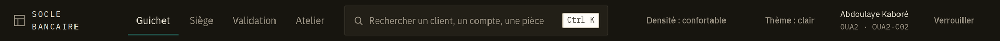
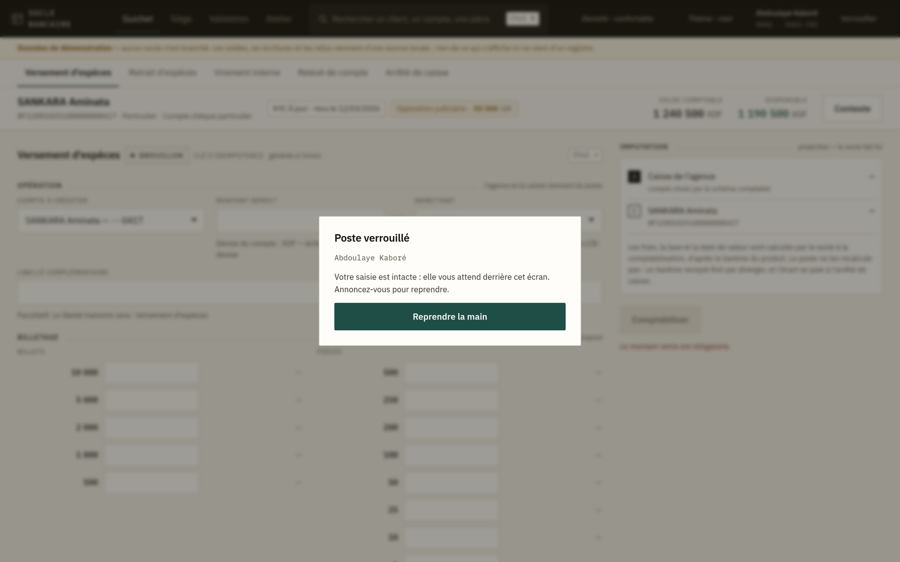
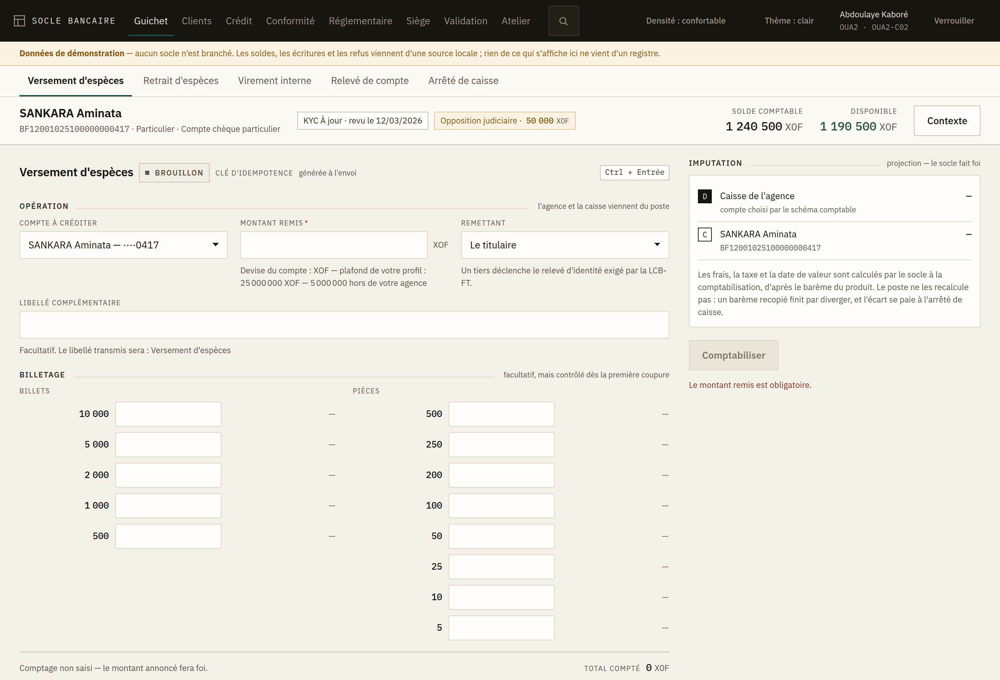

# 1. Prise en main

## Ouvrir l'application

Vous ne saisissez pas de mot de passe dans l'application : elle vous envoie vers le **portail
d'identité de la banque**, vous vous y annoncez, et il vous ramène. Votre nom, votre agence et
votre caisse apparaissent alors en haut à droite.

Conséquence à connaître : **recharger la page vous redemande une session.** C'est voulu —
l'application ne garde aucun mot de passe ni aucun jeton sur le poste. Le plus souvent le retour
est instantané, parce que le portail vous reconnaît encore.

## La barre du haut

De gauche à droite : le nom de la banque, les **espaces** (Guichet, Siège, Validation, Atelier),
la recherche, deux réglages d'affichage, puis vous.

- **Les espaces** sont des mondes de travail. Le Guichet est celui du client au comptoir ; le
  Siège est celui de l'exploitation comptable ; la Validation est le second regard. Chaque espace
  a sa propre barre d'écrans, juste en dessous.
- **Densité** — *confortable* ou *compacte*. La compacte fait tenir plus de lignes à l'écran ;
  sur un poste 1366×768 avec un relevé long, elle change la journée.
- **Thème** — *clair* ou *sombre*. Les deux sont dessinés, pas l'un déduit de l'autre.

Ces deux réglages sont personnels et restent sur votre poste. Ils ne changent rien à ce qui est
comptabilisé.

## Verrouiller votre poste

Le bouton **Verrouiller**, à l'extrême droite, couvre l'écran. Il ne vous déconnecte pas :
**votre saisie en cours reste intacte derrière le voile**. Vous revenez d'un clic sur *Reprendre
la main* et vous retrouvez exactement votre versement à moitié saisi.

Le poste se verrouille aussi tout seul après un moment sans activité — le délai est réglé par
votre établissement.

> **Verrouillez en vous levant.** C'est justement parce que le verrouillage ne vous fait rien
> perdre qu'il n'y a aucune raison de ne pas le faire.

## Le bandeau « Données de démonstration »

S'il est affiché, **aucun système central n'est branché**. Les soldes, les écritures et les refus
que vous voyez viennent d'une source locale ; rien de ce qui s'affiche ne vient d'un registre, et
rien de ce que vous validez n'est comptabilisé.

Ce bandeau ne se ferme pas. En formation, c'est ce qu'on veut. En production, s'il apparaît,
prévenez immédiatement : l'application n'est pas raccordée.

## Ce que votre profil vous permet

L'application ne vous montre que ce que vos droits admettent, et elle le fait à trois niveaux.

**Les espaces et les écrans.** Un espace dont aucun écran ne vous est ouvert n'apparaît pas dans
la barre. Ce n'est pas qu'il n'existe pas : c'est qu'il n'est pas pour vous.

**Les actions à l'intérieur d'un écran.** C'est le cas le plus fréquent, et le moins évident :
**un même écran porte souvent des actes qui n'appellent pas les mêmes droits.** Sur le détail d'un
état réglementaire, produire et transmettre sont deux droits différents ; sur un crédit passé en
perte, constater un recouvrement et sortir l'actif des livres aussi.

Quand l'écran existe pour un acte que vous ne portez pas, il **ne cache pas le bouton** : il le
remplace par la raison, et dit ce que votre profil fait — *« votre profil ne transmet pas : il
produit »*. Quand l'acte n'est qu'une option parmi d'autres, il disparaît simplement : une liste
d'impossibilités n'aide personne.

**Les plafonds.** Quand votre profil en a un, il est écrit **sous le champ du montant, avant la
saisie**, et l'écran vous arrête au-delà. Un second plafond, plus bas, s'applique aux opérations
faites hors de votre agence : vous opérez alors sans avoir le dossier sous les yeux.

> Rien de tout cela n'est une décision : **c'est le système central qui autorise ou refuse**, et
> lui seul connaît l'agence du compte et l'objet visé. L'application évite simplement de vous
> proposer une porte qu'elle sait fermée.

## Ce que l'écran vérifie, et ce qu'il ne vérifie pas

L'écran ne bloque que ce qui est **certain** : un montant vide, un compte non choisi, un billetage
qui ne tombe pas sur le montant annoncé. Tout le reste — provision, plafond, opposition, droits —
est vérifié par le système central, qui refuse avec un motif.

C'est délibéré. Un écran qui devine les règles finit par diverger de celles qui s'appliquent
vraiment, et il refuse alors des opérations légitimes sans pouvoir dire pourquoi.

## Lire les montants

Le franc CFA n'a pas de décimales : les montants s'affichent en unités entières, groupées par
milliers, la devise à côté du nombre. Un montant en gras et en chiffres alignés est un montant
qui vient du système central ; un montant plus discret est une **projection**.

## Se déplacer au clavier

- `Ctrl + K` — la recherche.
- `Ctrl + Entrée` — valider l'écran en cours (le bouton principal l'affiche).
- `Tab` suit l'ordre de lecture : bandeau client, saisie, action.

Les raccourcis annoncés à l'écran existent tous. Aucun raccourci caché ne déclenche une
comptabilisation.
