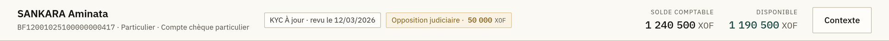
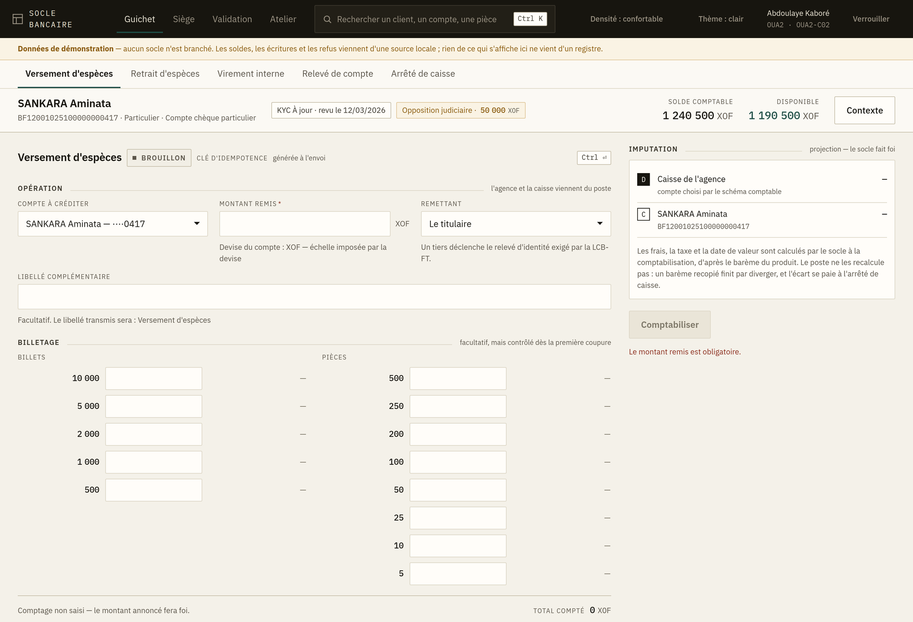
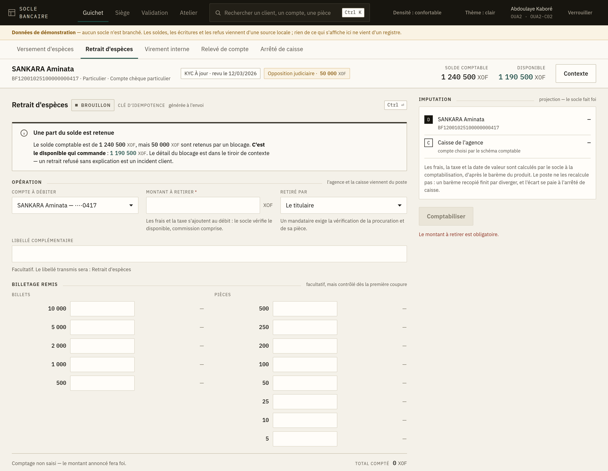
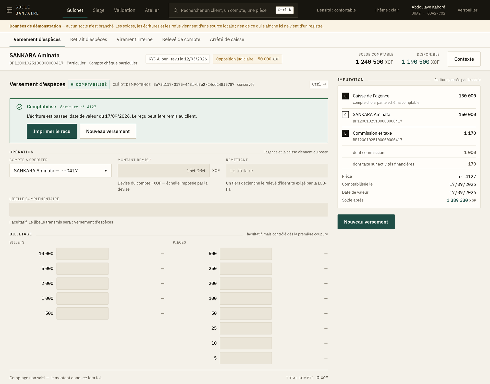

# 2. Les opérations d'espèces

Deux écrans, une même mécanique : **Versement d'espèces** et **Retrait d'espèces**, dans l'espace
Guichet.

## Le bandeau client, en haut

Dès qu'un compte est choisi, la ligne du haut porte tout ce qu'il faut savoir avant de toucher au
montant :

| Ce que vous voyez | Ce que cela veut dire |
|---|---|
| Nom du titulaire, numéro de compte, type de compte | À lire à voix haute pour confirmer avec le client |
| **KYC à jour** ou **KYC à revoir** | Le dossier client ; « à revoir » n'interdit pas l'opération mais doit être signalé |
| **Opposition judiciaire · 50 000 XOF** | Une part du solde est retenue : voir ci-dessous |
| **Solde comptable** | Ce que le compte porte |
| **Disponible** | Ce que le client peut effectivement utiliser |

> **C'est le disponible qui commande, jamais le solde comptable.** Quand les deux diffèrent, une
> retenue existe — opposition, blocage, provision de chèque en attente de règlement. Le bandeau
> la nomme. Annoncez au client le **disponible**, et expliquez la retenue : un client à qui on
> refuse un retrait « alors qu'il a de l'argent sur le compte » est un incident d'agence.

Le bouton **Contexte** ouvre le détail du compte sans quitter la saisie.

## Versement d'espèces

1. **Compte à créditer** — choisissez-le dans la liste.
2. **Montant remis** — en unités entières, dans la devise du compte.
3. **Remettant** — *le titulaire* ou *un tiers*. Un tiers déclenche le relevé d'identité exigé par
   la réglementation LCB-FT : renseignez-le, il n'est pas décoratif.
4. **Libellé complémentaire** — facultatif ; le libellé transmis est indiqué juste en dessous.
5. **Billetage** — facultatif, **mais contrôlé dès la première coupure saisie**. Si vous
   commencez à compter, allez au bout : un billetage qui ne tombe pas sur le montant remis
   bloque la validation. C'est ce contrôle qui fait qu'un écart se voit au comptoir plutôt qu'à
   l'arrêté de caisse.
6. **Comptabiliser** (ou `Ctrl + Entrée`).

**L'agence et la caisse ne se saisissent pas** : elles viennent de votre poste.

## Retrait d'espèces

Même déroulé, avec deux différences :

- Le **billetage remis** est celui que vous allez décaisser ;
- Le bandeau **Une part du solde est retenue** apparaît quand disponible et solde comptable
  diffèrent. Lisez-le avant d'annoncer un montant au client.

## Le panneau « Imputation », à droite

Avant validation, il montre les comptes qui seront mouvementés et porte la mention
**« projection — le socle fait foi »**. Les frais, la taxe et la date de valeur n'y figurent pas :
ils sont calculés par le système central au moment de la comptabilisation, d'après le barème du
produit. Le poste ne les recalcule pas — un barème recopié finit par diverger, et l'écart se paie
à l'arrêté de caisse.

Après validation, ce même panneau porte **les chiffres réels du reçu**.

## Les trois issues possibles

Une demande envoyée revient de trois façons, et une seule veut dire « c'est fait » :

### ✅ Comptabilisé
L'écriture est passée. Le panneau d'imputation affiche les montants réels, les frais, la taxe et
la date de valeur. **Imprimez le reçu**, puis *Nouveau versement* / *Nouveau retrait*.

### ℹ️ Déjà comptabilisé — voici le premier reçu
Vous avez rejoué une demande déjà passée (typiquement après un *Réessayer*). **Rien n'a été
comptabilisé une seconde fois** ; le reçu affiché est celui de la première comptabilisation.
C'est un message rassurant, pas une anomalie.

### ⏳ En attente de validation
L'opération dépasse un seuil ou relève d'une règle de double validation. Elle est **enregistrée
mais pas comptabilisée**, et porte un numéro d'opération. Un collègue habilité doit l'approuver
depuis l'espace **Validation** ([chapitre 5](05-validation.md)).

Dites-le au client dans ces termes : *« l'opération est enregistrée, elle attend la validation
d'un responsable »*. Ne remettez pas les espèces avant approbation sur un retrait, et ne
resaisissez pas l'opération.

## Quand ça refuse

Un bandeau rouge **Opération refusée** apparaît, avec le motif et son code. Deux boutons :

- **Réessayer avec la même clé** — n'apparaît que lorsque le refus peut venir d'un incident de
  transmission. Rejoue **la même** demande, sans risque de double comptabilisation.
- **Reprendre la saisie** — revient au formulaire pour corriger.

Le [chapitre 11](11-messages.md) donne le geste à faire pour chaque code.

> **La clé d'idempotence couvre une demande, pas un écran.** Tant que vous ne modifiez rien, le
> *Réessayer* rejoue la même opération. Dès que vous changez un champ, une nouvelle clé est
> générée : c'est une nouvelle demande, et il n'y a plus de protection contre le doublon avec la
> précédente. Ne modifiez jamais la saisie « pour forcer le passage » après un refus technique.
