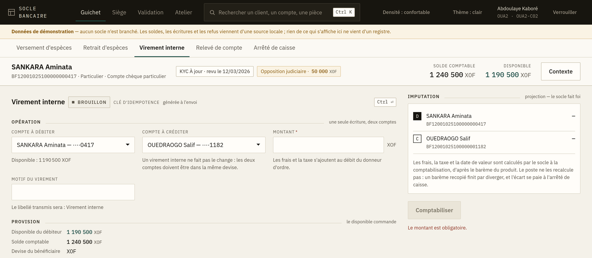
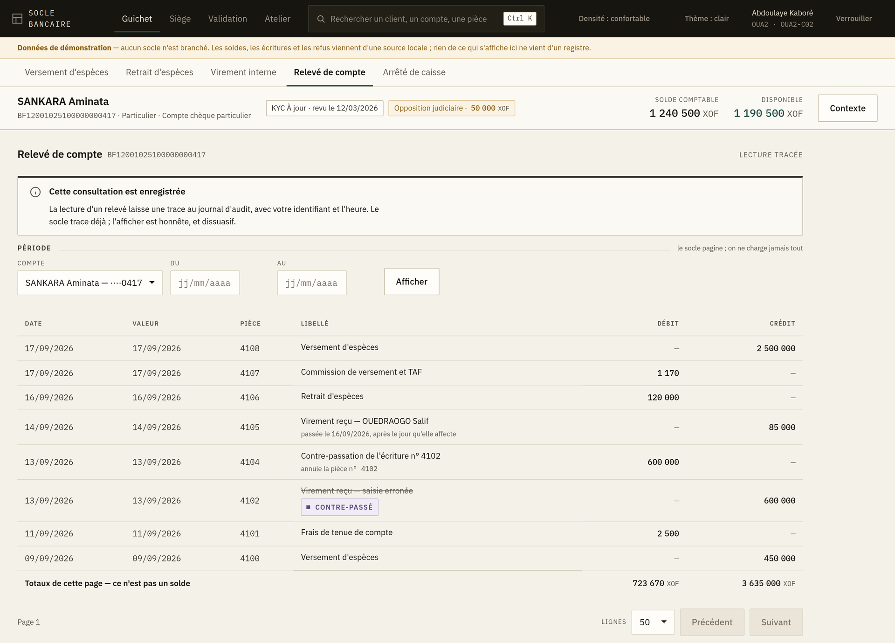

# 3. Virement interne et relevé de compte

## Virement interne

Un virement entre deux comptes tenus par la banque. C'est **une seule écriture à deux comptes** :
il n'y a pas un débit puis un crédit qui pourraient rester à moitié faits.

1. **Compte à débiter** — le payeur.
2. **Compte à créditer** — le bénéficiaire. Il doit être différent du précédent ; l'écran le
   vérifie.
3. **Montant**, puis **motif** — le motif part avec l'écriture et se retrouvera sur les deux
   relevés. Écrivez-le pour le client, pas pour vous.
4. **Comptabiliser**.

### Le panneau « Provision »

À droite, avant validation : le disponible du compte débité, le montant demandé, et ce qui
resterait. **Le disponible commande** — pas le solde comptable.

Cette projection ne tient pas compte des frais, qui sont ajoutés par le système central. Un
virement qui laisse le compte à quelques francs du disponible peut donc être refusé pour
provision insuffisante une fois les frais appliqués. Ce n'est pas une erreur de l'écran : c'est
pourquoi il annonce une projection et non un résultat.

### Les issues

Identiques au chapitre précédent : **Comptabilisé**, **Déjà comptabilisé**, **En attente de
validation**, ou un refus motivé. Les virements dépassent plus souvent les seuils de double
validation que les opérations d'espèces ; l'attente y est normale.

## Relevé de compte

Choisissez le compte et la période, puis **Appliquer**.

### Ce que vous devez savoir avant de l'ouvrir

> **Cette consultation est enregistrée.** Le bandeau le dit en haut de l'écran, et ce n'est pas
> une formalité : qui a consulté quel compte et quand est tracé. Consultez les comptes que votre
> travail vous demande de consulter.

### Lire le relevé

Chaque ligne porte : la date d'opération, la **date de valeur**, le libellé, le sens (débit ou
crédit), le montant, et le solde après opération.

- La **date de valeur** est celle qui compte pour les intérêts. Elle peut différer de la date
  d'opération ; c'est normal et cela vient du barème du produit.
- Une ligne marquée **Contre-passé** a été annulée par une écriture inverse. Les deux lignes
  restent visibles : en comptabilité bancaire on n'efface pas, on contre-passe. Si un client
  demande pourquoi il voit deux lignes, c'est la réponse.

### La pagination

Le relevé se charge par pages. **On ne charge jamais tout** : un compte actif depuis dix ans
représente des dizaines de milliers de lignes, et les charger bloquerait le poste. Utilisez la
période pour cibler, pas le défilement.

### Imprimer

Le bouton d'impression rend la page telle qu'elle est affichée — la période sélectionnée, pas
l'historique complet. Vérifiez la période avant de remettre un document à un client.
