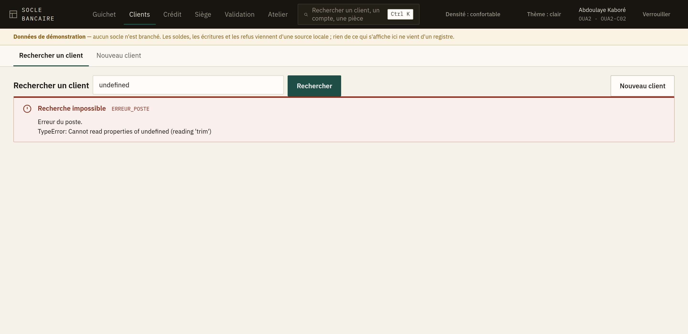
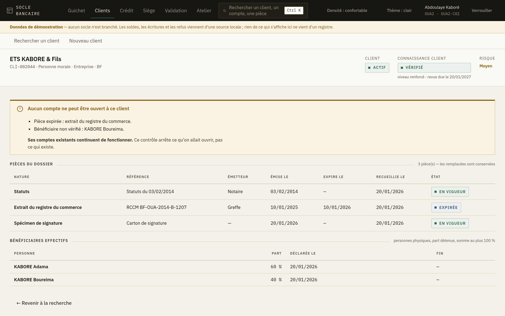
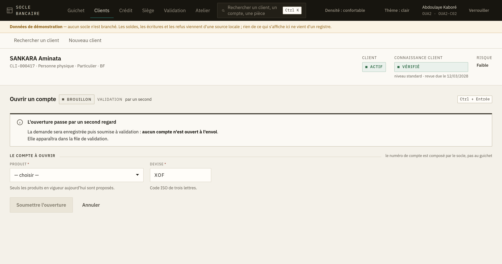

# 6. Les clients

L'espace **Clients** sert à retrouver une personne au référentiel, à voir où en est son dossier,
à en créer une nouvelle, et à lui ouvrir un compte.

Trois entrées seulement dans la barre : *Rechercher un client* et *Nouveau client*. Le dossier et
l'ouverture de compte ne sont pas des destinations — on y arrive depuis un client, jamais dans le
vide.

## Rechercher un client

Tapez un nom, une raison sociale ou une référence, puis **Rechercher**. La recherche **ne part
pas à chaque lettre** : c'est voulu. Vous tapez pendant que le client vous épelle son nom, et des
résultats qui défileraient sous vos yeux à chaque frappe seraient faux la plupart du temps.

Une recherche **vide** n'est pas une erreur : elle rend les premiers clients. C'est ce qu'on veut
en ouvrant l'écran.

**Aucun résultat n'est une réponse, pas un échec.** L'écran vous propose alors la seule suite
utile : créer le client.

> **Attention au doublon.** L'écran vous le rappelle sous le message d'absence : **cherchez sur la
> référence ou sur la pièce d'identité avant de créer**. La recherche porte sur le nom tel qu'il a
> été saisi — une lettre de différence, un prénom inversé, un nom d'épouse, et le dossier existant
> ne remonte pas. Le créer à nouveau ferait un second dossier pour la même personne, avec sa
> propre connaissance client et son propre risque, et personne ne le rattrapera.

### Ce que la liste vous dit avant d'ouvrir le dossier

Deux colonnes valent le détour, parce qu'elles vous évitent un aller-retour :

| Colonne | Ce qu'elle veut dire |
|---|---|
| **Client** | *Actif* : le client peut travailler avec la banque. *Bloqué* : plus aucune opération nouvelle. *Clos* : la relation est terminée. |
| **Connaissance client** | *Vérifié* : le dossier a été contrôlé. *À vérifier* : il ne l'a pas encore été. *Revue dépassée* : il l'a été, mais la revue périodique est en retard. *Bloquée* : la conformité l'a suspendu. |

Un client **bloqué** ou dont la connaissance client n'est **pas vérifiée** ne peut pas recevoir de
nouveau compte. Ses comptes existants, eux, continuent de fonctionner — ce n'est pas la même
chose, et un client vous le demandera.

## Le dossier d'un client

Cliquez une ligne pour ouvrir le dossier. L'écran répond d'abord à la question qu'on vient poser :
**puis-je ouvrir un compte à cette personne ?**

Quand la réponse est non, l'écran **nomme ce qui manque**, un point par obstacle : telle pièce
absente, telle pièce expirée, tel bénéficiaire effectif non vérifié. « Dossier incomplet » ne vous
dirait pas quoi réclamer au client ; cette liste, si.

### Les pièces

Le tableau des pièces montre tout ce qui a été versé au dossier, y compris ce qui a été
**remplacé**. Une pièce remplacée reste affichée, en gris : un dossier client se relit des années
après, et une pièce disparue est une question sans réponse.

La colonne **État** dit *En vigueur*, *Expirée* ou *Remplacée*.

### Les bénéficiaires effectifs

Cette section n'apparaît que pour une **personne morale** : la notion ne s'applique pas à un
particulier, et une rubrique vide ferait croire à un oubli.

On y lit qui détient l'entreprise et dans quelle proportion. Un bénéficiaire non vérifié empêche
l'ouverture d'un compte, et le dossier le dit en haut.

### Ses comptes

Le dossier liste les comptes du client : numéro, produit, agence, devise, date d'ouverture et
état. Un compte **clos** y reste, en retrait — le faire disparaître ferait croire qu'il n'a jamais
existé, et un client s'en souvient.

> **Les soldes n'y sont pas.** Un solde se lit compte par compte, au guichet, et cette lecture
> laisse une trace. Une liste qui les afficherait tracerait cinquante consultations que personne
> n'a demandées.

Un client **sans compte** n'est pas une anomalie : il peut porter un crédit, ou n'être qu'un
bénéficiaire effectif.

## Créer un client

*Nouveau client* ne recueille que l'**identité** : nature (personne physique ou morale), nom ou
raison sociale, pays, date de naissance ou d'immatriculation. Facultativement une référence
interne et un segment.

Les pièces, la vérification et le niveau de connaissance client viennent **après**, dans le
dossier. Un formulaire qui prétendrait tout collecter d'un coup serait abandonné en cours de
route, et laisserait un dossier à moitié constitué.

> **Un client naît non vérifié.** L'écran vous le dit à la création. Ne promettez pas un compte
> dans la foulée : il faudra d'abord constituer et faire vérifier le dossier.

### Si l'envoi se perd

Si le réseau tombe ou si le socle ne répond pas, **l'écran ne vous propose pas de renvoyer**. Il
vous renvoie à la recherche, avec le nom déjà saisi.

C'est délibéré : sur cet écran, le socle ne reconnaît pas encore les envois en double. Renvoyer
inscrirait deux fois la même personne au référentiel, et un doublon de client se paie ensuite en
rapprochements manuels. **Cherchez d'abord** ; si le client est là, la demande était passée.

## Ouvrir un compte

Depuis le dossier, quand rien ne bloque : *Ouvrir un compte*.

Deux champs seulement :

- **Produit** — la liste ne contient que les produits **en vigueur aujourd'hui**. Un produit en
  cours de rédaction ou retiré n'y figure pas : le proposer vous ferait saisir une ouverture que
  le socle refuserait ensuite, après que le client a signé.
- **Devise** — elle **vient du produit** et se verrouille dès que vous en choisissez un. Un compte
  s'ouvre dans la devise de son produit ; les laisser choisir séparément produirait des couples
  impossibles.

Vous ne saisissez **pas** le numéro de compte : le socle le compose selon le plan de numérotation
de la banque.

### Une ouverture passe toujours par un second regard

L'écran vous le dit **avant** l'envoi, et c'est la règle sans exception :

> La demande sera enregistrée puis soumise à validation : **aucun compte n'est ouvert à l'envoi.**

Après l'envoi, vous recevez un **numéro d'opération en attente**. Le compte existera quand un
second porteur aura approuvé la demande dans la [file de validation](05-validation.md).

**Ne resaisissez pas.** Si l'écran affiche « La demande a peut-être été enregistrée », c'est que
l'envoi s'est perdu sans réponse : allez vérifier dans la file de validation avant de recommencer,
sans quoi le client pourrait se retrouver avec deux comptes.
