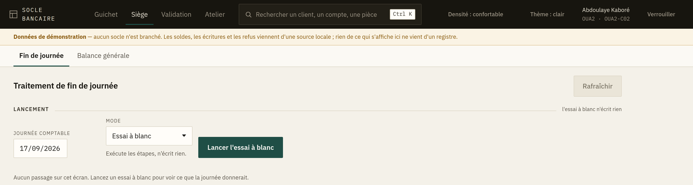

# 6. L'espace siège — exploitation et balance

Deux écrans, réservés aux profils d'exploitation comptable : **Exploitation** (le traitement de
fin de journée) et **Balance générale**.

---

## Le traitement de fin de journée

C'est l'écran le plus lourd de conséquences de l'application. Il enchaîne **27 étapes** — de
`PRE_CHECKS` à `OPEN_NEXT_DAY` — qui arrêtent la journée comptable, calculent les intérêts,
provisionnent, réconcilient les sous-livres et ouvrent la journée suivante.

### Essai à blanc d'abord

Le lancement propose un **essai à blanc**. Il déroule les mêmes contrôles **sans rien écrire**,
et c'est ainsi qu'on découvre une caisse non arrêtée ou une écriture en suspens avant de lancer
le vrai passage.

> **Lancez toujours l'essai à blanc en premier.** Il ne coûte que son temps d'exécution, et il
> transforme un échec en milieu de traitement réel en une anomalie corrigée avant de commencer.

Un essai à blanc porte le bandeau **« Essai à blanc — rien n'a été écrit »**. Il **ne peut pas
être annulé**, pour la raison évidente qu'il n'a rien fait : proposer son annulation laisserait
croire le contraire.

### Suivre le passage

Les 27 étapes s'affichent dans l'ordre réel du traitement, avec leur état. L'écran relit le
passage tant qu'il tourne, et cesse quand il est terminé.

### Quand une étape échoue

Bandeau rouge **« Le traitement s'est arrêté »**, avec le nom de l'étape en cause. Deux
comportements possibles :

- **Étape bloquante** — le traitement s'arrête là. Corrigez la cause, puis **Reprendre** : le
  traitement repart de l'étape en échec, il ne rejoue pas ce qui est déjà passé.
- **Anomalie non bloquante** — le traitement va au bout et affiche **« Terminé, avec des
  anomalies à lire »**. Elles sont comptées dans le bandeau et détaillées sur leur étape. Un
  traitement terminé avec anomalies n'est pas un traitement réussi : lisez-les le jour même.

L'échec le plus fréquent est `PRE_CHECKS` sur une **caisse mouvementée non arrêtée**. Il se
débloque au guichet, pas au siège : c'est l'écran d'arrêté de caisse du guichetier concerné
([chapitre 4](04-arrete-de-caisse.md)).

### Annuler un passage

**Annuler** n'existe que pour un passage réel. Le système central le refuse dès qu'une journée
postérieure a tourné — on ne défait pas une journée sur laquelle d'autres se sont appuyées.

---

## La balance générale

### L'équilibre d'abord

Avant les chiffres, l'écran répond à une seule question : **la balance s'équilibre-t-elle ?**

- ✅ **Balance équilibrée** — le registre se tient, vous pouvez exploiter les chiffres.
- ❌ **La balance ne s'équilibre pas** — les deux colonnes sont affichées avec leur différence.
  Rien de ce qui en découle — états financiers, déclarations réglementaires — ne vaut tant que ce
  n'est pas réglé.

> Une balance déséquilibrée n'est pas un écran à corriger : c'est une écriture à retrouver. Le
> déséquilibre ne vient jamais de l'affichage.

### La sélection

- **Niveau** — *général* (les comptes collectifs) ou *détail* (les comptes élémentaires).
- **Agence** — une agence, ou l'ensemble.
- **Période**, puis **Afficher**.

### Les totaux sont par devise

**Une balance ne s'additionne pas entre devises.** Le faire produirait un nombre qui ne veut rien
dire. Les totaux sont donc rendus devise par devise, par le système central ; le poste
n'additionne rien.

Si vous avez besoin d'un total toutes devises confondues, il passe par une conversion à un cours
donné, à une date donnée — c'est une opération comptable, pas une addition, et elle ne se fait
pas sur cet écran.

### La pagination

La balance se charge par pages et le système central totalise sur l'ensemble, pas sur la page
affichée. Le total en bas d'écran est donc le vrai total, même si vous ne voyez que trente
lignes.
