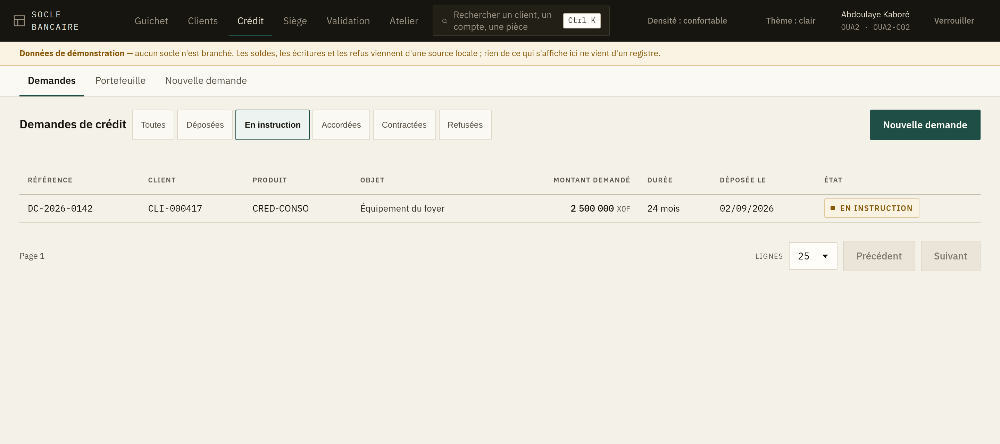
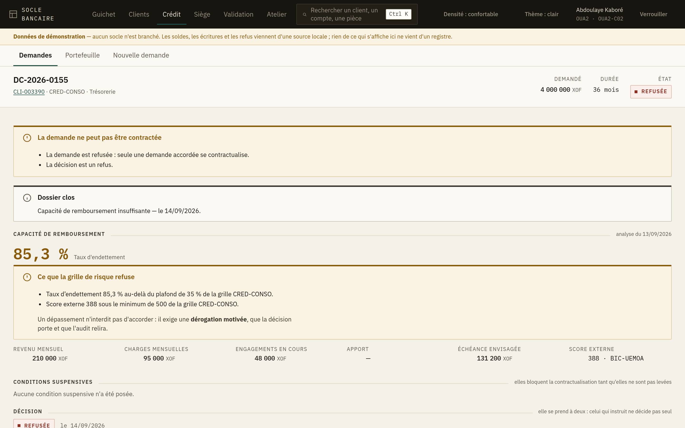
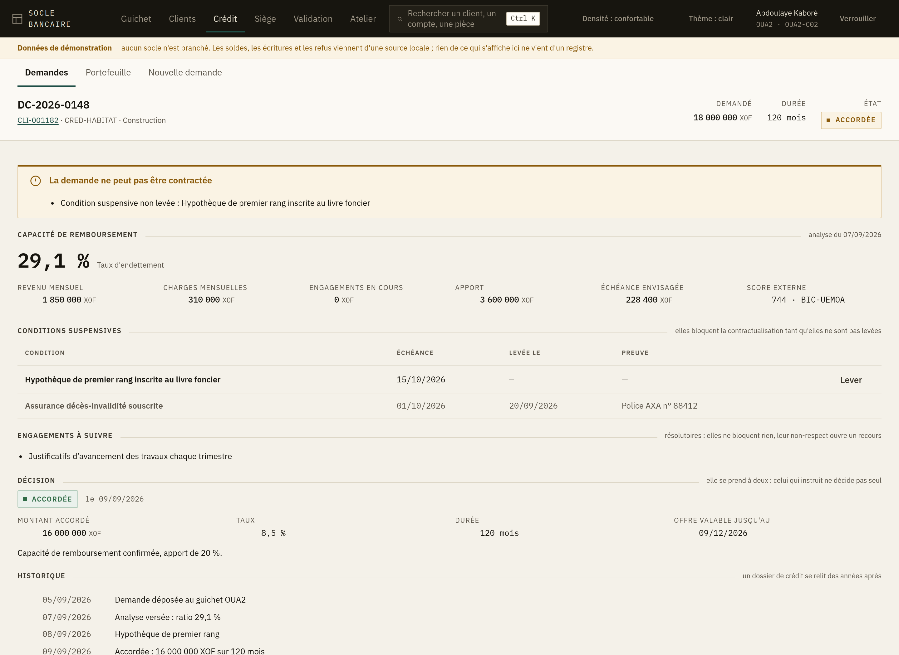
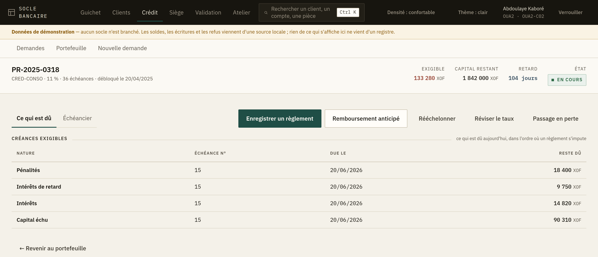
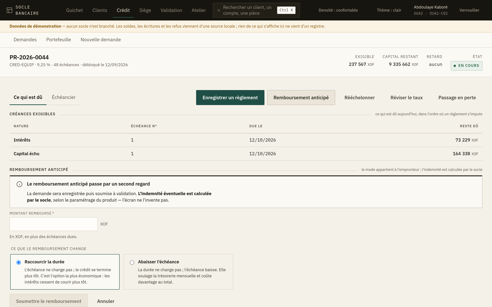
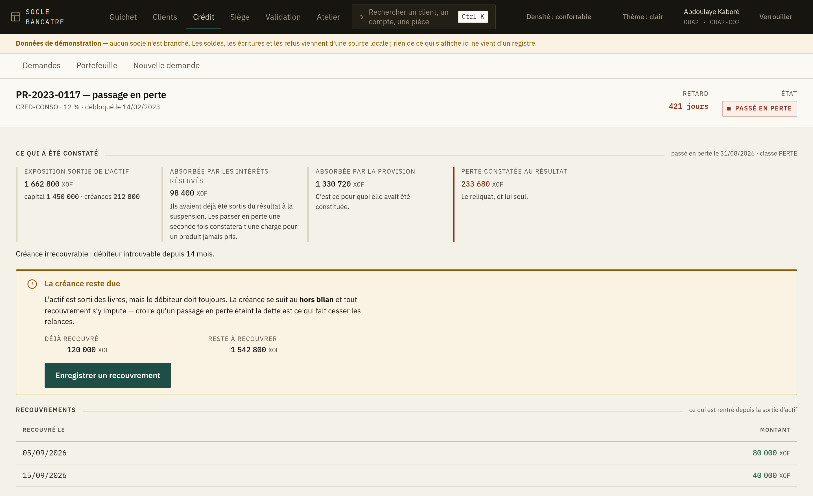

# 7. Le crédit

L'espace **Crédit** couvre la vie entière d'un prêt : la demande, son instruction, la décision, le
contrat, les règlements, et — quand plus rien ne rentre — le passage en perte.

Trois entrées dans la barre : *Demandes*, *Portefeuille*, *Nouvelle demande*.

## Les demandes

L'écran s'ouvre sur les demandes **en instruction** : c'est ce qu'un chargé de crédit vient faire.
Les autres états sont à un clic — *Déposées*, *Accordées*, *Contractées*, *Refusées*, ou *Toutes*.

## Déposer une demande

*Nouvelle demande* ne recueille que **ce que le client demande** : qui, combien, sur combien de
temps, pour quoi faire.

L'analyse de sa capacité, les conditions et la décision viennent après, dans le dossier. Un
formulaire qui prétendrait tout instruire d'un coup serait rempli au jugé, et le dossier naîtrait
déjà faux.

Comme pour la création d'un client : si l'envoi se perd, **l'écran ne propose pas de renvoyer**.
Il renvoie à la liste des demandes. Deux dossiers pour le même client seraient instruits en
parallèle par deux personnes.

## Instruire un dossier

C'est l'écran central du crédit. Il répond dans l'ordre où les questions se posent.

### 1. Où en est-on, et que puis-je faire maintenant ?

En haut : ce qui bloque la suite, ou ce qui est possible. Le reste de l'écran ne sert à rien si
cette réponse est « rien pour l'instant ».

### 2. Le client peut-il rembourser ?

*Verser une analyse* recueille le revenu, les charges, l'apport éventuel et le taux envisagé. Le
socle en tire le **taux d'endettement** et le confronte à la **grille de risque** de la banque.

Le taux s'affiche en grand. S'il dépasse, l'écran liste **ce que la grille refuse**, en toutes
lettres. Un ratio seul est un chiffre ; un dépassement nommé est une décision à prendre.

> **Un dépassement n'interdit pas d'accorder.** Il exige une **dérogation motivée**, que la
> décision porte et que l'audit relira. C'est une responsabilité, pas un obstacle technique.

**Une décision sans analyse ne se motive pas** devant un contrôle : tant qu'aucune analyse n'est
versée, le bouton *Décider* n'apparaît pas.

### 3. Qu'a-t-on exigé du client ?

Les conditions, et la distinction la plus importante de tout le chapitre :

| Nature | Ce qu'elle fait |
|---|---|
| **Suspensive** | **Bloque la contractualisation** tant qu'elle n'est pas levée. Exemple : une hypothèque inscrite, une assurance souscrite. |
| **Résolutoire** | Ne bloque rien. C'est un engagement que le client prend pour la suite ; son non-respect ouvre un recours. Exemple : des justificatifs d'avancement chaque trimestre. |

> **Confondre les deux débloque un crédit sans la garantie qui le couvrait.** C'est la faute la
> plus coûteuse de l'instruction, et elle ne se voit qu'à l'impayé. L'écran les sépare en deux
> sections et ne les mélange jamais.

**Lever une condition suspensive passe par un second regard** : vous saisissez la preuve — la
référence de l'inscription, de la police, de l'acte — et un second porteur la vérifie avant
qu'elle ne compte.

### 4. Décider

*Décider* ouvre la saisie **sous les dépassements**, pour que vous les ayez sous les yeux au
moment de motiver. Vous choisissez *Accorder* ou *Refuser*, le montant, le taux et la durée
accordés, et vous **motivez** — le motif reste au dossier.

> **La décision passe par un second regard.** Celui qui instruit ne décide pas seul : c'est la
> séparation qui empêche qu'un dossier soit monté et accordé par la même main. L'écran vous le
> dit avant l'envoi, et vous recevez un numéro d'opération en attente.

### 5. Établir le contrat

Quand la décision est favorable **et** que toutes les suspensives sont levées, l'écran propose
*Établir le contrat*. Vous indiquez le compte de prêt et le compte de règlement du client.

> **Le contrat naît non débloqué.** Il existe, mais le client n'a rien reçu et l'échéancier n'est
> pas encore arrêté.

## Le portefeuille et un contrat

Le **portefeuille** liste les contrats, **les retards en tête** : un portefeuille trié par
référence oblige à le parcourir pour trouver ce qui ne va pas.

Sur un contrat, deux onglets :

- **Ce qui est dû** — les créances exigibles **aujourd'hui**. C'est la question qu'on pose au
  guichet, et elle passe avant l'échéancier.
- **Échéancier** — le tableau d'amortissement : capital, intérêts, assurance, taxe, total.

### Débloquer les fonds

Sur un contrat non débloqué. **Le déblocage passe par un second regard** : c'est l'acte qui fait
sortir l'argent. L'échéancier est arrêté à l'approbation.

### Enregistrer un règlement

Vous saisissez le montant reçu ; **le socle décide à quoi il s'impute**, et l'écran vous montre le
détail, ligne par ligne. L'ordre est celui que la banque a paramétré :

1. frais de recouvrement, 2. pénalités, 3. frais et assurance, 4. intérêts de retard,
5. intérêts, 6. capital échu.

C'est ce qu'un client vous demandera — « à quoi est allé mon argent ? » — et vous pourrez le lui
lire.

Un versement **supérieur** à ce qui est dû reste en attente d'une échéance : **ce n'est pas un
remboursement anticipé**, qui se demande séparément.

## Remboursement anticipé

Deux modes, et **le choix appartient à l'emprunteur, pas à la banque** :

| Mode | Ce qu'il change |
|---|---|
| **Raccourcir la durée** | L'échéance ne change pas ; le crédit se termine plus tôt. **C'est l'option la plus économique** : les intérêts cessent de courir plus tôt. |
| **Abaisser l'échéance** | La durée ne change pas ; l'échéance baisse. Elle soulage la trésorerie mensuelle et coûte davantage au total. |

Posez la question au client, et cochez sa réponse. À capital égal remboursé, la différence de coût
entre les deux est considérable.

**L'indemnité éventuelle est calculée par le socle**, selon le paramétrage du produit. L'écran ne
l'invente pas.

## Rééchelonner, réviser le taux

Les deux passent par un second regard.

- **Rééchelonner** porte sur le **capital non échu** : ce qui est déjà exigible reste dû. Un motif
  est obligatoire — il se relit lors d'un contrôle.
- **Réviser le taux** ne vaut qu'à partir de sa **date d'effet** : les intérêts déjà courus ne se
  recalculent pas.

## Le passage en perte

C'est un écran à part, et non un bouton de plus : passer en perte sort un actif des livres, et
cela se décide avec la provision sous les yeux.

### La perte n'est pas ce que le client doit

C'est ce qui surprend le plus, et ce qu'il faut comprendre. L'exposition est absorbée dans un
ordre qui n'est pas négociable :

1. **Les intérêts réservés** d'abord. Ils avaient déjà été sortis du résultat quand le dossier a
   été suspendu ; les passer en perte une seconde fois constaterait une charge pour un produit que
   la banque n'a jamais pris.
2. **La provision** ensuite. C'est exactement ce pour quoi elle avait été constituée.
3. **Le reliquat seul** est une perte au résultat.

Sur l'exemple ci-dessus, 1 662 800 XOF sortis de l'actif ne donnent que 233 680 XOF de perte.

Si le dossier était **sur-provisionné**, l'excédent est rendu au résultat : la provision n'a plus
d'objet.

### La créance reste due

> **Un passage en perte n'éteint pas la dette.** L'actif est sorti des livres, mais le débiteur
> doit toujours. La créance se suit au **hors bilan**, et tout recouvrement s'y impute.

Croire l'inverse est ce qui fait cesser les relances. L'écran affiche en face « déjà recouvré » et
« reste à recouvrer ».

**Enregistrer un recouvrement** ne passe pas par un second regard : l'argent est déjà rentré,
l'écriture suit. Le passage en perte, lui, passe à deux.
