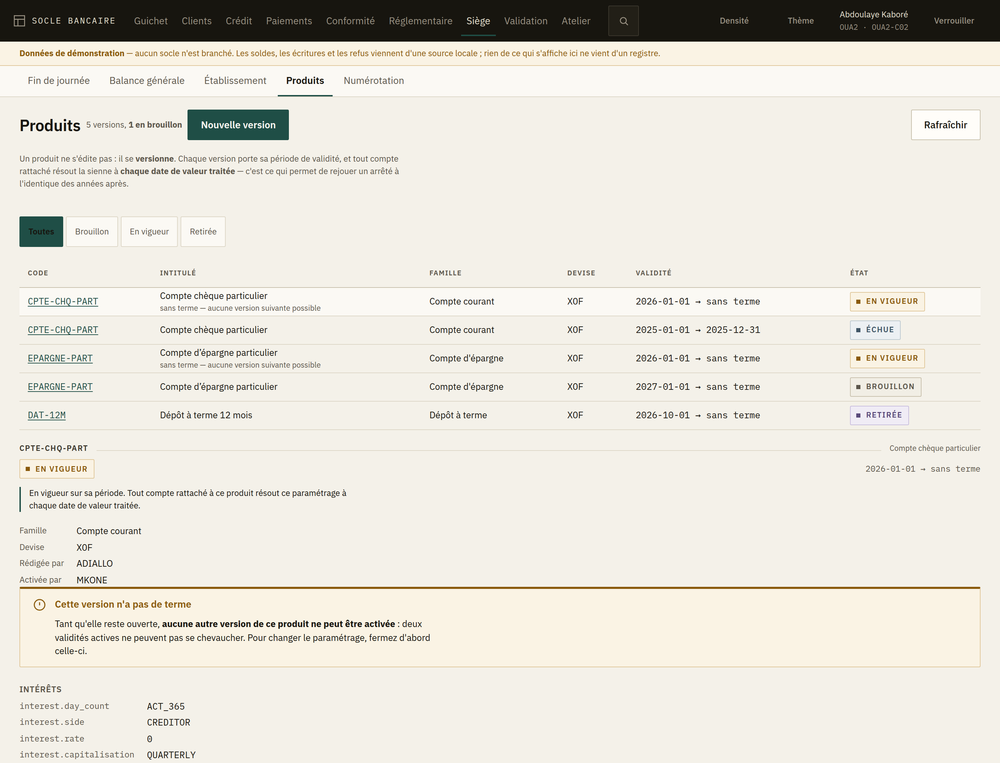
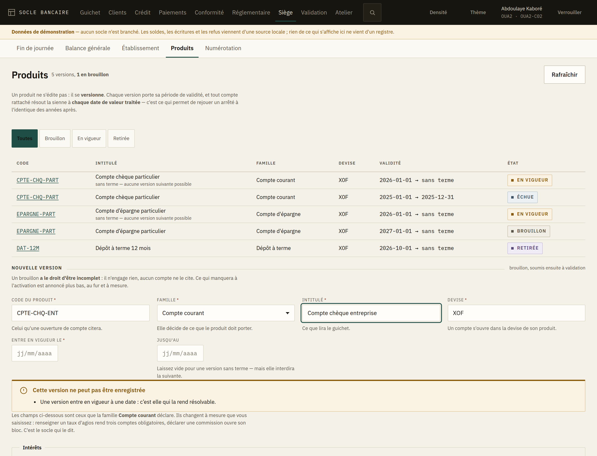
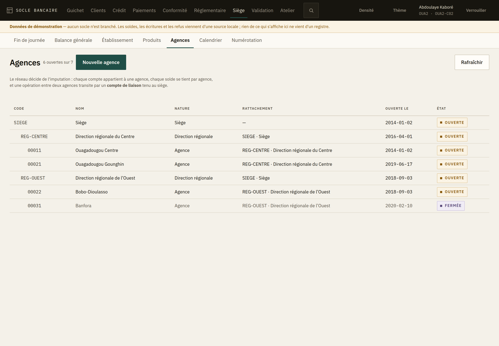
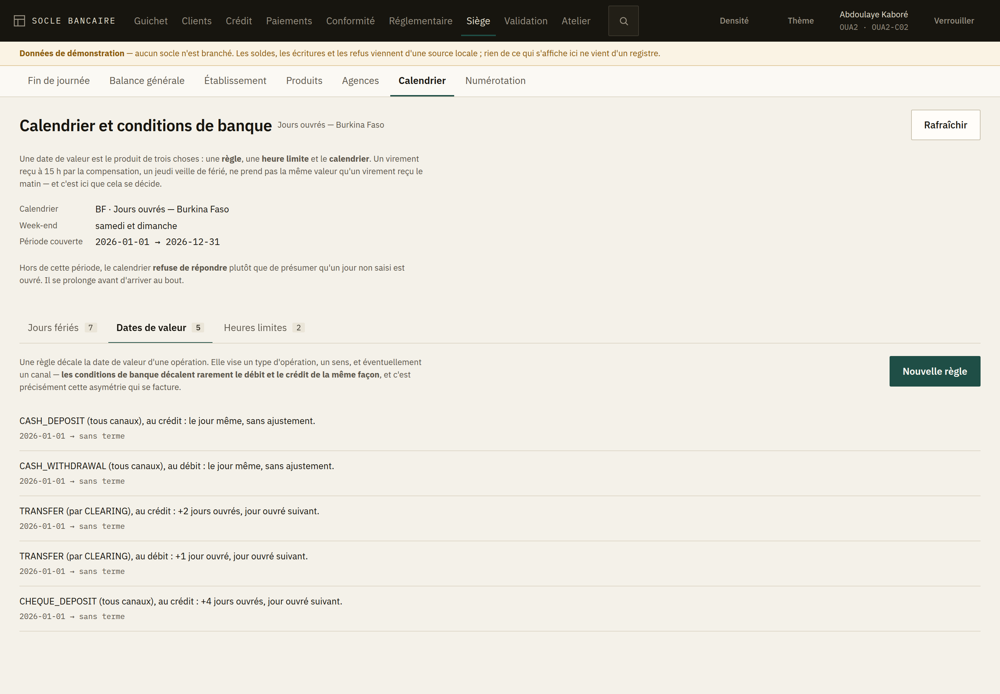
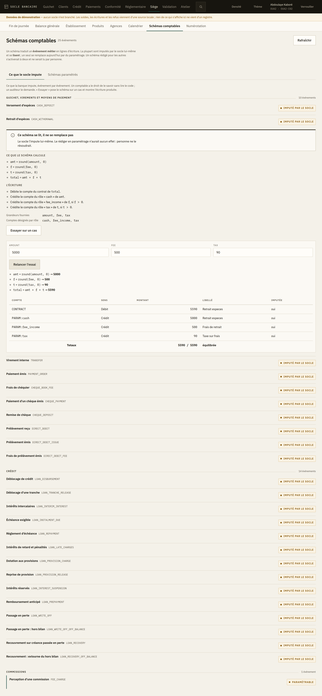
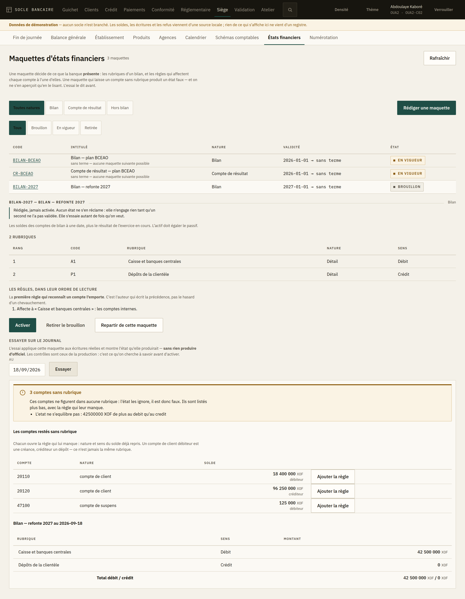

# 8. L'espace siège — exploitation, balance et paramétrage

Neuf écrans, réservés aux profils d'exploitation comptable et de paramétrage. Deux servent tous
les jours : **Fin de journée** (le traitement de clôture) et **Balance générale**. Sept servent au
paramétrage : **Établissement** — la fiche de la banque —, **Produits** — ce que la banque vend et
à quelles conditions —, **Agences** — le réseau —, **Calendrier** — les conditions de banque —,
**Schémas comptables** — la traduction de chaque événement en écritures —, **États financiers** —
ce que la banque présente au superviseur — et **Numérotation** — comment se composent les numéros
de clients et de comptes.

L'ordre de la barre suit cet usage : ce qui se touche tous les jours vient devant.

---

## Le traitement de fin de journée

C'est l'écran le plus lourd de conséquences de l'application. Il enchaîne **27 étapes** — de
`PRE_CHECKS` à `OPEN_NEXT_DAY` — qui arrêtent la journée comptable, calculent les intérêts,
provisionnent, réconcilient les sous-livres et ouvrent la journée suivante.

### Essai à blanc d'abord

Le lancement propose un **essai à blanc**. Il déroule les mêmes contrôles **sans rien écrire**,
et c'est ainsi qu'on découvre une caisse non arrêtée ou une écriture en suspens avant de lancer
le vrai passage.

> **Lancez toujours l'essai à blanc en premier.** Il ne coûte que son temps d'exécution, et il
> transforme un échec en milieu de traitement réel en une anomalie corrigée avant de commencer.

Un essai à blanc porte le bandeau **« Essai à blanc — rien n'a été écrit »**. Il **ne peut pas
être annulé**, pour la raison évidente qu'il n'a rien fait : proposer son annulation laisserait
croire le contraire.

### Suivre le passage

Les 27 étapes s'affichent dans l'ordre réel du traitement, avec leur état. L'écran relit le
passage tant qu'il tourne, et cesse quand il est terminé.

### Quand une étape échoue

Bandeau rouge **« Le traitement s'est arrêté »**, avec le nom de l'étape en cause. Deux
comportements possibles :

- **Étape bloquante** — le traitement s'arrête là. Corrigez la cause, puis **Reprendre** : le
  traitement repart de l'étape en échec, il ne rejoue pas ce qui est déjà passé.
- **Anomalie non bloquante** — le traitement va au bout et affiche **« Terminé, avec des
  anomalies à lire »**. Elles sont comptées dans le bandeau et détaillées sur leur étape. Un
  traitement terminé avec anomalies n'est pas un traitement réussi : lisez-les le jour même.

L'échec le plus fréquent est `PRE_CHECKS` sur une **caisse mouvementée non arrêtée**. Il se
débloque au guichet, pas au siège : c'est l'écran d'arrêté de caisse du guichetier concerné
([chapitre 4](04-arrete-de-caisse.md)).

### Annuler un passage

**Annuler** n'existe que pour un passage réel. Le système central le refuse dès qu'une journée
postérieure a tourné — on ne défait pas une journée sur laquelle d'autres se sont appuyées.

---

## La balance générale

### L'équilibre d'abord

Avant les chiffres, l'écran répond à une seule question : **la balance s'équilibre-t-elle ?**

- ✅ **Balance équilibrée** — le registre se tient, vous pouvez exploiter les chiffres.
- ❌ **La balance ne s'équilibre pas** — les deux colonnes sont affichées avec leur différence.
  Rien de ce qui en découle — états financiers, déclarations réglementaires — ne vaut tant que ce
  n'est pas réglé.

> Une balance déséquilibrée n'est pas un écran à corriger : c'est une écriture à retrouver. Le
> déséquilibre ne vient jamais de l'affichage.

### La sélection

- **Niveau** — *général* (les comptes collectifs) ou *détail* (les comptes élémentaires).
- **Agence** — une agence, ou l'ensemble.
- **Période**, puis **Afficher**.

### Les totaux sont par devise

**Une balance ne s'additionne pas entre devises.** Le faire produirait un nombre qui ne veut rien
dire. Les totaux sont donc rendus devise par devise, par le système central ; le poste
n'additionne rien.

Si vous avez besoin d'un total toutes devises confondues, il passe par une conversion à un cours
donné, à une date donnée — c'est une opération comptable, pas une addition, et elle ne se fait
pas sur cet écran.

### La pagination

La balance se charge par pages et le système central totalise sur l'ensemble, pas sur la page
affichée. Le total en bas d'écran est donc le vrai total, même si vous ne voyez que trente
lignes.

---

## L'établissement

C'est la fiche de la banque : ce qui figure **en en-tête de chaque relevé** et de chaque état
transmis au superviseur.

### Ce qui ne se corrige pas

Le **code de l'entité**, le **pays** et la **devise de tenue** sont écrits dans chaque écriture
depuis le premier jour. L'écran les montre sans champ de saisie, et ce n'est pas un oubli : les
changer ne serait pas corriger une fiche, ce serait réécrire l'histoire comptable.

### Le code banque

C'est celui que la banque centrale attribue, et c'est l'**en-tête du RIB** de tous vos comptes.

> **Posez-le avant d'ouvrir le premier compte.** S'il manque, l'écran vous le signale : une règle
> de numérotation qui le porte refusera de composer, et le refus arrivera au comptoir, devant un
> client.

Une fois qu'un compte a été numéroté avec lui, **il ne se change plus**. Le système central le
refuse, et il a raison : deux comptes de la même banque porteraient des RIB de banques
différentes. Un changement de code banque est une migration, pas une correction de fiche.

### Corriger

**Corriger…** ouvre le formulaire. Deux règles :

- un champ **laissé vide** est effacé ; un champ **non modifié** reste ce qu'il était. Seul ce qui
  change part au système central ;
- la correction passe par un **second regard**. Tant qu'il n'est pas donné, **rien n'a changé** —
  l'écran vous le dit, et ce n'est pas une formule de politesse.

---

## La numérotation

C'est le plan de numérotation de la banque : comment se composent les numéros de clients, de
comptes, de dossiers de crédit.

### Lire une règle

Choisissez ce qui vous intéresse dans la barre du haut — *Numéro de compte*, *Référence client*,
*Demande de crédit*… La liste montre la règle **active**, les brouillons, et les règles retirées :
une règle retirée n'est pas supprimée, parce que les numéros qu'elle a composés doivent rester
explicables.

La colonne **Exemple** donne le numéro que la règle produirait. C'est ce qu'il faut regarder : un
gabarit se lit mal, un numéro se lit tout de suite.

> L'exemple est calculé par le poste, avec le compteur à son premier numéro et une agence
> d'exemple. **Le numéro réel est composé par le système central**, qui seul connaît le compteur
> et l'agence qui ouvre.

### Un numéro de compte en zone UEMOA

C'est un **RIB** : code banque (5), code guichet (5), numéro (12), **clé de contrôle** (2). La clé
est calculée pour que le numéro entier soit divisible par 97 — c'est elle qui fait rejeter un
numéro mal recopié avant qu'un virement ne parte au mauvais compte.

### Rédiger une règle

Trois points de départ : la **proposition du système central**, la **règle active** — pour corriger
un chiffre sans tout réécrire — ou **zéro**.

Le gabarit est une suite de segments, dans l'ordre où ils se collent :

| Segment | Ce qu'il met dans le numéro |
|---|---|
| **Texte fixe** | ce que vous écrivez — `CLI-`, `DC-` |
| **Code banque** | celui de la fiche de l'établissement |
| **Code agence** | celui de l'agence qui ouvre |
| **Date** | la date comptable, au format choisi |
| **Compteur** | le numéro de série, cadré |
| **Clé de contrôle** | la clé, calculée sur tout ce qui précède |

Deux réglages commandent le compteur :

- la **portée** — une série pour la banque, ou une par agence. Une série par agence exige le code
  agence dans le numéro, sinon deux agences composeraient le même ;
- la **remise à zéro** — jamais, chaque année, chaque mois. Un numéro de compte ne se remet
  **jamais** à zéro : il doit rester unique pour toujours.

L'aperçu en haut se recalcule à chaque changement. Ce qui empêche de rédiger s'affiche en clair,
avant l'envoi.

### Rédiger n'active rien

Une règle rédigée est un **brouillon**. Elle ne numérote rien tant qu'une **autre personne** ne
l'a pas activée, et c'est voulu : l'activation décide de l'identité des comptes ouverts demain, et
pour toujours. Un chiffre de trop, et tous les RIB de la banque changent de forme.

Activer une règle **retire** celle qui numérotait. La retirée reste dans la liste.

### Quand rien ne numérote

Un bandeau le dit, et nomme les domaines concernés. **Rien n'est posé d'office à la création d'un
établissement** : c'est la banque qui choisit son plan de numérotation. Tant qu'elle ne l'a pas
choisi, le numéro doit être fourni à chaque fois — et le système central refuse de composer,
plutôt que d'inventer une forme dont personne n'aura décidé.

---

## Les produits

C'est ici que se décide ce que la banque vend : les taux, les frais, les plafonds, les comptes sur
lesquels tout cela s'impute. Rien de ce qui est fait ici n'est anodin — un paramétrage produit des
montants sur les comptes de tous les clients qui citent le produit.

### Un produit ne s'édite pas : il se versionne

Chaque version porte sa **période de validité**, et tout compte rattaché résout la sienne à
**chaque date de valeur traitée**. C'est ce qui permet de rejouer un arrêté de l'an dernier et
d'obtenir exactement les mêmes montants.

Conséquence directe : **on ne corrige pas un taux**, on rédige une nouvelle version qui prend effet
à une date. L'ancienne reste, et c'est elle qui explique les intérêts déjà versés.

| État | Ce que cela veut dire |
|---|---|
| **Brouillon** | Rédigée, jamais activée. Aucun compte ne la cite, aucun arrêté ne la résout. |
| **À venir** | Activée, mais sa période n'a pas commencé. |
| **En vigueur** | Elle s'applique aujourd'hui. |
| **Échue** | Sa période est close. Elle ne s'applique plus, et reste au dossier — un arrêté de cette période la résout encore. |
| **Retirée** | Un brouillon abandonné. |

### Rédiger une version

*Nouvelle version*, puis le code, la **famille**, l'intitulé, la devise et la date d'entrée en
vigueur.

> **La famille décide de tout le reste.** Compte courant, compte d'épargne, dépôt à terme, crédit
> amortissable : chacune déclare ce qu'un produit de son espèce doit porter. Les champs affichés
> sous le formulaire sont **les siens** — l'écran ne les invente pas, il les demande au système.

Les champs changent à mesure que vous saisissez :

- renseigner un **taux d'agios** rend obligatoires les comptes d'imputation et l'arrêté — l'écran
  vous dit pourquoi : *« des agios sans comptes d'imputation échoueraient à la première journée
  débitrice »* ;
- déclarer une commission dans `fee.codes` **ouvre son bloc** de champs : compte de produit,
  montant ou taux, périodicité, taxe.

Les **comptes d'imputation** ne se tapent pas : ils se cherchent dans le plan comptable, par leur
numéro. Ce qui a été retenu s'affiche en clair — `602100 · débit · résultat` — parce qu'un compte
de produits retenu là où il fallait un compte de charges ne se verrait jamais sur un identifiant.

> **Un brouillon a le droit d'être incomplet.** Ce qui manquera à l'activation est listé au bas du
> formulaire, et n'empêche pas d'enregistrer. Autant le voir maintenant : ce sont exactement les
> lignes que le système opposera le jour de l'activation.

**Repartir d'une version existante** copie tout son paramétrage — sauf sa date d'entrée en vigueur,
qui ne se copie jamais. C'est le geste courant : une nouvelle version change deux lignes sur
quarante, et tout ressaisir est la meilleure façon d'introduire une faute là où il n'y en avait
pas.

### Activer

**À deux.** Et le système confronte d'abord le paramétrage à sa famille : ce qui manque est refusé
ici, devant vous, plutôt que la nuit sur une étape bloquante de l'arrêté.

Le rédacteur ne valide pas sa propre version. Ce n'est pas un réglage : la base elle-même le
refuse.

### Fermer une validité

**Un produit ne se retire pas : sa validité se ferme.** Les comptes déjà rattachés continuent de
résoudre ce paramétrage pour les journées qu'il couvre — rien de ce qui a été produit ne change.

> **C'est aussi ce qui débloque la suite.** Deux versions en vigueur ne peuvent pas se chevaucher.
> Tant qu'une version reste **sans terme**, aucune autre version de ce produit ne peut être
> activée. L'écran le signale sur la ligne concernée. Pour changer un paramétrage, fermez d'abord
> la version en cours.

La fermeture se demande **à deux**, et sa date ne peut pas être antérieure à la **date comptable de
la banque** : fermer une journée déjà arrêtée changerait ce qu'un rejeu résoudrait, donc les
montants.

### Retirer un brouillon

Seul acte du paramétrage produit qui ne se fasse pas à deux : un brouillon n'engage rien. Il n'est
pas supprimé pour autant — il passe en *Retirée*, et reste lisible.

---

## Les agences

Le réseau décide de l'imputation : chaque compte appartient à une agence, chaque solde se tient par
agence, et une opération entre deux agences transite par un **compte de liaison** tenu au siège.

La table se lit comme un arbre : le siège en tête, puis les directions régionales, puis leurs
agences, décalées d'un cran à chaque niveau.

### Créer une agence

*Nouvelle agence*, puis le code, le nom, la nature (agence ou direction régionale), le rattachement
et la date d'ouverture.

> **Le code ne se change plus.** Il figure dans les numéros de compte que cette agence ouvrira.
> C'est pourquoi une création se valide **à deux**, comme une opération.

Une agence se rattache au siège ou à une région — jamais à une autre agence. Seul le siège n'a pas
de parent.

### Le compte de liaison

C'est le champ qu'on oublie, et celui qui coûte le plus cher à oublier.

> Une écriture entre deux agences ne passe pas d'un compte client à l'autre : elle transite par un
> **compte de liaison** tenu au siège, **dans la devise de l'opération**. Sans lui, la première
> opération déplacée échoue — en agence, devant un client.

L'écran en exige au moins un, et propose d'abord la devise de tenue de la banque. Une banque qui
opère en plusieurs devises en ajoute autant qu'elle en tient.

---

## Le calendrier et les conditions de banque

Une date de valeur est le produit de **trois** choses : une règle, une heure limite et le
calendrier. C'est pourquoi elles sont sur le même écran.

> Un virement reçu à 15 h par la compensation, un jeudi veille de férié : la règle dit +2 jours
> ouvrés, l'heure limite de 14 h 30 le repousse au lendemain, le calendrier saute le férié puis le
> week-end. Séparées sur trois écrans, ces trois choses ne permettraient jamais d'expliquer la date
> qu'un client conteste.

En tête : le calendrier rattaché, le week-end et la **période couverte**.

> Hors de cette période, le calendrier **refuse de répondre** plutôt que de présumer qu'un jour non
> saisi est ouvré. Il se prolonge avant d'arriver au bout — pas après.

### Jours fériés

Date et libellé. Le libellé est ce qui explique, des années après, pourquoi une échéance a été
reportée.

Un férié hors de la période couverte est refusé : il ne servirait à rien.

### Dates de valeur

Chaque règle s'affiche en **une phrase** — celle qu'on répète au client :

> *TRANSFER (par CLEARING), au crédit : +2 jours ouvrés, jour ouvré suivant.*

Une règle vise un **type d'opération**, un **sens** et éventuellement un **canal**.

> **Le sens compte.** Les conditions de banque décalent rarement le débit et le crédit de la même
> façon, et c'est précisément cette asymétrie qui se facture.

Le décalage se compte en jours ouvrés ou calendaires ; la **convention** dit ce qui se passe quand
la date tombe un jour chômé — reporter au jour ouvré suivant, au précédent, ou ne rien ajuster.

Une règle déplace des intérêts : un jour de valeur sur un solde, c'est un jour d'intérêts gagné ou
perdu, sur tous les comptes concernés. Elle se valide donc **à deux**.

### Heures limites

Au-delà de l'heure limite, l'opération prend la date de valeur du **jour ouvré suivant**. Une heure
limite peut aussi **fermer le canal** : l'opération est alors refusée, et non reportée.

> **Deux heures limites de même portée ne peuvent pas se chevaucher.** La date de valeur
> dépendrait de l'ordre de lecture. L'écran refuse le chevauchement à la saisie — le système
> central le refuserait aussi, mais après le second regard.

---

## Les schémas comptables

Un **schéma comptable** traduit un événement métier — un retrait, une échéance de crédit, une
commission — en **lignes d'écriture**. C'est le pivot entre le métier et la comptabilité : un
module ne construit jamais d'écriture, il publie un événement, et le schéma le traduit.

L'écran a deux onglets, et la distinction entre les deux est la chose la plus importante à
comprendre.

### Ce que le socle impute

Le premier onglet montre **les 25 événements que la banque comptabilise**, groupés par module :
guichet et moyens de paiement, crédit, commissions. Pour chacun : ce que le schéma calcule, les
lignes qu'il produit, les grandeurs que le module lui fournit, et les comptes qu'il désigne par
rôle.

> **Un comptable a le droit de savoir ce que la banque impute sur un retrait d'espèces.** Jusqu'ici
> cela ne se lisait que dans le code. C'est aussi la première question d'un auditeur.

Chaque événement porte une pastille :

- **Imputé par le socle** — le schéma est construit dans le programme. Il se lit ; il ne se
  remplace pas.
- **Paramétrable** — un schéma rédigé ici le remplace effectivement.

Aujourd'hui, **un seul** événement est paramétrable : la *perception d'une commission*. Tous les
autres sont imputés par le socle.

> **Pourquoi cette distinction est capitale.** Avant cet écran, on pouvait rédiger et activer à
> deux un schéma pour n'importe quel événement — y compris un déblocage de crédit. Le schéma
> passait la validation, entrait en vigueur, et **n'était lu par personne**. Celui qui l'avait
> écrit croyait l'imputation changée. L'écart se serait vu au premier rapprochement, des mois plus
> tard, sans qu'on sache le relier à ce paramétrage-là. L'écran refuse désormais ces schémas, et
> le système central aussi.

### Essayer un schéma sur un cas

Sous chaque événement, **« Essayer sur un cas »** pose le schéma sur des montants qu'on choisit et
montre l'écriture produite : les variables calculées avec leur valeur, chaque ligne avec son
montant, et le motif de celles qui ne sont **pas** imputées — condition fausse, ou montant nul.

> *Un retrait de 5 000 F avec 500 F de frais et 90 F de taxe : le compte du client est débité de
> 5 590, la caisse créditée de 5 000, le produit de commission de 500 et la taxe de 90. Totaux
> 5 590 / 5 590 — équilibrée.*

Personne ne lit `round(net, 0) + round(tax, 0)` et n'en déduit l'écriture. On la lit en la posant
sur un cas. L'essai **n'impute rien** : il se relance autant de fois qu'on veut.

L'essai montre aussi les **refus**, et c'est souvent ce qu'on cherchait :

| Refus | Ce qu'il veut dire |
|---|---|
| Moins de deux lignes imputées | Les conditions et les montants nuls ont vidé l'écriture. |
| Débit et crédit différents | Le schéma se déséquilibre sur ce jeu de valeurs — presque toujours un arrondi. |
| Montant non comptabilisable | Le montant a plus de décimales que la devise. Le moteur n'arrondit pas à votre place. |
| Montant négatif | Le sens est porté par la direction de la ligne, jamais par le signe du montant. |

### Rédiger un schéma

Le second onglet liste les schémas rédigés dans l'établissement, brouillons compris, et permet
d'en écrire un.

La rédaction **part du schéma du socle** plutôt que d'une page blanche : un schéma de commission
qu'on remplace en change une ligne sur trois, et tout ressaisir serait la meilleure façon
d'introduire une faute là où il n'y en avait pas.

Un schéma porte :

- un **code** — c'est lui qu'une commission désigne ;
- une **devise**, qui fixe l'échelle d'arrondi. Le même schéma ne peut pas servir en XOF et en EUR ;
- une **période de validité** ;
- des **variables calculées**, évaluées dans l'ordre : chacune peut employer les précédentes ;
- des **lignes**, chacune avec un compte, un sens, un montant et une condition facultative.

Un compte se désigne par son **rôle**, jamais par son identifiant : `CONTRACT` (le compte du
contrat), `GL:70611` (un compte général), `PARAM:fee_income` (un compte désigné par le
paramétrage), `RESOLVE:cash` (un compte résolu à l'exécution). C'est ce qui permet au même schéma
de servir dans deux filiales aux plans comptables différents.

> **Un schéma déséquilibré n'entre jamais en base.** À l'enregistrement, le système central
> l'évalue sur **trois cents jeux de valeurs** tirés de façon déterministe, et vérifie l'équilibre
> **après arrondi à l'échelle de la devise**. C'est l'arrondi qui coûte cher : un schéma qui débite
> un total et crédite deux composantes arrondies séparément est exact en arithmétique et faux en
> francs dès que les deux ont des décimales.

### Activer, fermer, retirer

- **Activer** se fait à deux, et jamais par le rédacteur.
- **Retirer** ne vaut que sur un brouillon, et se fait seul. Le brouillon reste lisible : ce qui a
  été écrit une fois explique pourquoi un schéma attendu n'existe pas.
- **Fermer la validité** est le seul acte possible sur un schéma en vigueur.

> **Un schéma en vigueur ne se retire pas.** Les imputations se résolvent à la date de valeur
> traitée, y compris passée, et seul un schéma actif se résout : le sortir de cet état changerait
> ce qu'un arrêté rejoué produirait. Sa validité se **ferme**, et pas avant la date comptable de
> la banque.

> **Fermer est ce qui rend le versionnement possible.** Tant que le schéma en vigueur n'a pas de
> terme, aucun successeur ne peut être activé sous le même code. C'est pourquoi la fermeture est
> un acte à part entière plutôt qu'un détail.

---

## Les maquettes d'états financiers

Une **maquette** décide de ce que la banque **présente** : les rubriques d'un bilan, d'un compte de
résultat ou d'un hors bilan, et les **règles** qui affectent chaque compte du plan interne à l'une
d'elles.

> C'est la table de correspondance entre le plan comptable interne et l'état présenté au
> superviseur — généralisée au sens du solde, parce qu'un compte de client débiteur est une
> créance et le même compte créditeur un dépôt.

### Les règles se lisent dans l'ordre

**La première règle qui reconnaît un compte l'emporte.** C'est l'auteur qui écrit la précédence,
pas le hasard d'un chevauchement. Chaque règle s'affiche en une phrase :

> *Affecte à « Créances sur la clientèle » : les comptes de clients dont le solde est débiteur.*

À la rédaction, les règles se **déplacent** — leur rang est l'ordre de la liste, il ne se saisit
pas. Et l'écran signale une règle qu'une précédente recouvre entièrement : elle ne s'appliquera
jamais.

> **Ce défaut-là ne se voit pas autrement.** Une règle morte ne fait rien échouer : elle laisse
> simplement une rubrique vide dans le bilan, et on cherche longtemps pourquoi.

### Essayer avant d'activer

C'est le cœur de l'écran. **« Essayer sur le journal »** applique la maquette aux écritures
réelles et montre l'état qu'elle produirait — sans rien produire d'officiel, et sans rien écrire.

Les contrôles sont ceux de la production :

| Contrôle | Ce qu'il veut dire |
|---|---|
| Comptes sans rubrique | Aucune règle ne les reconnaît. L'état les ignore : il est donc faux. |
| L'état ne s'équilibre pas | L'actif diffère du passif — presque toujours une conséquence du précédent. |
| Résultat antérieur non clos | L'exercice précédent n'est pas clos ; le bilan ne le présente pas. |
| Résultat de l'exercice non présenté | La maquette n'a pas de rubrique de résultat, et il y en a un. |

> **Sans l'essai, on activait à deux une maquette qui laisse quarante comptes de côté, et on
> l'apprenait en lisant un bilan faux — après l'avoir transmis.**

### Un compte sans rubrique se corrige d'un geste

Chaque compte resté sans rubrique porte un bouton **« Ajouter la règle »**. Il ouvre la rédaction
sur la maquette essayée — on ne la réécrit pas pour ajouter une règle — et remplit la règle
manquante avec la **nature du compte** et le **sens de son solde** déjà repris.

> Le sens compte : un compte de client débiteur est une créance, créditeur un dépôt. Une règle qui
> ignore le sens enverrait les deux dans la même rubrique.

### Rédiger une maquette

Trois natures d'état, et chacune présente autre chose :

- **Bilan** — les soldes des comptes de bilan à une date, plus le résultat de l'exercice en cours.
  L'actif doit égaler le passif.
- **Compte de résultat** — les mouvements des comptes de charges et de produits sur une période,
  l'exercice en cours par défaut. Son solde est le résultat.
- **Hors bilan** — les engagements donnés et reçus à une date.

Une rubrique est de **détail** (elle reçoit des comptes), de **total** (elle somme des rubriques
qui la précèdent) ou porte le **résultat de l'exercice** — cette dernière n'existe qu'au bilan, se
présente au crédit, et reçoit un montant que le socle calcule seul.

L'écran signale **tous** les défauts de la saisie en même temps : deux rubriques au même code, un
total qui somme une rubrique absente ou postérieure, une règle qui vise un total. Le système
central, lui, s'arrête au premier — corriger quarante rubriques une erreur à la fois serait un
supplice.

### Activer, fermer, retirer

- **Activer** se fait à deux, et jamais par le rédacteur.
- **Retirer** ne vaut que sur un brouillon, et se fait seul.
- **Fermer la validité** est le seul acte possible sur une maquette en vigueur, et il se fait à
  deux.

> **Une maquette en vigueur ne se retire pas.** Un état se produit à une date, y compris passée, et
> seule une maquette active se résout : la sortir de cet état changerait la présentation d'un bilan
> déjà transmis au superviseur.

> **Une seule maquette active par nature d'état et par date.** Tant que le bilan en vigueur n'a pas
> de terme, aucune maquette de bilan suivante ne peut être activée — l'écran le dit dès la
> rédaction, plutôt que de laisser écrire quarante rubriques pour rien.

