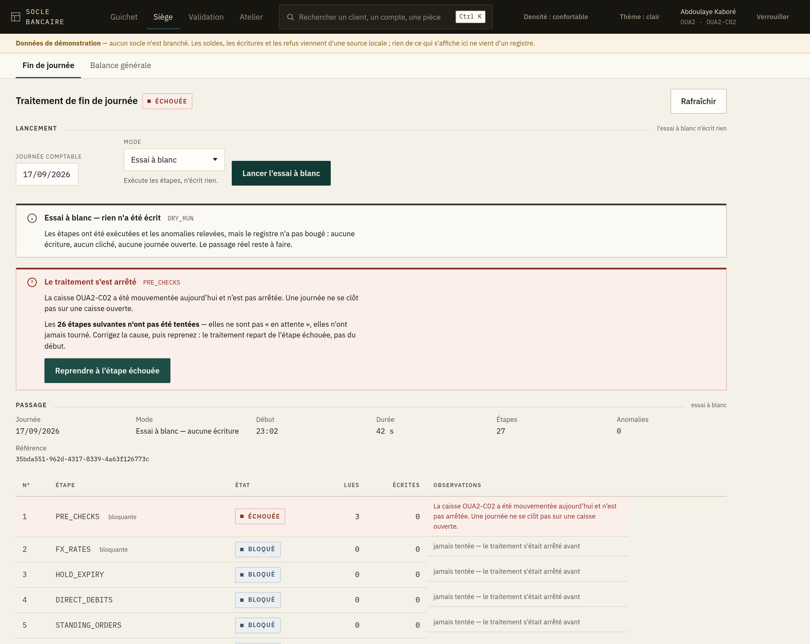
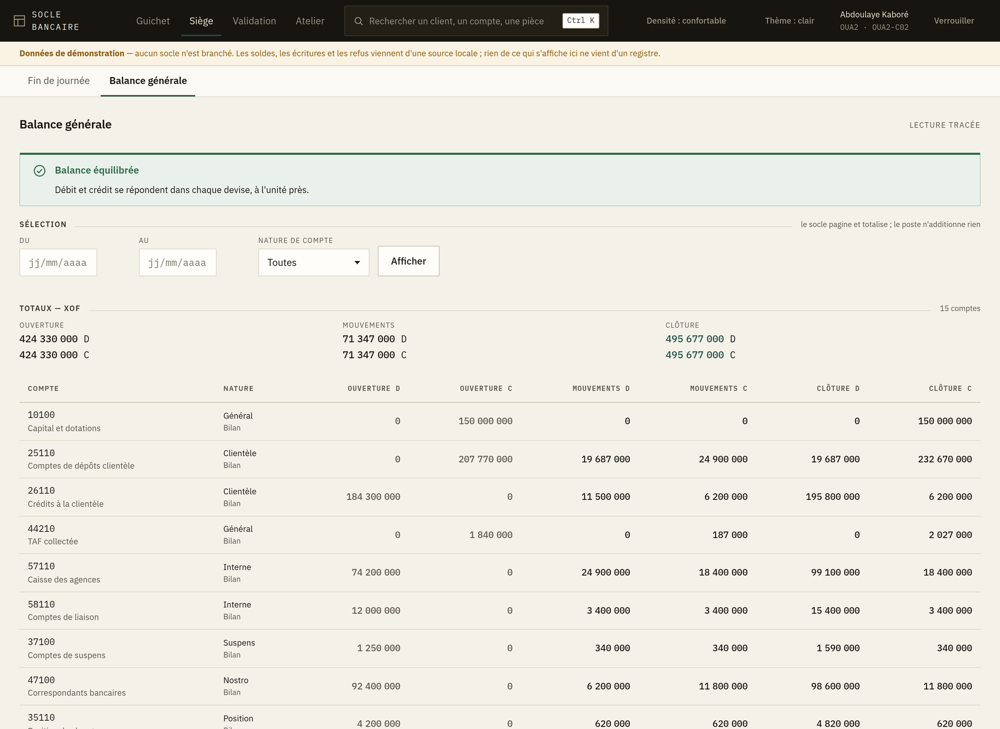

# 8. L'espace siège — exploitation, balance et paramétrage

Quatre écrans, réservés aux profils d'exploitation comptable. Deux servent tous les jours :
**Fin de journée** (le traitement de clôture) et **Balance générale**. Deux servent au
paramétrage de l'établissement : **Établissement** — la fiche de la banque — et **Numérotation** —
comment se composent les numéros de clients et de comptes.

L'ordre de la barre suit cet usage : ce qui se touche tous les jours vient devant.

---

## Le traitement de fin de journée

C'est l'écran le plus lourd de conséquences de l'application. Il enchaîne **27 étapes** — de
`PRE_CHECKS` à `OPEN_NEXT_DAY` — qui arrêtent la journée comptable, calculent les intérêts,
provisionnent, réconcilient les sous-livres et ouvrent la journée suivante.

### Essai à blanc d'abord

Le lancement propose un **essai à blanc**. Il déroule les mêmes contrôles **sans rien écrire**,
et c'est ainsi qu'on découvre une caisse non arrêtée ou une écriture en suspens avant de lancer
le vrai passage.

> **Lancez toujours l'essai à blanc en premier.** Il ne coûte que son temps d'exécution, et il
> transforme un échec en milieu de traitement réel en une anomalie corrigée avant de commencer.

Un essai à blanc porte le bandeau **« Essai à blanc — rien n'a été écrit »**. Il **ne peut pas
être annulé**, pour la raison évidente qu'il n'a rien fait : proposer son annulation laisserait
croire le contraire.

### Suivre le passage

Les 27 étapes s'affichent dans l'ordre réel du traitement, avec leur état. L'écran relit le
passage tant qu'il tourne, et cesse quand il est terminé.

### Quand une étape échoue

Bandeau rouge **« Le traitement s'est arrêté »**, avec le nom de l'étape en cause. Deux
comportements possibles :

- **Étape bloquante** — le traitement s'arrête là. Corrigez la cause, puis **Reprendre** : le
  traitement repart de l'étape en échec, il ne rejoue pas ce qui est déjà passé.
- **Anomalie non bloquante** — le traitement va au bout et affiche **« Terminé, avec des
  anomalies à lire »**. Elles sont comptées dans le bandeau et détaillées sur leur étape. Un
  traitement terminé avec anomalies n'est pas un traitement réussi : lisez-les le jour même.

L'échec le plus fréquent est `PRE_CHECKS` sur une **caisse mouvementée non arrêtée**. Il se
débloque au guichet, pas au siège : c'est l'écran d'arrêté de caisse du guichetier concerné
([chapitre 4](04-arrete-de-caisse.md)).

### Annuler un passage

**Annuler** n'existe que pour un passage réel. Le système central le refuse dès qu'une journée
postérieure a tourné — on ne défait pas une journée sur laquelle d'autres se sont appuyées.

---

## La balance générale

### L'équilibre d'abord

Avant les chiffres, l'écran répond à une seule question : **la balance s'équilibre-t-elle ?**

- ✅ **Balance équilibrée** — le registre se tient, vous pouvez exploiter les chiffres.
- ❌ **La balance ne s'équilibre pas** — les deux colonnes sont affichées avec leur différence.
  Rien de ce qui en découle — états financiers, déclarations réglementaires — ne vaut tant que ce
  n'est pas réglé.

> Une balance déséquilibrée n'est pas un écran à corriger : c'est une écriture à retrouver. Le
> déséquilibre ne vient jamais de l'affichage.

### La sélection

- **Niveau** — *général* (les comptes collectifs) ou *détail* (les comptes élémentaires).
- **Agence** — une agence, ou l'ensemble.
- **Période**, puis **Afficher**.

### Les totaux sont par devise

**Une balance ne s'additionne pas entre devises.** Le faire produirait un nombre qui ne veut rien
dire. Les totaux sont donc rendus devise par devise, par le système central ; le poste
n'additionne rien.

Si vous avez besoin d'un total toutes devises confondues, il passe par une conversion à un cours
donné, à une date donnée — c'est une opération comptable, pas une addition, et elle ne se fait
pas sur cet écran.

### La pagination

La balance se charge par pages et le système central totalise sur l'ensemble, pas sur la page
affichée. Le total en bas d'écran est donc le vrai total, même si vous ne voyez que trente
lignes.

---

## L'établissement

C'est la fiche de la banque : ce qui figure **en en-tête de chaque relevé** et de chaque état
transmis au superviseur.

### Ce qui ne se corrige pas

Le **code de l'entité**, le **pays** et la **devise de tenue** sont écrits dans chaque écriture
depuis le premier jour. L'écran les montre sans champ de saisie, et ce n'est pas un oubli : les
changer ne serait pas corriger une fiche, ce serait réécrire l'histoire comptable.

### Le code banque

C'est celui que la banque centrale attribue, et c'est l'**en-tête du RIB** de tous vos comptes.

> **Posez-le avant d'ouvrir le premier compte.** S'il manque, l'écran vous le signale : une règle
> de numérotation qui le porte refusera de composer, et le refus arrivera au comptoir, devant un
> client.

Une fois qu'un compte a été numéroté avec lui, **il ne se change plus**. Le système central le
refuse, et il a raison : deux comptes de la même banque porteraient des RIB de banques
différentes. Un changement de code banque est une migration, pas une correction de fiche.

### Corriger

**Corriger…** ouvre le formulaire. Deux règles :

- un champ **laissé vide** est effacé ; un champ **non modifié** reste ce qu'il était. Seul ce qui
  change part au système central ;
- la correction passe par un **second regard**. Tant qu'il n'est pas donné, **rien n'a changé** —
  l'écran vous le dit, et ce n'est pas une formule de politesse.

---

## La numérotation

C'est le plan de numérotation de la banque : comment se composent les numéros de clients, de
comptes, de dossiers de crédit.

### Lire une règle

Choisissez ce qui vous intéresse dans la barre du haut — *Numéro de compte*, *Référence client*,
*Demande de crédit*… La liste montre la règle **active**, les brouillons, et les règles retirées :
une règle retirée n'est pas supprimée, parce que les numéros qu'elle a composés doivent rester
explicables.

La colonne **Exemple** donne le numéro que la règle produirait. C'est ce qu'il faut regarder : un
gabarit se lit mal, un numéro se lit tout de suite.

> L'exemple est calculé par le poste, avec le compteur à son premier numéro et une agence
> d'exemple. **Le numéro réel est composé par le système central**, qui seul connaît le compteur
> et l'agence qui ouvre.

### Un numéro de compte en zone UEMOA

C'est un **RIB** : code banque (5), code guichet (5), numéro (12), **clé de contrôle** (2). La clé
est calculée pour que le numéro entier soit divisible par 97 — c'est elle qui fait rejeter un
numéro mal recopié avant qu'un virement ne parte au mauvais compte.

### Rédiger une règle

Trois points de départ : la **proposition du système central**, la **règle active** — pour corriger
un chiffre sans tout réécrire — ou **zéro**.

Le gabarit est une suite de segments, dans l'ordre où ils se collent :

| Segment | Ce qu'il met dans le numéro |
|---|---|
| **Texte fixe** | ce que vous écrivez — `CLI-`, `DC-` |
| **Code banque** | celui de la fiche de l'établissement |
| **Code agence** | celui de l'agence qui ouvre |
| **Date** | la date comptable, au format choisi |
| **Compteur** | le numéro de série, cadré |
| **Clé de contrôle** | la clé, calculée sur tout ce qui précède |

Deux réglages commandent le compteur :

- la **portée** — une série pour la banque, ou une par agence. Une série par agence exige le code
  agence dans le numéro, sinon deux agences composeraient le même ;
- la **remise à zéro** — jamais, chaque année, chaque mois. Un numéro de compte ne se remet
  **jamais** à zéro : il doit rester unique pour toujours.

L'aperçu en haut se recalcule à chaque changement. Ce qui empêche de rédiger s'affiche en clair,
avant l'envoi.

### Rédiger n'active rien

Une règle rédigée est un **brouillon**. Elle ne numérote rien tant qu'une **autre personne** ne
l'a pas activée, et c'est voulu : l'activation décide de l'identité des comptes ouverts demain, et
pour toujours. Un chiffre de trop, et tous les RIB de la banque changent de forme.

Activer une règle **retire** celle qui numérotait. La retirée reste dans la liste.

### Quand rien ne numérote

Un bandeau le dit, et nomme les domaines concernés. **Rien n'est posé d'office à la création d'un
établissement** : c'est la banque qui choisit son plan de numérotation. Tant qu'elle ne l'a pas
choisi, le numéro doit être fourni à chaque fois — et le système central refuse de composer,
plutôt que d'inventer une forme dont personne n'aura décidé.
