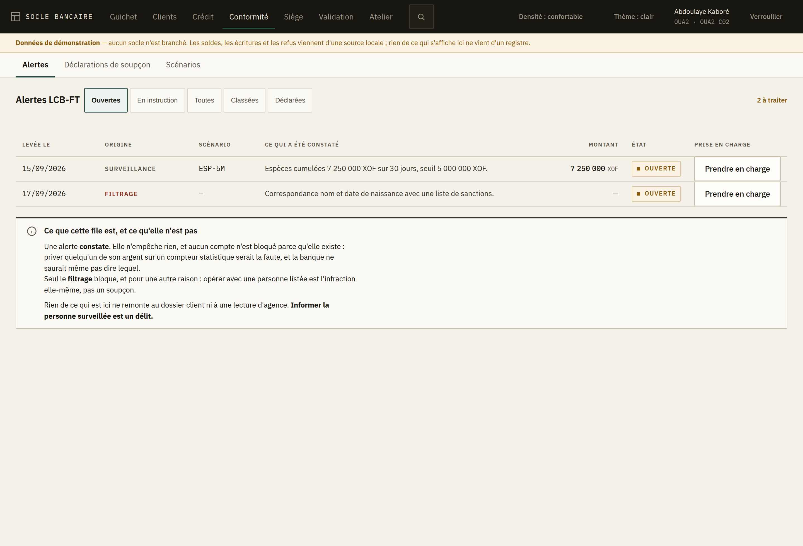
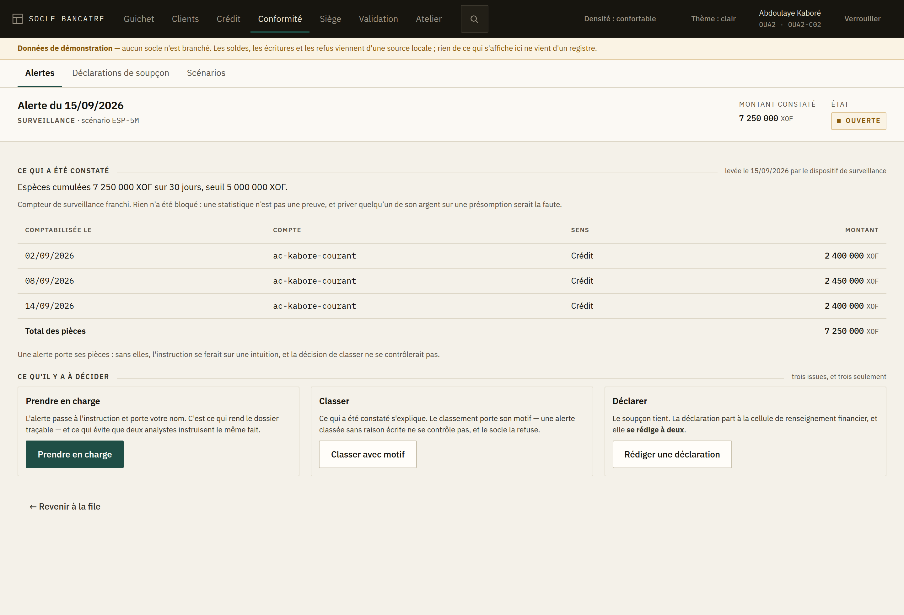
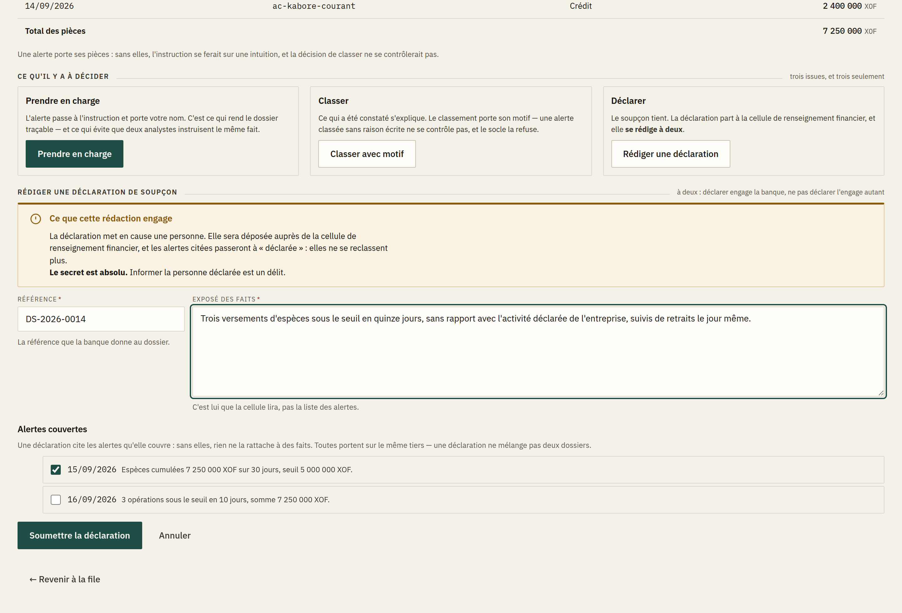
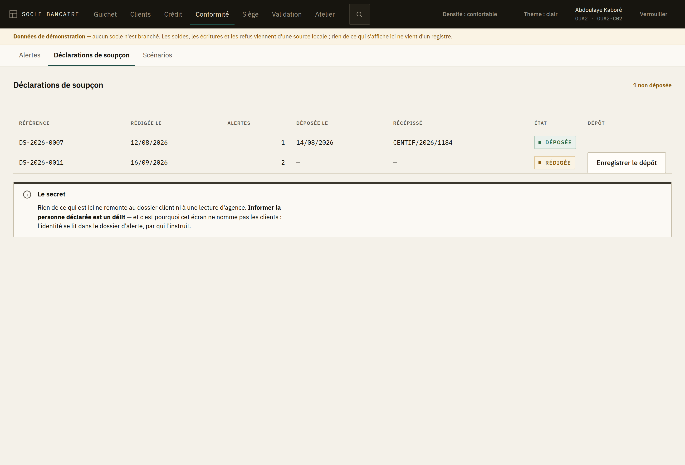
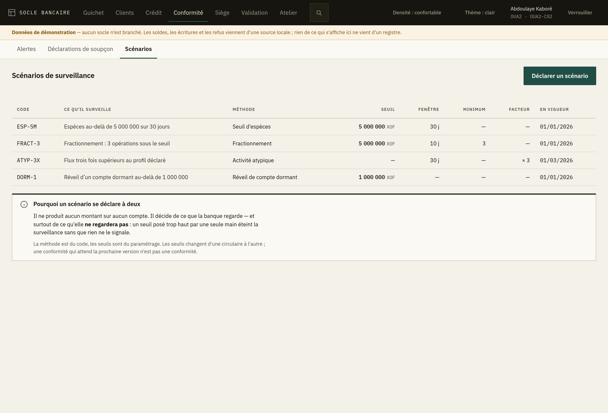
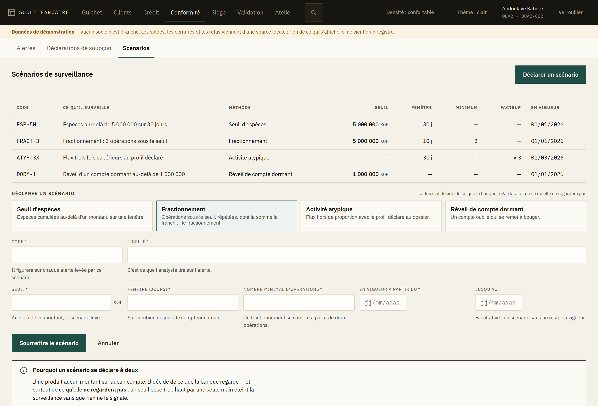

# 9. La conformité

L'espace **Conformité** est celui de la lutte contre le blanchiment et le financement du
terrorisme (LCB-FT). Il réunit trois choses : la **file des alertes** à instruire, les
**déclarations de soupçon** et leur dépôt, et les **scénarios de surveillance** qui décident de
ce que la banque regarde.

Trois entrées dans la barre : *Alertes*, *Déclarations de soupçon*, *Scénarios*.

## Avant tout le reste : deux règles

**1. Une alerte n'est pas une sanction.** Elle constate, elle n'empêche rien. Aucun compte n'est
bloqué parce qu'une alerte existe, et cet espace ne propose aucun geste sur un compte : priver
quelqu'un de son argent sur un compteur statistique serait la faute, et la banque ne saurait même
pas dire lequel.

La seule exception vient du **filtrage** : opérer avec une personne figurant sur une liste de
sanctions est l'infraction elle-même, pas un soupçon. Là, le socle a déjà refusé l'opération
avant que l'alerte n'arrive ici.

**2. Tout ce qui est ici est secret.** Rien ne remonte au dossier client ni à une lecture
d'agence — et c'est pour cela que la file des alertes et la liste des déclarations **ne nomment
pas les clients**. *Informer la personne surveillée ou déclarée est un délit.* Ne parlez de ces
écrans ni au guichet, ni au client, ni à son chargé de clientèle.

## La file des alertes

L'écran s'ouvre sur les alertes **ouvertes** : c'est ce qu'un analyste vient prendre. Les autres
états sont à un clic — *En instruction*, *Classées*, *Déclarées*, ou *Toutes*. Le compteur en haut
à droite dit ce qui reste à traiter dans ce que l'écran montre.

La colonne **Origine** est la plus importante de la file :

| Origine | Ce qui s'est passé | Ce que vous instruisez |
|---|---|---|
| **Surveillance** | Un compteur paramétré a été franchi. Rien n'a été bloqué. | Si le comportement s'explique. |
| **Filtrage** | Le nom correspond à une liste. Le socle a refusé l'opération. | Si la correspondance vise bien cette personne. |

*Prendre en charge* se fait directement depuis la file : l'alerte passe à l'instruction et porte
votre nom. C'est ce qui évite que deux analystes instruisent le même fait.

## Le dossier d'une alerte

Le dossier montre ce qui a été constaté, puis **les pièces** : les opérations qui ont déclenché
l'alerte, avec leur total. Sans elles, l'instruction se ferait sur une intuition et la décision
de classer ne se contrôlerait pas.

Une alerte de filtrage ne porte aucune opération : elle compare des identités, pas des mouvements.

Ensuite, **trois issues, et trois seulement** :

| Issue | Quand | Ce qu'il faut savoir |
|---|---|---|
| **Prendre en charge** | Vous commencez l'instruction. | L'alerte porte votre nom. |
| **Classer** | Ce qui a été constaté s'explique. | Le motif est **obligatoire**, et le socle refuse sans lui. |
| **Déclarer** | Le soupçon tient. | La déclaration **se rédige à deux**. |

Il n'y a pas de quatrième porte. Pas de blocage de compte depuis ici, pas de courrier au client,
pas de note au dossier client.

### Le motif de classement

Écrivez-le pour quelqu'un qui lira le dossier dans trois ans sans rien savoir du contexte :
« Vente d'un véhicule justifiée par acte de cession au dossier » et non « RAS ». C'est la seule
trace que l'inspection viendra lire.

## Rédiger une déclaration de soupçon

Une déclaration **se rédige depuis l'alerte**, jamais depuis la liste des déclarations : un exposé
des faits écrit loin des pièces ne vaut rien devant la cellule de renseignement financier.

Trois choses sont demandées :

- **la référence** que la banque donne au dossier ;
- **l'exposé des faits** — c'est lui que la cellule lira, pas la liste des alertes ;
- **les alertes couvertes**. L'alerte ouverte est cochée d'office ; les autres alertes du même
  tiers sont proposées dessous.

Deux refus que l'écran annonce avant de vous laisser soumettre, parce que le socle les oppose
aussi :

- **une déclaration ne mélange pas deux dossiers** : toutes les alertes citées portent sur le
  même tiers ;
- **une alerte déjà déclarée est déjà couverte** : la citer une seconde fois ferait deux dossiers
  pour un seul fait.

Après la soumission, **rien n'est déposé** tant qu'un second regard n'a pas approuvé. Les alertes
citées ne passent à « déclarée » qu'à ce moment-là. Ne resaisissez pas : la demande est dans la
[file de validation](05-validation.md).

## Les déclarations et leur dépôt

Cet écran sert à ce qui vient après la rédaction : savoir ce qui est déposé et ce qui ne l'est pas.
Le compteur en haut à droite dit combien de déclarations attendent leur dépôt.

**Enregistrer le dépôt ne transmet rien à la cellule.** Le dépôt a déjà eu lieu, par le canal
habituel. Ce que l'écran enregistre est le **récépissé** rendu par la cellule : c'est la seule
preuve que la banque pourra produire si on lui demande un jour quand elle a déclaré.

## Les scénarios de surveillance

Un scénario dit **ce que la banque regarde**. La façon de compter est du logiciel ; les seuils,
les fenêtres et les populations sont du paramétrage — c'est ce qui permet de suivre une circulaire
sans attendre une livraison.

Quatre méthodes :

| Méthode | Ce qu'elle compte | Ce qu'elle exige |
|---|---|---|
| **Seuil d'espèces** | Espèces cumulées au-delà d'un montant, sur une fenêtre. | Un seuil, une fenêtre. |
| **Fractionnement** | Opérations sous le seuil, répétées, dont la somme le franchit. | Un seuil, une fenêtre, un nombre minimal d'opérations (au moins 2). |
| **Activité atypique** | Flux hors de proportion avec le profil déclaré au dossier. | Une fenêtre, un facteur d'écart. |
| **Réveil de compte dormant** | Un compte oublié qui se remet à bouger. | Un seuil. |

Choisissez la méthode en premier : **le formulaire ne demande ensuite que ce qu'elle exige**, et
changer de méthode efface les paramètres de la précédente — un seuil posé pour un cumul d'espèces
ne veut pas dire la même chose pour un réveil de compte dormant.

Un scénario **se déclare à deux**, et pas pour la raison habituelle : il ne produit aucun montant
sur aucun compte. Il décide de ce que la banque regarde, et surtout de ce qu'elle **ne regardera
pas** — un seuil posé trop haut par une seule main éteint la surveillance sans que rien ne le
signale. Tant que le second regard n'a pas approuvé, **le scénario ne surveille rien**.

Si la liste est vide, l'écran le dit franchement : aucune alerte de surveillance ne remontera,
seul le filtrage des identités reste actif.

## Ce qui n'est pas encore là

Le **profil d'activité déclaré** par le client — celui contre lequel l'activité atypique se mesure
— se recueille au guichet, avec le reste de la connaissance client ; il n'a pas encore d'écran.
Le **reporting réglementaire** (états BCEAO, échéances, fiscalité) et les **sûretés** non plus.
