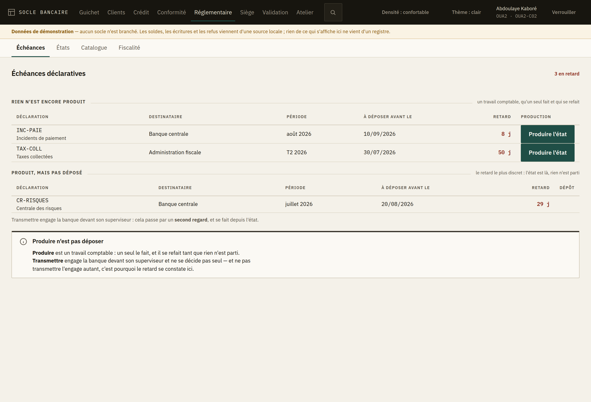
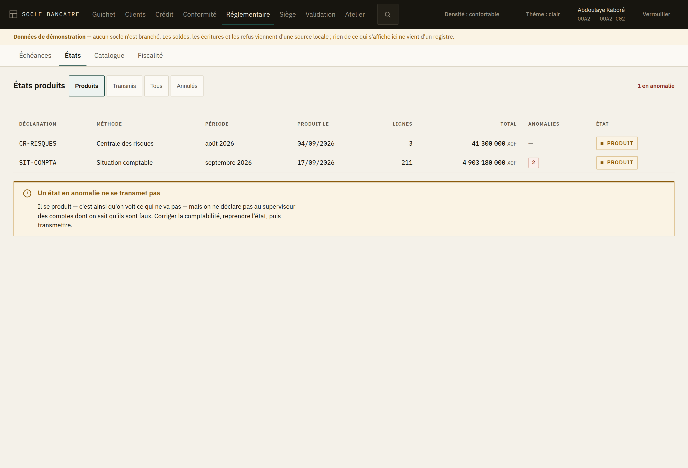
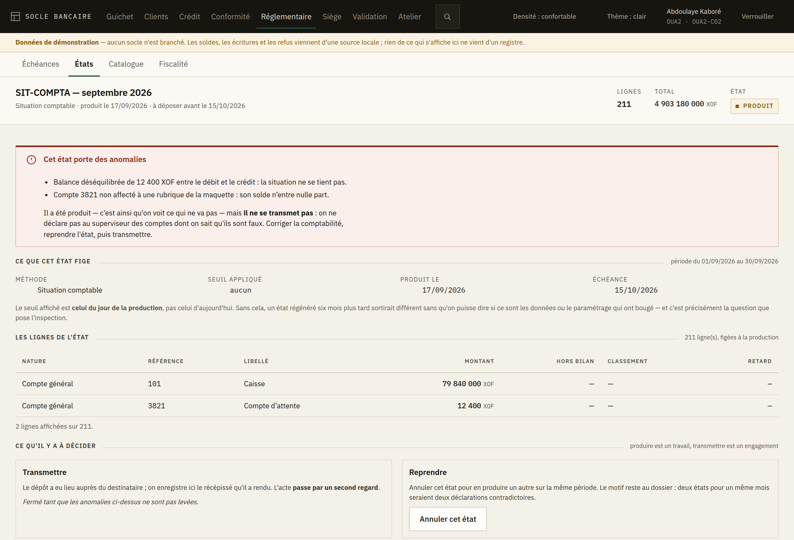
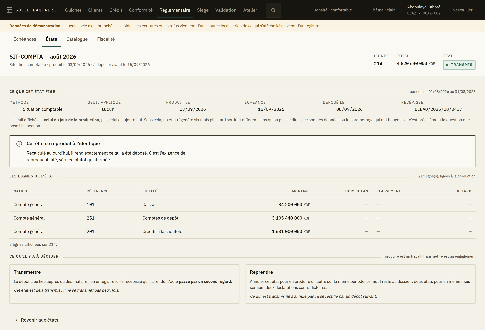
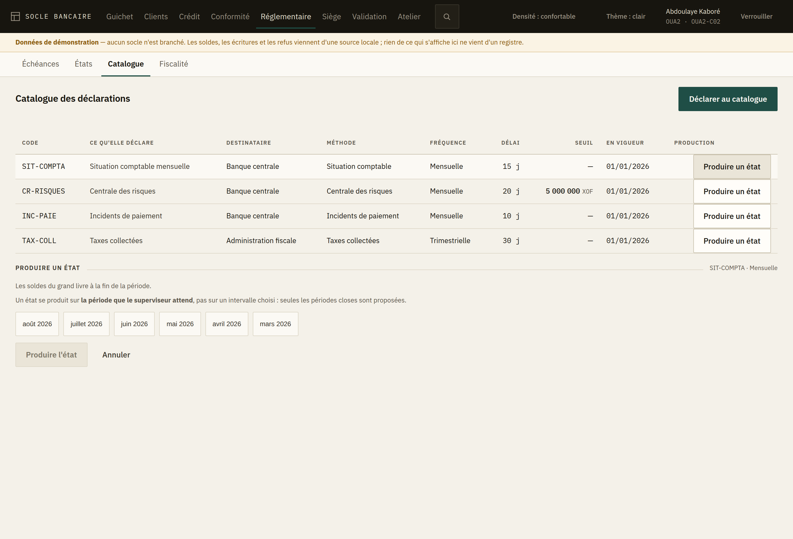
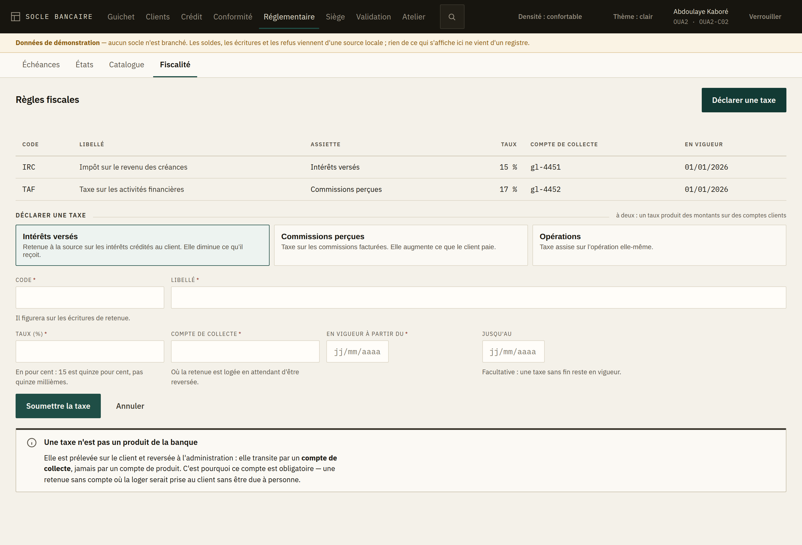

# 10. Le réglementaire

L'espace **Réglementaire** couvre ce que la banque doit à son superviseur et à l'administration :
le **catalogue** de ce qui est attendu, les **échéances** qui en découlent, les **états** produits
et leur dépôt, et les **règles fiscales**.

Quatre entrées dans la barre : *Échéances*, *États*, *Catalogue*, *Fiscalité*.

## Avant tout le reste : produire n'est pas déposer

Ce sont deux actes différents, deux droits différents, et les confondre est la cause la plus
fréquente d'un retard déclaratif.

| | Produire | Transmettre |
|---|---|---|
| Ce que c'est | Un travail comptable : l'état se calcule sur la période close | Un engagement devant le superviseur |
| Qui le fait | Un seul, et cela se refait tant que rien n'est parti | **Deux** : un second regard est requis |
| Ce que ça change | Rien pour le superviseur : il ne voit pas l'état | Le dépôt est fait, et le récépissé le prouve |

**Ne pas transmettre engage la banque autant que transmettre.** C'est pourquoi le retard se
constate et se lit — voir l'écran des échéances.

## Les échéances

C'est l'écran d'accueil du réglementaire, parce que c'est la seule question qu'on se pose en
arrivant : **qu'est-ce qui est en retard ?**

Il sépare deux retards qui n'appellent pas le même geste :

- **Rien n'est encore produit** — l'état n'existe pas. *Produire l'état* le calcule sur la période
  de la ligne ; la période n'est pas redemandée, c'est celle de l'échéance.
- **Produit, mais pas déposé** — l'état est là, tout paraît fait, et rien n'est parti. C'est le
  retard le plus discret, et c'est celui que le superviseur constate.

Si une ligne indique *déclaration absente du catalogue*, c'est que le code déclaré ne correspond à
aucune entrée : voyez l'onglet *Catalogue*.

## Les états produits

L'écran s'ouvre sur les états **produits** : ce sont ceux qui attendent une décision. Les états
transmis se relisent, mais on ne vient pas les chercher tous les matins.

**La colonne « anomalies » n'est pas décorative.** Un état qui en porte ne se transmettra pas tant
qu'elles seront là ; le découvrir la veille de l'échéance est exactement ce que cette colonne
évite.

## Le détail d'un état

Trois choses que cet écran dit, et qui sont toutes contre-intuitives.

### 1. L'état est figé avec son paramétrage

Le **seuil affiché est celui du jour de la production**, pas celui d'aujourd'hui. Sans cela, un
état régénéré six mois plus tard sortirait différent sans qu'on puisse dire si ce sont les données
ou le paramétrage qui ont bougé — et c'est précisément la question que pose l'inspection.

### 2. Un état en anomalie se produit, mais ne se transmet pas

Produire sert justement à **voir ce qui ne va pas**. Les anomalies s'affichent en premier, et le
bouton de transmission est fermé avec sa raison écrite, pas grisé en silence.

La conduite est toujours la même : **corriger la comptabilité, reprendre l'état, puis
transmettre.** Il n'y a pas de dérogation — on ne déclare pas au superviseur des comptes dont on
sait qu'ils sont faux.

### 3. Ce qui est transmis ne s'annule pas

Un état produit se **reprend** : on l'annule avec un motif, puis on en produit un autre sur la
même période. Deux états transmis pour le même mois seraient deux déclarations contradictoires.

Un état déjà déposé, lui, ne s'annule pas : **on dépose un rectificatif**, on ne réécrit pas
l'histoire.

Sur un état transmis, l'écran affiche en plus le résultat de son **recalcul**. S'il annonce que
l'état *ne se reproduit plus à l'identique*, ce n'est pas une curiosité : c'est le signe que
quelque chose a bougé derrière lui. À signaler au responsable comptable avant le prochain
contrôle.

### Qui peut quoi

| Geste | Droit requis |
|---|---|
| Lire les états et les échéances | Lecture réglementaire |
| Produire un état | Production |
| Transmettre un état | Transmission (à deux) |
| Annuler un état produit | **Transmission**, pas production |

La dernière ligne surprend et n'est pas une bizarrerie : reprendre un état est une décision sur
ce que la banque déclarera, pas un travail de production. Un comptable qui produit ne défait pas
seul ce qu'il a produit.

## Le catalogue

Le catalogue dit **ce que la banque doit, à qui, et sous quel délai**.

**Le délai de dépôt n'est pas cosmétique** : c'est lui qui fait exister l'échéance. Une
déclaration sans délai ne produit aucun retard, donc aucune alerte, et personne ne voit rien
manquer. L'écran l'exige.

**Le seuil suit la méthode.** Seule la centrale des risques recense au-delà d'un seuil ; le
formulaire ne le propose que là — et l'exige là.

On produit aussi depuis cet écran, pour une **période choisie** : l'écran des échéances ne propose
que les périodes en retard, et il arrive qu'on reprenne un mois plus ancien. Seules les périodes
closes sont proposées — un état se produit sur la période que le superviseur attend, pas sur un
intervalle choisi.

Déclarer au catalogue **passe par un second regard**, et tant qu'il n'a pas approuvé, aucune
échéance n'est comptée.

## La fiscalité

**Une taxe n'est pas un produit de la banque.** Elle est prélevée sur le client et reversée : elle
transite par un **compte de collecte**, jamais par un compte de produit. C'est pourquoi ce compte
est obligatoire — une retenue sans compte où la loger serait prise au client sans être due à
personne, et l'erreur se découvre au contrôle fiscal.

Trois assiettes, et elles ne vont pas dans le même sens :

| Assiette | Ce qu'elle taxe | Pour le client |
|---|---|---|
| **Intérêts versés** | Les intérêts crédités au client | Il reçoit moins |
| **Commissions perçues** | Les commissions facturées | Il paie plus |
| **Opérations** | L'opération elle-même | Il paie plus |

**Le taux s'exprime en pour cent** : 15 est quinze pour cent, pas quinze millièmes. La confusion
coûte cher dans les deux sens ; l'écran borne la saisie entre 0 et 100. La virgule est acceptée
comme séparateur décimal.

Un taux **se pose à deux** : il produit des montants sur des comptes clients, comme le reste du
paramétrage qui compte. Tant que le second regard n'a pas approuvé, aucune retenue n'est
appliquée.

## Ce qui n'est pas encore là

La **liasse réglementaire** et la **consolidation multi-entités** : le socle les expose, mais
choisir les entités membres d'un périmètre demande une liste des entités que l'API ne publie pas
encore. Les **sûretés** sont dans le même cas.
