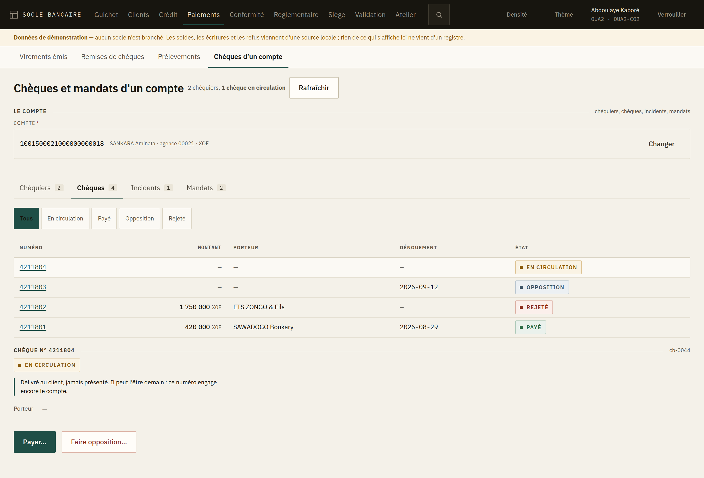

# 11. Les moyens de paiement

L'espace **Paiements** porte trois files de travail — les **virements émis**, les **remises de
chèques** et les **prélèvements** — puis un quatrième écran qui part d'un compte : les **chèques
et mandats d'un compte**. C'est le poste du service des moyens de paiement — celui qui dénoue ce
que le guichet a engagé.

Toutes trois ont la même forme, parce qu'elles disent la même chose : la banque a débité, crédité
ou bloqué, et elle **attend le correspondant**. Ce qui les distingue est ce qu'on peut encore
faire.

> **Une règle qui vaut pour les trois.** Quand une opération revient impayée, le montant est rendu
> au client mais **les frais restent acquis à la banque** : le service a été rendu. Le client le
> découvrira sur son relevé. Le motif que vous écrivez est ce qui le lui explique.

---

## Les virements émis

### Ce qu'un ordre est, avant d'être parti

Un ordre enregistré a **déjà débité le compte du client**, frais et taxe compris. Le montant
attend sur un compte de règlement sortant. **Rien n'est parti.**

C'est ce qui rend l'annulation possible — et seulement à ce moment-là.

### Les quatre états

| État | Ce qu'il attend | Ce qu'on peut faire |
|---|---|---|
| **Enregistré** | Débité du compte, pas encore parti | **Envoyer** ou **Annuler** |
| **Envoyé** | Parti au système de paiement | **Régler** ou **Retourner impayé** |
| **Réglé** | Le correspondant a payé | **Retourner impayé** |
| **Retourné**, **Annulé** | Dénoué | rien |

> **Un ordre envoyé ne s'annule plus.** Il est parti ; la banque ne décide plus seule. Il se
> règle, ou il revient. L'écran ne propose pas « Annuler » sur un ordre envoyé, et ce n'est pas un
> oubli : proposer le bouton ferait espérer l'impossible au client qui est devant vous.

### Enregistrer un ordre

**Nouvel ordre** demande le compte à débiter, le montant, et le **bénéficiaire complet** : nom,
banque, compte. Les trois sont obligatoires.

Le compte à débiter se **cherche** — par son numéro, par le nom du client ou par sa référence —
puis s'affiche en clair : numéro, titulaire, agence, devise. Relisez-le avant d'envoyer : c'est ce
compte-là qui sera débité.

Un virement mal adressé ne se perd pas tout de suite : il part, il cherche, et il revient des
semaines plus tard. Entre-temps le client a cru son fournisseur payé.

### Régler

**Régler** demande le **compte nostro** : le compte de correspondant sur lequel le règlement est
reçu, dans la devise de l'ordre. Le compte de règlement sortant s'y solde.

---

## Les remises de chèques

### Créditée sauf bonne fin

C'est la phrase à retenir, et c'est la question que tous les clients posent.

Quand vous enregistrez une remise, le compte du client est **crédité tout de suite** — son solde
monte — et le montant est **bloqué** jusqu'à ce que la banque tirée règle : **son disponible ne
monte pas**.

Un client qui voit son solde augmenter et son disponible immobile appellera. La réponse est là.

### Les trois états

| État | Ce qu'il attend | Ce qu'on peut faire |
|---|---|---|
| **À l'encaissement** | Créditée sauf bonne fin, montant bloqué | **Régler** ou **Retourner impayée** |
| **Réglée** | La banque tirée a payé, le blocage est levé | rien |
| **Impayée** | Le crédit a été contre-passé | rien |

### Enregistrer une remise

Le compte à créditer — cherché par numéro, par nom ou par référence, puis affiché en clair —, le
montant, la **banque tirée** — celle qui paiera — et le **numéro du chèque**. Ce numéro est ce qui distingue deux remises du même montant : sans lui, une recherche
d'impayé devient un travail d'enquête.

### Retourner impayée

Le crédit est **contre-passé** et le blocage levé : le client retrouve le solde qu'il avait avant
la remise. Le motif est obligatoire — c'est ce que le client lira.

Un chèque revenu impayé se **represente par une nouvelle remise**, jamais en rouvrant celle-ci.

---

## Les prélèvements

### Reçu ou émis : ce n'est pas la même chose

- un prélèvement **reçu** est un créancier qui prélève sur un compte de la banque, sur un mandat
  signé par le débiteur ;
- un prélèvement **émis** est un client de la banque qui prélève sur un compte d'ailleurs, et la
  banque le crédite sauf bonne fin.

Les deux ne se confondent pas, et l'écran ne les mélange pas. Un bouton de filtre sépare les sens.

### Le poste n'exécute pas

> Le passage de **en attente** à **exécuté** est le travail du **traitement de fin de journée**, à
> l'échéance. Pas le vôtre.

C'est la première chose qu'un nouvel arrivant essaie de faire, et l'écran n'offre pas ce bouton :
un prélèvement ne se force pas à la main, hors de l'arrêté. Ce qui se fait ici, c'est retirer,
régler, retourner, rembourser.

### Ce qu'on peut faire, selon le sens et l'état

| État | Reçu | Émis |
|---|---|---|
| **En attente** | Retirer avant échéance | Retirer avant échéance |
| **Exécuté** | **Régler**, ou rappeler par annulation | **Régler**, ou **Retourner impayé** |
| **Réglé** | **Rembourser le débiteur** | **Retourner impayé** |
| **Rejeté**, **Annulé**, **Retourné**, **Remboursé** | rien | rien |

**Seul un prélèvement reçu se rembourse** : c'est le débiteur de la banque qui conteste, et c'est
au créancier de se retourner vers lui. **Seul un prélèvement émis revient impayé** : c'est le
débiteur d'ailleurs qui n'a pas payé.

### Rejeté

Le traitement n'a pas pu exécuter : provision insuffisante à l'échéance, mandat révoqué, compte
bloqué. Le motif est au dossier. Un créancier qui veut réessayer **présente un nouveau
prélèvement**.

---

## Les chèques et les mandats d'un compte

Les trois écrans précédents sont des **files** : on y regarde ce qui attend, tous comptes
confondus. Celui-ci part d'un **compte**, parce que ce qu'il porte n'a de sens que sur un compte
nommé : un chéquier appartient à un compte, une opposition porte sur un numéro, un mandat est
signé par un titulaire.

Vous arrivez ici de deux façons : par la barre de l'espace, en cherchant le compte par son numéro,
le nom ou la référence du client ; ou depuis le **dossier client**, en cliquant *Chèques et
mandats* sur la ligne d'un compte — le compte est alors déjà désigné.

### Chéquiers

La liste des carnets délivrés : les numéros du premier au dernier, la date, les frais, l'état.

Pour en délivrer un, *Délivrer un chéquier*, puis le nombre de chèques — **de 1 à 200**. En deçà
il n'y a pas de carnet ; au-delà, une opposition sur perte porterait sur un carnet qu'aucun client
n'a pu suivre.

> **Le carnet n'est pas délivré quand vous validez.** Un chéquier **se délivre à deux** : votre
> demande part à la file de validation, et **les numéros sont attribués à ce moment-là**. Dites-le
> au client plutôt que de le faire attendre au guichet.

### Chèques

Les chèques du compte, filtrables par état. Chaque état dit ce qu'il attend, au présent :

| État | Ce que cela veut dire |
|---|---|
| **En circulation** | Délivré au client, jamais présenté. Il peut l'être demain : ce numéro engage encore le compte. |
| **Payé** | Payé et comptabilisé. Un chèque payé ne se reprend pas. |
| **Opposition** | Sous opposition. Aucun paiement ne passera sur ce numéro. |
| **Rejeté** | Présenté sans provision suffisante. L'incident est au dossier, et il se déclare. |

**Seul un chèque en circulation** se paie ou se frappe d'opposition. Sur les trois autres, aucun
bouton : ce n'est pas un oubli, c'est qu'il n'y a plus rien à faire.

#### Payer un chèque

Le montant, le porteur, et **comment le chèque est payé** :

- **au guichet** — sur **votre caisse**. Elle vient de votre profil : elle ne se choisit pas, et
  l'écran ne vous la demande pas ;
- **par compensation** — sur un compte **nostro**, que vous désignez.

Le compte est débité à l'instant. **Sans provision, le socle refuse et l'incident reste au
dossier** : il est daté, il se déclare, et il suit le client.

> **Le porteur.** Au guichet, il est obligatoire : celui qui présente le chèque est devant vous, et
> c'est lui que le chèque paie. En compensation, il vient de la banque présentatrice — le poste ne
> l'invente pas.

Votre **plafond** sur le paiement d'un chèque est écrit au-dessus du champ, et l'écran vous
avertit dès que le montant le dépasse : mieux vaut le savoir avant de compter.

#### Faire opposition

Quatre motifs, et **ce sont les seuls** : perte, vol, utilisation frauduleuse, redressement ou
liquidation du porteur.

> L'opposition sur chèque n'est pas libre : la loi uniforme l'enferme dans ces cas. Une opposition
> hors de ces motifs — un client mécontent de sa livraison — **engage la banque, et vous**. C'est
> pourquoi l'écran n'offre pas de champ libre.

Une fois enregistrée, aucun paiement ne passera plus sur ce numéro.

### Incidents de paiement

En lecture seule : le chèque, le montant, la date, le motif, qui l'a présenté.

> Un incident **ne se corrige pas**. Il est daté, il se déclare à la Centrale des incidents de
> paiement, et il suit le client.

### Mandats

Les autorisations de prélèvement sur ce compte : référence, créancier, plafond, validité, état.

Pour en enregistrer un, *Enregistrer un mandat*. Ce qu'il faut, et pourquoi :

| Ce qu'on saisit | Pourquoi |
|---|---|
| **Référence** | Celle que le créancier citera à chaque prélèvement : sans elle, aucun rapprochement. |
| **Identifiant du créancier** | Ce qui identifie le préleveur sur chaque présentation, quand son nom ne fait que le désigner. |
| **Nom du créancier** | Celui qui prélèvera. |
| **Où il tient son compte** | **Chez vous**, et vous désignez le compte ; **ailleurs**, et vous donnez la banque et le compte. L'un **ou** l'autre — jamais les deux. |
| **Signé le** | La date que le client a portée sur le mandat : elle fait foi si le prélèvement est contesté. |
| **Prend effet le** | À partir de quand le créancier peut prélever. |
| **Jusqu'au** | Facultatif : vide, le mandat n'a pas de terme. |
| **Plafond** | Facultatif — mais **sans plafond, le créancier prélève ce qu'il veut**. C'est légal, et c'est au client de le savoir avant de signer. |

Comme le chéquier, un mandat **s'enregistre à deux** : il n'autorisera aucun prélèvement tant
qu'un second ne l'aura pas validé.

#### Révoquer

Un mandat actif se révoque sur motif. La révocation **prend effet tout de suite** : une
présentation du créancier sera désormais rejetée.

Un mandat révoqué ne se révoque pas deux fois. Pour autoriser à nouveau ce créancier, enregistrez
un **nouveau mandat** — c'est une nouvelle signature du client.
